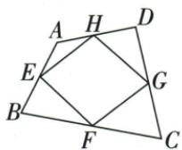

## 讲解

### 是什么

顺次连接原凸四边形各边中点，所得中点四边形总是平行四边形。其相邻边分别等原两对角一半，且与对应原对角平行；原对角的等长、垂直因此决定新四边菱形、矩形或正方。

### 怎么来的

连AC/BD，E/F是AB/BC中点，EF∥AC且AC/2；G/H是CD/DA中点，GH同样∥AC且AC/2。FG/HE各∥BD且BD/2。两组对边平行先得平行四边。若AC=BD，新邻边等，菱形；若AC⊥BD，新邻边90，矩形；兼等兼垂便正方。半面积来自中位线分小三角面积四分之一：每大三角的两半边与原夹角配SAS相似或四个全等中位块，角边中点对应给一角块四分之一；四角合原面积一半，剩中点区也一半。

### 什么时候能用

原凸四边中线都内部，面积可直接相加扣除。凹形可保中位线平行代数关系但区域可能越界，自交尤其不可把普通区域面积不加说明仍说一半。本条原性质模型已有图但没有另数字面积题；与矩形半对角各中点题区分端点对象，后一仍矩形，原四边中点一般菱形。

## 例题

### 原中点四边形对角性质转四边类型与半面积

> 来源ID Q23-63；第23章平行四边形；251-300/full.md 第1075–1086行。原答案与解析定位：251-300/full.md 第1075–1086行。

# 知识点 ③ 中点四边形★☆☆

1. 定义：顺次连接四边形各边中点所得的四边形叫作中点四边形。如图，点 E、F、G、H 分别为四边形 ABCD 各边的中点，则四边形 EFGH 为中点四边形。

# 2.重要结论

(1) 连接对角线相等的四边形各边的中点所得的中点四边形是菱形（如连接矩形各边的中点所得的中点四边形为菱形）.  
(2) 连接对角线互相垂直的四边形各边的中点所得的中点四边形是矩形(如连接菱形各边的中点所得的中点四边形为矩形).  
(3) 连接对角线既垂直又相等的四边形各边的中点所得的中点四边形是正方形.  
(4) 中点四边形的面积等于原四边形面积的一半.

**原资料答案与解析：**

# 知识点 ③ 中点四边形★☆☆

1. 定义：顺次连接四边形各边中点所得的四边形叫作中点四边形。如图，点 E、F、G、H 分别为四边形 ABCD 各边的中点，则四边形 EFGH 为中点四边形。

# 2.重要结论

(1) 连接对角线相等的四边形各边的中点所得的中点四边形是菱形（如连接矩形各边的中点所得的中点四边形为菱形）.  
(2) 连接对角线互相垂直的四边形各边的中点所得的中点四边形是矩形(如连接菱形各边的中点所得的中点四边形为矩形).  
(3) 连接对角线既垂直又相等的四边形各边的中点所得的中点四边形是正方形.  
(4) 中点四边形的面积等于原四边形面积的一半.

**展开解析（依据原详解补足理由与步骤）：**

连AC/BD，原AB/CD中点组组成两三角中位线：EF/GH各平行AC且半AC；FG/HE各平行BD且半BD，所以新四边总是平行四边。AC=BD让新四边邻边等，菱形；AC⊥BD使新邻边垂直，矩形；两者兼有正方。原凸四边面积半：四角的小三角各为其所属大三角两半边SAS相似半尺度，面积各四分之一；A/C两块共原ABC+ADC的一四分之一，B/D两块共ABD+CBD一四分之一，合原面积一半，剩新中点区也一半。也可先将两大三角各以中位线分出四等块证面积比，避免未经依据的比平方。凹/自交需区分普通面积或有向区域，本章原凸图。

### 矩形半对角四中点互平分加等对角判矩形

> 来源ID Q23-30；第23章平行四边形；251-300/full.md 第1372–1388行。原答案与解析定位：251-300/full.md 第1390–1398行。

例1 如图所示,矩形 ABCD 的对角线相交于点 O, 点 E, F, G, H 分别是 AO, BO, CO, DO 的中点, 请问四边形 EFGH 是矩形吗? 请说明理由.

**原资料答案与解析：**

解析 四边形 EFGH 是矩形.

理由：∵ 四边形 ABCD 是矩形，∴ AO = BO = CO = DO.

∵ 点 E, F, G, H 分别是 AO, BO, CO, DO 的中点，

$\therefore EO=FO=GO=HO,$ 四边形 EFGH 是平行四边形.

∵ EO+GO=FO+HO, 即 EG=FH, ∴ 四边形 EFGH 是矩形.

**展开解析（依据原详解补足理由与步骤）：**

原AO=BO=CO=DO，四中点OE=OF=OG=OH，E-O-G及F-O-H原点序使新对角EG/FH在O互平分，先平行四边。又EG=OE+OG、FH=OF+OH都同两倍，等对角判矩形。不是顺次连原四边中点（那种一般为菱形），本题是半对角各中点。

### 原平行四边三句及四边从属六句辨析

> 来源ID Q23-60；第23章平行四边形；251-300/full.md 第656–661；2049–2056行。原答案与解析定位：251-300/full.md 第656–661行；251-300/full.md 第2049–2056行。

# ③ 易错辨析

1. 平行四边形是轴对称图形.
(×)  
2. 平行四边形的邻角互补. (√)  
3. 平行四边形被两条对角线分割而成的 4 个三角形全等. (×)

# ③ 易错辨析

1. 只有正方形既具有菱形的性质又具有矩形的性质. （√）  
2. 平行四边形一定不是轴对称图形. (×)  
3. 正方形的中点四边形依然是正方形. (√)  
4. 矩形的对角线可能互相垂直，菱形的对角线可能相等。（√）  
5. 特殊平行四边形中，正方形的对称轴条数最多，为4。（√）  
6. 正方形和菱形的面积都等于对角线长的乘积的一半。（√）

**原资料答案与解析：**

# ③ 易错辨析

1. 平行四边形是轴对称图形.
(×)  
2. 平行四边形的邻角互补. (√)  
3. 平行四边形被两条对角线分割而成的 4 个三角形全等. (×)

# ③ 易错辨析

1. 只有正方形既具有菱形的性质又具有矩形的性质. （√）  
2. 平行四边形一定不是轴对称图形. (×)  
3. 正方形的中点四边形依然是正方形. (√)  
4. 矩形的对角线可能互相垂直，菱形的对角线可能相等。（√）  
5. 特殊平行四边形中，正方形的对称轴条数最多，为4。（√）  
6. 正方形和菱形的面积都等于对角线长的乘积的一半。（√）

**展开解析（依据原详解补足理由与步骤）：**

原平行三句×√×：一般只中心对称、不保轴，但特殊矩形菱形有轴；邻角互补由平行同旁；对角两两相对三角全等而四块只等面积、不都全等。原特殊六句√×√√√√：正方为矩形与菱形交类；“平行四边一定不轴”排除特殊成员，错误；正方中点四边由原对角等且垂直仍正方；矩形可垂直或菱形可等是正方特例；正方4轴最多；菱形/正方垂直对角面积积半。量词“可能”“一定”要分开，不能误把一般不保证写成绝不。

## 易错

原对角等→新菱形，原对角垂→新矩形，对应容易反；不是原四边形称什么就原样传给新四边。
