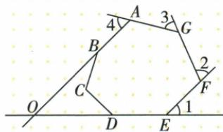
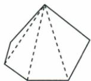
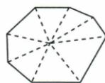
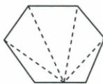
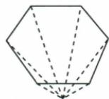

## 讲解

### 是什么

凸n边形内角和(n−2)180°；每顶点按同一走向取一个邻补外角，外角和360°。内角和随n变化，外角和不变。一个内角配的外角180减它，不得在某顶点取两个或漏顶点。

### 怎么来的

从一顶点作对角把凸形分n−2内部三角，三角各180，原各三角顶点角正好拼成全部内角，故内和。另取内部点分n三角，n180中另含中心周角360，扣得同式；边内部点分n−1三角扣180；原外点扇形覆盖多一个三角角和180，也扣180。外角每点邻补，总n180−内和(n−2)180，逐项相消余360；几何是沿边方向转一整周。原2570漏角题须先被漏内角0<α<180，再用总内和逼唯一整数，而不是S/180直接四舍五入。

### 什么时候能用

本书外角说凸形非退化且一致转向；自交星形绕转可多周，不能直接取360。简单凹形内角和仍(n−2)180，但需要合法内部三角划分；凹外转角要带符号，不能把每个小正角随意相加。本章默认凸题用0<α<180，n≥3整数是解边数最后不可漏约束。

## 例题

### 1800 540 1700 1080 810内角和逐项验整数

> 来源ID Q23-02；第23章平行四边形；251-300/full.md 第421–425行。原答案与解析定位：251-300/full.md 第427–429行。

例2 下列各度数不是多边形的内角和的是\_\_\_\_.(填序号)

①1 800°; ②540°; ③1 700°;

④1 080°; ⑤810°.

**原资料答案与解析：**

解析 由多边形内角和定理可知多边形的内角和是 $180^{\circ}$ 的整数倍.

答案 ③⑤

**展开解析（依据原详解补足理由与步骤）：**

内角和S=(n−2)180，n≥3整数。①1800/18010使n12，可；②540/1803使n5，可；③1700/180非整数，不可；④1080/1806使n8，可；⑤810/1804.5使n6.5不可。答案③⑤。仅S是180整数倍还需正且至少180，本题原列表都是正。

### 七边图四外角220转五边第五外角再补40

> 来源ID Q23-03；第23章平行四边形；251-300/full.md 第433–452行。原答案与解析定位：251-300/full.md 第454–456行。

例3 七边形 ABCDEFG 如图所示, AB、ED 的延长线相交于点 O. 若图中 $\angle1$ 、 $\angle2$ 、 $\angle3$ 、 $\angle4$ 的度数和为 $220^{\circ}$ ，则 $\angle BOD$ 的度数为

**原资料答案与解析：**

解析 在 BO 的延长线上取一点 M, 则 $\angle DOM$ 为五边形 OAGFE 的一个外角, 根据多边形的外角和为 $360^{\circ}$ , $\angle 1$ 、 $\angle 2$ 、 $\angle 3$ 、 $\angle 4$ 的度数和为 $220^{\circ}$ , 可得 $\angle DOM = 360^{\circ} - 220^{\circ} = 140^{\circ}$ , 所以 $\angle BOD = 180^{\circ} - 140^{\circ} = 40^{\circ}$ .

答案 $40^{\circ}$

**展开解析（依据原详解补足理由与步骤）：**

沿实际A-G-F-E-O组成凸五边（B落AO直线、D落EO直线），原1/2/3/4恰为其四外角。O剩余外角DOM=360−220=140，其中M在BO反向延长。BOD与DOM邻补，目标180−140=40°。不是七边全部内角和扣220，须先定位原四标角所属新五边。

### 内角和为外角和三倍四项边数8

> 来源ID Q23-04；第23章平行四边形；251-300/full.md 第472–480行。原答案与解析定位：251-300/full.md 第482–484行。

例1 若一个多边形的内角和是该多边形的外角和的3倍,则这个多边形的边数是 ( )

A.6

B.7

C.8

D.9

**原资料答案与解析：**

解析 设这个多边形的边数为 n, 根据题意有 $(n-2) \times 180^{\circ} = 3 \times 360^{\circ}$ , 解得 n = 8.

答案 C

**展开解析（依据原详解补足理由与步骤）：**

每顶点同向一外角和360，内角和3×3601080。方程(n−2)1801080，两边除180得n−2=6，再加2，n8，C。A6内720仅2倍，B7内900为2.5倍，D9内1260为3.5倍，皆不符。

### 每内角108只等角不必等边求五边

> 来源ID Q23-05；第23章平行四边形；251-300/full.md 第486–494行。原答案与解析定位：251-300/full.md 第496–500行。

例2 若一个多边形的每个内角都等于 $108^{\circ}$ , 则这个多边形是 ( )

A. 四边形

B.五边形

C.六边形

D.七边形

**原资料答案与解析：**

解析 $\because$ 多边形的每个内角均为 $108^{\circ},\therefore$ 每个外角的度数是 $180^{\circ} - 108^{\circ} = 72^{\circ}$

又∵多边形的外角和是 $360^{\circ}$ ，∴这个多边形的边数是 $360^{\circ}\div72^{\circ}=5$ .

答案 B

**展开解析（依据原详解补足理由与步骤）：**

每内角108，邻外72；每顶点一个同向外角合360，n72=360，n5，B。A4若等角各90，C6各120，D7各900/7，都不108。题只所有角等，可求边数但不能补“正五边形”，还缺各边等；原解析不需要这一补造。

### 去一内角余2570严格角界整数逼17

> 来源ID Q23-06；第23章平行四边形；251-300/full.md 第502–502行。原答案与解析定位：251-300/full.md 第504–508行。

例3 一个多边形除去一个内角后,其余内角之和是 $2570^{\circ}$ ,求这个多边形的边数.

**原资料答案与解析：**

解析 设多边形的边数为 n，则其内角和为 $(n-2)\times180^{\circ}$ .

依题意得 $ \left\{\begin{aligned}(n-2)\times180^{\circ}>2570^{\circ},\\(n-2)\times180^{\circ}<2570^{\circ}+180^{\circ},\end{aligned}\right. $ 解得 $ 16\frac{5}{18}<n<17\frac{5}{18}. $

又因为 n 是大于或等于 3 的整数, 所以 n=17, 故这个多边形的边数为 17.

**展开解析（依据原详解补足理由与步骤）：**

凸多边形被去内角α满足0<α<180。总S=2570+α，所以2570<(n−2)180<2750，同除180再加2，293/18<n<311/18，即16又5/18<n<17又5/18。唯一整数n17；总15×1802700，去角2700−2570=130在0到180，回验有效。凹角可大180会改界，原按凸多边形口径。

### 七边内角和900四选项

> 来源ID Q23-09；第23章平行四边形；251-300/full.md 第570–578行。原答案与解析定位：251-300/full.md 第602–604行。

例1（2024云南）一个七边形的内角和等于 （）

A.540°

B. $900^{\circ}$

C. $980^{\circ}$

D.1 080°

**原资料答案与解析：**

例1 解析 七边形的内角和为 $(7-2)\times180^{\circ}=900^{\circ}$ .

答案 B

**展开解析（依据原详解补足理由与步骤）：**

七边分5三角，内角和(7−2)180900，B。A540对应五边，C980非180整倍、无法构成整数边数，D1080对应八边，均非七边。

### 每外角40边数9

> 来源ID Q23-10；第23章平行四边形；251-300/full.md 第582–582行。原答案与解析定位：251-300/full.md 第606–608行。

例2 (2024 重庆 A) 如果一个多边形的每一个外角都是 $40^{\circ}$ , 那么这个多边形的边数为 \_\_\_\_.

**原资料答案与解析：**

例2 解析 这个多边形的边数为 $360^{\circ} \div 40^{\circ} = 9$ .

答案9

**展开解析（依据原详解补足理由与步骤）：**

凸多边形每顶点同向外角40，n×40=360，n9。角均等足够；不必各边等，不能因求得9就未经条件称正九边。

### 原多边内角四种分块证明和镶嵌模型

> 来源ID Q23-62；第23章平行四边形；251-300/full.md 第376–412行。原答案与解析定位：251-300/full.md 第376–412行。

# 知识点 ③ 多边形的内角和★★★ ④

n 边形的内角和等于 $(n-2)\times180^{\circ}$ .

特别地,正 n 边形每个内角的度数是 $\frac{(n-2)\times180^{\circ}}{n}$ .

知识解读 多边形内角和推导方法：

可先根据图中虚线构造多个三角形,再由三角形内角和推导.

# 知识点 ④ 多边形的外角和★★★ ⑤

在多边形的每个顶点处各取一个外角,这些外角的和叫作多边形的外角和.多边形的外角和等于 $360^{\circ}$ .正n边形的每一个外角都是 $\frac{360^{\circ}}{n}$ .

# 知识点 5 平面图形的镶嵌★☆☆

1. 概念：用形状、大小完全相同的一种或几种平面图形进行拼接，彼此之间不留空隙、不重叠地铺成一片，叫作平面图形的镶嵌，又称作平面图形的密铺。

2.镶嵌成立的首要条件：围绕一点拼在一起的几个多边形的以该点为顶点的内角的和等于 $360^{\circ}$

# 知识解读 1.用正多边形镶嵌

能进行镶嵌的正多边形有正三角形、正方形和正六边形.

2. 用一般凸多边形镶嵌

①用同一种三角形可以镶嵌.三角形的内角和是 $180^{\circ}$ ，一般地，用6个同一种三角形就可以在同一顶点处不重叠、无缝隙地镶嵌.

②用同一种四边形也能镶嵌. 四边形的内角和是 $360^{\circ}$ ，一般地，用 4 个同一种四边形就可以在同一顶点处不重叠、无缝隙地镶嵌.

**原资料答案与解析：**

# 知识点 ③ 多边形的内角和★★★ ④

n 边形的内角和等于 $(n-2)\times180^{\circ}$ .

特别地,正 n 边形每个内角的度数是 $\frac{(n-2)\times180^{\circ}}{n}$ .

知识解读 多边形内角和推导方法：

可先根据图中虚线构造多个三角形,再由三角形内角和推导.

# 知识点 ④ 多边形的外角和★★★ ⑤

在多边形的每个顶点处各取一个外角,这些外角的和叫作多边形的外角和.多边形的外角和等于 $360^{\circ}$ .正n边形的每一个外角都是 $\frac{360^{\circ}}{n}$ .

# 知识点 5 平面图形的镶嵌★☆☆

1. 概念：用形状、大小完全相同的一种或几种平面图形进行拼接，彼此之间不留空隙、不重叠地铺成一片，叫作平面图形的镶嵌，又称作平面图形的密铺。

2.镶嵌成立的首要条件：围绕一点拼在一起的几个多边形的以该点为顶点的内角的和等于 $360^{\circ}$

# 知识解读 1.用正多边形镶嵌

能进行镶嵌的正多边形有正三角形、正方形和正六边形.

2. 用一般凸多边形镶嵌

①用同一种三角形可以镶嵌.三角形的内角和是 $180^{\circ}$ ，一般地，用6个同一种三角形就可以在同一顶点处不重叠、无缝隙地镶嵌.

②用同一种四边形也能镶嵌. 四边形的内角和是 $360^{\circ}$ ，一般地，用 4 个同一种四边形就可以在同一顶点处不重叠、无缝隙地镶嵌.

**展开解析（依据原详解补足理由与步骤）：**

原四图依次从一顶点分n−2三角得(n−2)180；取内部点分n三角总n180扣中心一周360；取某边内部点分n−1三角扣该点平角180；取外点原图围成n−1三角，需要扣外点与所覆盖原边角总180，仍(n−2)180。每图按原虚线确分块，不把图外加的角当原内角。外角每点邻补，n180−内和360。正n边每角180−360/n，一种正多边密铺需k同角360，k=2n/(n−2)=2+4/(n−2)为≥3整数，n3/4/6分别k6/4/3，均可延续原铺法。一般三角两两翻转成平行四边再重复，任意凸四边绕边中点半转，四个原角围点360并按对边继续，不只角和相加就对任何多种混铺作充分判据。

## 易错

原1700/810均无法给整数n；“内角和是180整数倍”还须至少180正值。七边图先识四标外角属于新五边，不拿七边总内和乱扣。
