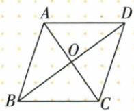
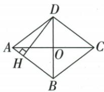

## 讲解

### 是什么

凸四边两对角垂直，面积为两条完整对角长乘积一半，不要求互平分。菱形有垂直对角所以可用，又有平行四边底×垂高；两式等可求高。没有垂直时不能无条件乘对角一半。

### 怎么来的

两对角交O，四小直角面积分别AO×BO/2、BO×CO/2、CO×DO/2、DO×AO/2；加并分组=(AO+CO)(BO+DO)/2=AC×BD/2。这里O在两有限对角内部，段都正可加。菱形互平分另使四小块全等，但公式本身不用半长相等。原24周/对角8先边6、半对角4，勾股另一半2√5再整4√5，得面积16√5；原对角8/6先面积24，半边4/3勾股边5，底高式24=5DH求24/5。

### 什么时候能用

长度同单位，面积单位平方；输入是完整AC/BD，若只OA/OB，则全面积4×OA×OB/2=2OA×OB。对于简单凹图若对角交外部，需有向/分割说明，本条原凸图不无条件沿全加。原筝形概述虽非菱形，只要凸且垂直对角也积半。

## 例题

### 菱形周长24对角8求另一对角四根5面积16根5

> 来源ID Q23-39；第23章平行四边形；251-300/full.md 第1677–1679行。原答案与解析定位：251-300/full.md 第1681–1691行。

例2 如图,已知菱形 ABCD 的周长为 24,一条对角线的长为 8,求该菱形的面积.

**原资料答案与解析：**

解析：菱形ABCD的周长为24，∴ AB=6. ∵ 一条对角线的长为 8,
∴ 不妨令 AC=8, 则 OA=4.

∵ 在菱形 ABCD 中, $AC \perp BD$ ,
∴ $\angle AOB = 90^{\circ}$ . 在 Rt $\triangle AOB$ 中，

$$
\begin{array}{l} O B = \sqrt {A B ^ {2} - O A ^ {2}} = 2 \sqrt {5}, \therefore B D = \\ 4 \sqrt {5} \therefore S _ {\text {菱形}} = \frac {1}{2} A C \cdot B D = \frac {1}{2} \times 8 \times \\ 4 \sqrt {5} = 1 6 \sqrt {5}. \\ \end{array}
$$

注意 易错在求面积时漏乘 $\frac{1}{2}$ .

**展开解析（依据原详解补足理由与步骤）：**

四边等、周24，边6。令AC8，互平分OA4；垂直对角AOB直角，OB²=6²−4²=20，OB2√5，BD2OB4√5。面积AC×BD/2=8×4√5/2=16√5。不是两对角乘积32√5，亦不可只用半对角OB不再倍回。

### 菱形对角8和6勾股边5等面积高24比5

> 来源ID Q23-42；第23章平行四边形；251-300/full.md 第1813–1813行。原答案与解析定位：251-300/full.md 第1815–1825行。

例3 如图,四边形 ABCD 是菱形,AC=8,DB=6,DH⊥AB 于点 H.求 DH 的长.

**原资料答案与解析：**

解析 $\because$ 四边形 $ABCD$ 为菱形, $AC = 8, DB = 6$ , $\therefore OA = \frac{1}{2} AC = 4, OB = \frac{1}{2} BD = 3, OA \perp OB$ ,

$$
\therefore A B ^ {2} = O A ^ {2} + O B ^ {2} = 4 ^ {2} + 3 ^ {2} = 2 5, \therefore A B = 5.
$$

$$
\because S _ {\text {菱形} A B C D} = \frac {1}{2} A C \cdot B D = A B \cdot D H, \therefore \frac {1}{2} \times 8 \times 6 = 5 D H, \therefore D H = \frac {2 4}{5}.
$$

**展开解析（依据原详解补足理由与步骤）：**

OA4、OB3且垂直，AB√(16+9)=5。全菱面积AC×BD/2=8×6/2=24；AB为底、D到AB高DH，24=5DH，DH24/5。高不是对角半长3/4，也非边5。

### 原菱形邻边与垂直对角不足两句辨析

> 来源ID Q23-61；第23章平行四边形；251-300/full.md 第1669–1673行。原答案与解析定位：251-300/full.md 第1669–1673行。

# ③ 易错辨析

1. 一组邻边相等的四边形是菱形.
(×)  
2. 对角线互相垂直的四边形不一定是菱形. (√)

**原资料答案与解析：**

# ③ 易错辨析

1. 一组邻边相等的四边形是菱形.
(×)  
2. 对角线互相垂直的四边形不一定是菱形. (√)

**展开解析（依据原详解补足理由与步骤）：**

“一组邻边等四边形菱形”假，缺平行四边基础或另两边等；“对角垂直四边形不一定菱形”真，缺互平分。若已平行四边才有互平分，垂直推出四半图直角三角全等、四边等。只垂直可成筝形，原另给筝形概述，不能自补两中点。

## 易错

漏1/2使原面积32√5多一倍；半对角没有倍回则又少一倍；底×斜边不等底×高。
