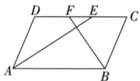
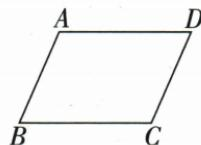
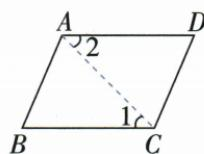
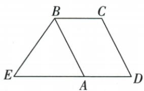

## 讲解

### 是什么

两组对边分别平行的四边形叫平行四边形。按顺序命名的ABCO中，AB与CO为一组对边，BC与OA为另一组。对边分别相等，选一边为底时，高是它与平行对边之间的垂直距离，面积底×高；斜边长度不能直接代垂高。矩形、菱形、正方形满足定义时也都是平行四边形。

### 怎么来的

对边相等可从画一条对角线说明：ABCO连AC分成△ABC与△COA。AB∥CO使∠BAC=∠OCA，BC∥AO使∠BCA=∠OAC（平行线被同一AC所截的内错角相等）；AC共同，两角及其间一边对应相等，两三角形全等，所以AB=CO、BC=OA。这里先给出相等角来自哪两条平行边，不用“看起来一样”。面积可把平行四边形一端越出的直角三角形沿底方向平移到另一端缺口，拼成同底同高的矩形，移前后形状面积不变，所以底×高。原OC在x轴、AB∥OC，B纵3使整条AB高3，故面积3=OC×3，OC=1；A与B同纵且AB=1、A在左，横由−1减1得−2。原图与辅助线如下，注意平行并不代表边都水平，只有与横轴平行的这一组才同纵。

### 什么时候能用

两组对边都平行才足够，只有一组平行不能套对边相等。命名字母须沿图的边界顺序，随意交换会将对角线当对边。面积高必须垂直所选底；斜着的OA通常不是OC的高。初次坐标例覆盖对边与底高；第23章原例已补齐对角、角及判定应用，例题来源分别列出。

本章对角性质由平行先得对边等，再在AOB/COD中平行给两内错角等、AB=CD夹边ASA，得到AO=CO、BO=DO；相邻角互补、对角等都由同旁内角相减。一对角分两全等三角，两个对角分四等面积而两两相对全等：同底高/等底中线使面积四份，相邻边OA与OB未必等。中心O半转交换A/C和B/D，故任何过O直线切两块全等，面积与周长都等；反向面积等的切线也必须过O，可将该线平移到过O的平行线，两线平行且不重合会在凸图截出正面积条带，导致原两块一大一小，矛盾。独立计算、判定与平分线原题现在均已接上，不再仅限坐标应用。

## 例题

### 平行四边形底高求双曲线点并补全原割补

> 来源ID Q15-18；第15章反比例函数；151-200/full.md 第2332–2345行。原答案与解析定位：151-200/full.md 第2273–2301行。

例5 (2024 黑龙江齐齐哈尔) 如图, 反比例函数 $y = \frac{k}{x} (x < 0)$ 的图象经过平行四边形 $ABCO$ 的顶点 $A, OC$ 在 $x$ 轴上, 若点 $B(-1,3), S_{\square ABCO} = 3$ , 则实数 $k$ 的值为 \_\_\_\_.

**原资料答案与解析：**

例5 解析 如图,延长AB交y轴于点D,∵ $B(-1,3)$ , $S_{\square ABCO}=3$ ,
∴ OC · OD = 3OC = 3,

$$
\begin{array}{r l} & {\therefore O C = 1 = B D, \text {易证} \triangle B E D \cong} \\ & {\triangle C E O, \therefore S _ {\triangle A O D} = S _ {\square A B C O} = 3,} \end{array}
$$

$$
\therefore | k | = 2 S _ {\triangle A O D} = 6,
$$

由图象知 $k<0,\therefore k=-6.$

答案 -6

**展开解析（依据原详解补足理由与步骤）：**

ABCO按图顺序是平行四边形，AB∥OC、AB=OC，OC在横轴。B(−1,3)，AB水平，A与B同高3；原面积3=OC×3，得OC=1。C在正横轴、O原点，所以C(1,0)。A在B左侧，AB=1，横−1−1=−2，故A(−2,3)，k=xy=−6，符号符合第二象限。原详解的割补也可补足：延AB交纵轴D(0,3)，BD=1=OC=1，令BC交纵轴E。△BED与△CEO中，BD、CO水平且DE、OE竖直，∠BDE=∠COE=90°；∠BED与∠CEO是两直线相交的对顶角，相等；对应边BD=CO，所以两三角形全等（两角及一边），面积相等。△AOD由四边形ABEO与△BED组成，平行四边形ABCO由同一四边形ABEO与△CEO组成，故面积都3。A到纵轴、横轴与O构成直角三角形面积|k|/2，所以|k|6；A在第二象限xy负，k=−6。这里“全等”所需角与边须说出，不能只保留原书“易证”。

### 平行四边对角8和10边5小周长14

> 来源ID Q23-12；第23章平行四边形；251-300/full.md 第646–648行。原答案与解析定位：251-300/full.md 第650–654行。

例1 如图, 已知 $\square ABCD$ 的对角线 AC, BD 交于点 O, 且 AC = 8, BD = 10, AB = 5, 则 $\triangle OCD$ 的周长为 \_\_\_\_.

**原资料答案与解析：**

解析 $\because$ 四边形 $ABCD$ 是平行四边形， $\therefore CD = AB = 5, OC = \frac{1}{2} AC = 4, OD = \frac{1}{2} BD = 5,$

∴ $\triangle OCD$ 的周长 = 5 + 4 + 5 = 14.

答案 14

**展开解析（依据原详解补足理由与步骤）：**

对边CD=AB5；互平分OC=AC/2=4、OD=BD/2=5。OCD三边相加4+5+5=14。原两对角可不等，不能取OC=OD；所给AB5不是OA5。

### 邻角平分交底线点序D F E C求EF2

> 来源ID Q23-14；第23章平行四边形；251-300/full.md 第781–790行。原答案与解析定位：251-300/full.md 第792–796行。

例1 如图, 在 $\square ABCD$ 中, $AB = 8$ , $AD = 5$ , $\angle DAB$ , $\angle ABC$ 的平分线 $AE$ , $BF$ 分别与直线 $CD$ 交于点 $E$ , $F$ , 求 $EF$ 的长.

**原资料答案与解析：**

解析 $\because$ 四边形 $ABCD$ 是平行四边形, $\therefore AD = BC = 5, AB = CD = 8, AB \parallel CD, \therefore \angle DEA = \angle EAB$ .

∵ AE 平分 $\angle DAB, \therefore \angle EAB = \angle DAE, \therefore \angle DEA = \angle DAE, \therefore DE = AD = 5.$

同理可得 $BC = CF = 5$ . $\therefore EF = DE + CF - CD = 2$ .

**展开解析（依据原详解补足理由与步骤）：**

对边CD=AB8、AD=BC5。AE平分A、AB∥CD搬角DEA=EAB=DAE，ADE等腰得DE=AD5；同理BCF等腰CF=BC5。沿原D-F-E-C共线，DE=DF+FE，CF=CE+EF，CD=DF+FE+CE；相加前两式减第三式得EF=DE+CF−CD=5+5−8=2。点序先核，若图换F/E先后目标为绝对差，不能固定用2腰减底。

### 一组平行加对角相等三种判平行四边证明

> 来源ID Q23-15；第23章平行四边形；251-300/full.md 第800–802行。原答案与解析定位：251-300/full.md 第804–818行。

例2 如图, 在四边形 ABCD 中, 如果 $AD \parallel BC, \angle B = \angle D$ , 那么四边形 ABCD 是平行四边形吗? 请说明理由.

**原资料答案与解析：**

解析 四边形 ABCD 是平行四边形.

理由一:∵ $AD \parallel BC$ , ∴ $\angle A + \angle B = 180^{\circ}$ .

$\because \angle B = \angle D, \therefore \angle A + \angle D = 180^{\circ}, \therefore AB \parallel CD, \therefore$ 四边形 $ABCD$ 是平行四边形.

理由二：∵ $AD \parallel BC, \therefore \angle A + \angle B = 180^{\circ}, \angle C + \angle D = 180^{\circ}.$

$\because \angle B = \angle D, \therefore \angle A = \angle C, \therefore$ 四边形ABCD是平行四边形.

理由三:如图所示,连接AC∵AD∥BC,∴∠1=∠2.又∵∠B=∠D,AC=CA,

$\therefore \triangle ABC \cong \triangle CDA(AAS), \therefore BC = AD, \therefore$ 四边形ABCD是平行四边形.

**展开解析（依据原详解补足理由与步骤）：**

是。法一AD∥BC给A+B180，B=D得A+D180，同旁内角互补判AB∥CD，两组平行定义。法二AD∥BC同时给A+B180、C+D180，B=D同减得A=C，与B=D两组对角等判。法三连AC，DAC=BCA为平行内错、D=B原等、AC公共为对应非夹边，AAS ABC≌CDA，BC=DA，再用同组对边平行且等。三法每个结论都未先用待证四边性质。

### 平行四边两垂足50半角求40并AAS证等距

> 来源ID Q23-17；第23章平行四边形；251-300/full.md 第847–865行。原答案与解析定位：251-300/full.md 第867–879行。

例4 如图,在平行四边形 ABCD 中,对角线 AC,BD 相交于点 O,分别过点 A,C 作 $AE \perp BD, CF \perp BD$ ,垂足分别为 E,F.AC 平分 $\angle DAE$ .

(1) 若 $\angle AOE = 50^{\circ}$ ，求 $\angle ACB$ 的度数.

(2) 求证: AE = CF.

**原资料答案与解析：**

解析（1）∵ $AE \perp BD, \therefore \angle AEO = 90^{\circ}$ ，又∵ $\angle AOE = 50^{\circ}, \therefore \angle EAO = 40^{\circ}$ .

∵ AC 平分 $\angle DAE, \therefore \angle OAD = \angle EAO = 40^{\circ}.$

∵ 四边形 ABCD 是平行四边形, ∴ $AD \parallel BC$ . ∴ $\angle ACB = \angle OAD = 40^{\circ}$ .

(2) 证明: ∵ 四边形 ABCD 是平行四边形, ∴ AO = CO.

∵ $AE \perp BD, CF \perp BD, \therefore \angle AEO = \angle CFO = 90^{\circ}.$

在 $\triangle AEO$ 和 $\triangle CFO$ 中， $\angle AEO = \angle CFO, \angle EOA = \angle FOC, AO = CO,$

$\therefore \triangle AEO \cong \triangle CFO(AAS) \therefore AE = CF.$

**展开解析（依据原详解补足理由与步骤）：**

(1)AEO直角，AOE50使EAO40；AC平分DAE给OAD40；AD∥BC内错ACB40。(2)AO=CO来自对角互平分，AEO/CFO两直角、EOA/FOC对顶，给对应角及非夹边AO=CO，AAS全等，AE=CF。这里原两垂线垂直同BD但长度相等由原中心对称或全等，不是“任何两垂线总等”。

### 角平分平行造成AE等BE3再加AD2得5

> 来源ID Q23-18；第23章平行四边形；251-300/full.md 第883–895行。原答案与解析定位：251-300/full.md 第942–964行。

例1（2024 广东广州）如图，□ABCD 中，BC=2，点 E 在 DA 的延长线上，BE=3，若 BA 平分 $\angle EBC$ ，则 DE= \_\_\_\_.

**原资料答案与解析：**

例1 解析 在□ABCD 中, BC // AD, AD = BC = 2,

$$
\therefore \angle C B A = \angle B A E.
$$

$$
\because B A \text {   平分   } \angle E B C,
$$

$$
\therefore \angle C B A = \angle E B A,
$$

$$
\therefore \angle B A E = \angle E B A, \therefore B E = A E = 3,
$$

$$
\therefore D E = A D + A E = 2 + 3 = 5.
$$

答案 5

**展开解析（依据原详解补足理由与步骤）：**

BC∥AD，E在DA延长，AD=BC2。以AB截平行线给CBA=BAE；BA内部平分EBC给CBA=EBA。ABE同三角两等角使AE=BE3，原D-A-E按序DE=DA+AE=2+3=5。A不能被误取DE中点，原没有此条件。

### 边两端等截同减SAS再补AF等BE

> 来源ID Q23-20；第23章平行四边形；251-300/full.md 第921–938行。原答案与解析定位：251-300/full.md 第994–1013行。

例3（2024 湖北武汉）如图，在□ABCD 中，点 E, F 分别在边 BC, AD 上, AF = CE.

(1) 求证: $\triangle ABE \cong \triangle CDF.$

(2) 连接 EF. 请添加一个与线段相关的条件, 使四边形 ABEF 是平行四边形。(不需要说明理由)

**原资料答案与解析：**

例3 解析（1）证明：∵ 四边形
ABCD 是平行四边形，

$$
\therefore A B = C D, A D = B C, \angle B = \angle D,
$$

$$
\because A F = C E,
$$

$$
\therefore A D - A F = B C - C E \text {, 即} D F = B E,
$$

$$
\therefore \triangle A B E \cong \triangle C D F (\mathrm{SAS}).
$$

(2)AF=BE.(答案不唯一)

**展开解析（依据原详解补足理由与步骤）：**

(1)原AB=CD、AD=BC、B=D，且AF=CE。同减AD−AF=BC−CE给DF=BE。ABE/CDF的AB=CD、BE=DF、B=D夹角，SAS全等。(2)原AF∥BE，因为分别在AD/BC，添AF=BE，同组对边平行且等判ABEF。原只需条件，仍给其理由；不能添已经原给AF=CE再宣称充分。

### 原平行四边三句及四边从属六句辨析

> 来源ID Q23-60；第23章平行四边形；251-300/full.md 第656–661；2049–2056行。原答案与解析定位：251-300/full.md 第656–661行；251-300/full.md 第2049–2056行。

# ③ 易错辨析

1. 平行四边形是轴对称图形.
(×)  
2. 平行四边形的邻角互补. (√)  
3. 平行四边形被两条对角线分割而成的 4 个三角形全等. (×)

# ③ 易错辨析

1. 只有正方形既具有菱形的性质又具有矩形的性质. （√）  
2. 平行四边形一定不是轴对称图形. (×)  
3. 正方形的中点四边形依然是正方形. (√)  
4. 矩形的对角线可能互相垂直，菱形的对角线可能相等。（√）  
5. 特殊平行四边形中，正方形的对称轴条数最多，为4。（√）  
6. 正方形和菱形的面积都等于对角线长的乘积的一半。（√）

**原资料答案与解析：**

# ③ 易错辨析

1. 平行四边形是轴对称图形.
(×)  
2. 平行四边形的邻角互补. (√)  
3. 平行四边形被两条对角线分割而成的 4 个三角形全等. (×)

# ③ 易错辨析

1. 只有正方形既具有菱形的性质又具有矩形的性质. （√）  
2. 平行四边形一定不是轴对称图形. (×)  
3. 正方形的中点四边形依然是正方形. (√)  
4. 矩形的对角线可能互相垂直，菱形的对角线可能相等。（√）  
5. 特殊平行四边形中，正方形的对称轴条数最多，为4。（√）  
6. 正方形和菱形的面积都等于对角线长的乘积的一半。（√）

**展开解析（依据原详解补足理由与步骤）：**

原平行三句×√×：一般只中心对称、不保轴，但特殊矩形菱形有轴；邻角互补由平行同旁；对角两两相对三角全等而四块只等面积、不都全等。原特殊六句√×√√√√：正方为矩形与菱形交类；“平行四边一定不轴”排除特殊成员，错误；正方中点四边由原对角等且垂直仍正方；矩形可垂直或菱形可等是正方特例；正方4轴最多；菱形/正方垂直对角面积积半。量词“可能”“一定”要分开，不能误把一般不保证写成绝不。

## 易错

原面积3不代表某条边3；B横−1不是高，高是纵的绝对值3。将AB与BC配为对边会破坏整个坐标推理。
