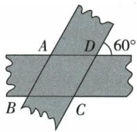

## 讲解

### 是什么

两不同平行直线之间的距离，是一线任一点到另一线的垂直距离，处处同一正值。连接两线的两条互相平行线段也等长，但斜段一般长于垂距；“平行跨段等长”不表示所有跨段都等。

### 怎么来的

原从同一平行线A/B向另一线作AC/BD垂线，两垂线同方向平行，原AB∥CD，所以ABDC平行四边，AC=BD，证明垂距恒定。另一示意AB/CD都跨两线且互平行，可构两组平行四边，得AB=CD，斜方向改变可变长度。等宽纸条两组垂距各3，面积以两邻边为底都“底×3”，同一面积除正3得两邻边等，才判菱形；宽3并不是纸条重叠的边长。

### 什么时候能用

比较两条所在整直线、两线不相交，有限纸条端部需原重叠在条内。求底高必须垂直所选底；水平看图不是定义。两斜跨段要互相平行且端点分别在两线，若只任意连接端点，不保证等长。原理论两张图与纸条原题有实际配套，不自编距离题。

## 例题

### 等宽3纸条交角60先平行同高证菱形周8根3

> 来源ID Q23-46；第23章平行四边形；251-300/full.md 第1936–1948行。原答案与解析定位：251-300/full.md 第1881–1885行。

例3 (2024 广西) 如图, 两张宽度均为 $3 \mathrm{~cm}$ 的纸条交叉叠放在一起, 交叉形成的锐角为 $60^{\circ}$ , 则重合部分构成的四边形ABCD的周长为 \_\_\_\_ cm.

**原资料答案与解析：**

例3 解析 由题意知两张纸条对边分别平行且宽度相等, 易证四边形 ABCD 为菱形, 过点 C 作 CE ⊥ AD, 垂足为 E.

由题意可得 $\angle CDA = 60^{\circ}$ ，所以 $CE$ $= CD\sin 60^{\circ} = 3$ ，则 $CD = 2\sqrt{3}$ ，所以四边形ABCD的周长为 $8\sqrt{3}\mathrm{cm}$

答案 $8\sqrt{3}$

**展开解析（依据原详解补足理由与步骤）：**

两纸条边线各组平行，重叠ABCD先平行四边。两对边线间垂距都3；面积用邻边作底分别AD×3和CD×3，等面积除正3得AD=CD，判菱形。原图外60与内部D邻补，所以内D120；原解析写“CDA60”与图不符，纠正单列：作CE⊥AD，垂足E在AD越D的延长线上，CDE180−120=60，DCE30。直角CDE，DE=CD/2，勾股CE²=CD²−(CD/2)²=3CD²/4；CE3给CD²12，CD2√3，周8√3 cm。原用sin60结果同，但本章用30+勾股即可，不必先学后章三角函数。

## 易错

纸条3是高，交60时斜边2√3；直接周4×3=12忽略斜距与垂距区别。
