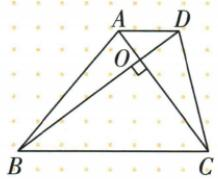
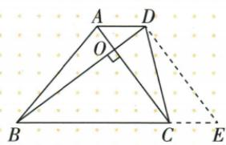
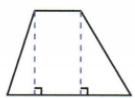
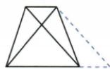
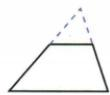
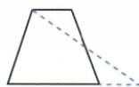
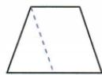
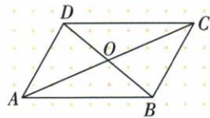
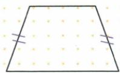

## 讲解

### 是什么

本资料梯形恰有一组对边平行、另一组不平行。平行组为上下底，另外两条为腰；不同于把至少一组平行都叫梯形的其他定义。一般梯形不必轴对称，但不会中心对称，因为半转若重合会使两组对边平行。

### 怎么来的

原辅助五图各有目标：两高把腰和底差纳入直角求边；平移一对角线构平行四边把它保持长度送到另对角同三角；延两腰造公共角两三角方便相似；一腰中点连接并延长，半腰等与平行内错ASA把一块等面积转到另一端，梯形面积化三角；平移腰将一块变平行四边并余三角，使两腰和两底差成为三边。原6/8垂直对角题用平移AC，DE6与BD8在D90小三角，BE10恰上下底和。辅助不是任意多画线，先看目标需要把哪两条散边放在同三角。

### 什么时候能用

若已两组平行应归平行四边不叫本口径梯形。上底延长与各交点必须存在并取正确侧；延腰共顶角不自动两三角全等，尺度通常相似。五图是原理论模型，只有平移对角数字例已有配套，不宣称其余四法都另有独立原题。

## 例题

### 垂直对角梯形平移AC使上下底和10厘米

> 来源ID Q23-49；第23章平行四边形；251-300/full.md 第2075–2087行。原答案与解析定位：251-300/full.md 第2089–2109行。

例3 如图,在梯形 ABCD 中, $AD \parallel BC, AC \perp BD$ . 若 $AC = 6 \, cm, BD = 8 \, cm$ , 求梯形 ABCD 的上、下底之和.

**原资料答案与解析：**

解析 如图, 过点 D 作 DE // AC 交 BC 延长线于点 E.

∵ AC∥DE, AD∥CE,

∴ 四边形 ACED 是平行四边形，

$\therefore DE=AC=6\ cm, CE=AD,$

∵ AC∥DE, AC⊥BD, ∴ DE⊥BD,

$\therefore BE=\sqrt{BD^{2}+DE^{2}}=10\ cm,$

$\therefore BC+AD=BC+CE=BE=10\ cm.$

**展开解析（依据原详解补足理由与步骤）：**

过D作DE∥AC交BC延长E，AD∥CE原底平行，ACED平行四边，DE=AC6、CE=AD。原AC⊥BD，又DE∥AC使DE⊥BD，BDE直角D，BE²=BD²+DE²=64+36=100，BE10。B-C-E依次，BE=BC+CE=BC+AD，就是上下底和10 cm。梯形对角不互平分，不能直接用各半3/4求底。

### 原梯形五种辅助线构造对象

> 来源ID Q23-65；第23章平行四边形；251-300/full.md 第2144–2175行。原答案与解析定位：251-300/full.md 第2144–2175行。

# 知识解读 梯形

一组对边平行,另一组对边不平行的四边形叫作梯形.梯形中平行的一组对边叫作梯形的底,不平行的一组对边叫作梯形的腰.

梯形不一定是轴对称图形,一定不是中心对称图形.

# 技巧总结 梯形中常见的辅助线的作法 5

(1)作高:使两腰在两个直角三角形中,如图①.

(2) 平移对角线: 使两条对角线在同一个三角形中, 如图②.

(3)延长两腰:构造具有公共角的两个三角形,如图③.

(4)等积变形:连接梯形一腰的端点和另一腰的中点并延长,与底边的延长线交于一点,构造全等三角形,如图④.

(5)平移腰:过上底端点作一腰的平行线,构造一个平行四边形和一个三角形,如图⑤.

  
图①

  
图②

  
图③

  
图④

  
图⑤

**原资料答案与解析：**

# 知识解读 梯形

一组对边平行,另一组对边不平行的四边形叫作梯形.梯形中平行的一组对边叫作梯形的底,不平行的一组对边叫作梯形的腰.

梯形不一定是轴对称图形,一定不是中心对称图形.

# 技巧总结 梯形中常见的辅助线的作法 5

(1)作高:使两腰在两个直角三角形中,如图①.

(2) 平移对角线: 使两条对角线在同一个三角形中, 如图②.

(3)延长两腰:构造具有公共角的两个三角形,如图③.

(4)等积变形:连接梯形一腰的端点和另一腰的中点并延长,与底边的延长线交于一点,构造全等三角形,如图④.

(5)平移腰:过上底端点作一腰的平行线,构造一个平行四边形和一个三角形,如图⑤.

  
图①

  
图②

  
图③

  
图④

  
图⑤

**展开解析（依据原详解补足理由与步骤）：**

原定义恰一组对边平行，不能叫平行四边。五图依次：作两高把腰拆成直角三角；平移对角通过平行四边把原两对角转入同一三角；延两腰交点使上下底成两个共顶角三角；连一腰端到另一腰中点再延，以两半腰及平行角ASA构等面积块把梯形转三角；平移一腰造平行四边，剩三角两腰为原腰、底为两底差。这些是原示意构造并非独立数值题，不能称都已另有原题计算覆盖。

### 五组条件只有异组平行相等不足

> 来源ID Q23-13；第23章平行四边形；251-300/full.md 第741–759行。原答案与解析定位：251-300/full.md 第761–765行。

例2 如图, 四边形 ABCD 中, 对角线 AC, BD 交于点 O, 下列条件不能判定这个四边形是平行四边形的是 \_\_\_\_. (填序号)

① $AB \parallel CD, AD \parallel BC;$   
② $AB \parallel CD, AD = BC;$   
③AO=CO,BO=DO;   
④AB=CD,AD=BC;   
⑤AB∥CD,∠ABC=∠ADC.

**原资料答案与解析：**

答案 ②

注意 一组对边平行，另一组对边相等的四边形不一定是平行四边形，也可能是等腰梯形.

**展开解析（依据原详解补足理由与步骤）：**

①两组对边平行，定义成立；②AB∥CD但AD=BC是另一组等腰，可为原等腰梯形，不足；③OA=OC且OB=OD互平分，成立；④两组对边相等，成立；⑤AB∥CD给A+B180，B=D代入A+D180再判AD∥BC，成立。不能判仅②。原等腰梯形图是实际错法证据，不自编数字反例。

## 易错

梯形两对角不默认互平分，原6/8不能各半求底。原自动Mermaid混成“矩形三直角→梯形”是识别错，正文用原图正确从属表。
