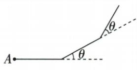
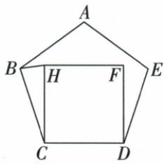
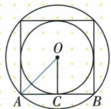
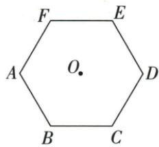
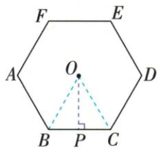
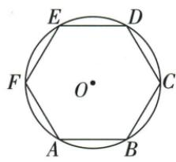

## 讲解

### 是什么

各边等长且各内角相等的凸多边形叫正多边形，两项同时要有。正n边每内角(n−2)180/n=180−360/n，每外角360/n。等角多边形也能用每角除总和算边数，但未经等边不能称“正”。

### 怎么来的

n角都等，内角总和除n得到每内角；其邻补外角180−这个角，通分n180−(n−2)180=360，除n为360/n。等边确保形状规则、原正五边中BC=CD，等角确保C108，两项再配原内部正方CH=CD、C直角90，才把BCH变18顶角等腰。正n边围中心均分一周为n等中心角，每次旋360/n重合；翻折轴共n条，偶n含过对顶与过对边中点两类，奇n过一顶和其对边中点；半转180是整数次基本旋转仅当n偶，所以偶n中心对称、奇n不中心对称。

### 什么时候能用

按原n≥3、等长为正、凸非退化；正三边是等边、正四边是正方。原每角108只保证等角可求五边，不补各边等。左转行走原按图简单凸闭合可当正形；若允许自交，同长同转第一次闭合可为星形，原概述条件不足，不能推固定一周360。

第24章补全与圆的联系：正n边形顶点n等分一周，每边对应中心角360°/n；正形内外接圆共中心，边心距是内切半径，中心到顶点为外接半径。连中心到所有顶点得n个全等等腰三角，向边作高各得半边直角；因此R²=r²+(a/2)²，面积为n个ar/2相加即周长乘r的一半。正形n轴与旋转最小角360°/n来自各等分点对应；偶n时180°为基本转角的整数倍，有中心对称，奇n则无此半转重合。原72中心角、正方半径比、六边亭子周面积与内切半径例均已补齐，不能把六边a=R推广任意n。

## 例题

### 每内角108只等角不必等边求五边

> 来源ID Q23-05；第23章平行四边形；251-300/full.md 第486–494行。原答案与解析定位：251-300/full.md 第496–500行。

例2 若一个多边形的每个内角都等于 $108^{\circ}$ , 则这个多边形是 ( )

A. 四边形

B.五边形

C.六边形

D.七边形

**原资料答案与解析：**

解析 $\because$ 多边形的每个内角均为 $108^{\circ},\therefore$ 每个外角的度数是 $180^{\circ} - 108^{\circ} = 72^{\circ}$

又∵多边形的外角和是 $360^{\circ}$ ，∴这个多边形的边数是 $360^{\circ}\div72^{\circ}=5$ .

答案 B

**展开解析（依据原详解补足理由与步骤）：**

每内角108，邻外72；每顶点一个同向外角合360，n72=360，n5，B。A4若等角各90，C6各120，D7各900/7，都不108。题只所有角等，可求边数但不能补“正五边形”，还缺各边等；原解析不需要这一补造。

### 等长左转每段5总60首次闭合四项30

> 来源ID Q23-07；第23章平行四边形；251-300/full.md 第514–532行。原答案与解析定位：251-300/full.md 第534–536行。

例4 小磊利用最近学习的数学知识,给同伴出了这样一道题:如图,假如从点 A 出发,沿直线走 5 米后向左转 $\theta$ ,接着沿直线前进 5 米后,再向左转 $\theta$ ,……如此下去,当他第一次回到 A 点时,发现自己走了 60 米,则 $\theta$ 为 ( )

A. ${28}^{ \circ  }$

B. $30^{\circ}$

C. $33^{\circ}$

D. $36^{\circ}$

**原资料答案与解析：**

解析 由题意得第一次回到出发点 A 时, 所经过的路线正好构成一个正多边形, ∴ 正多边形的边数为 $60 \div 5 = 12$ , ∵ 正多边形的外角和为 $360^{\circ}$ , ∴ $\theta = 360^{\circ} \div 12 = 30^{\circ}$ .

答案 B

**展开解析（依据原详解补足理由与步骤）：**

原图按简单凸闭合路线，每边5、总60，边数12，走一周同向转角总360，每次30，B。A28若12段总336不闭合，C33总396，D36周期10会首次50米回出发，不合60。本题选项只有B满足。原详解“等长同转首次闭合就必正多边形”忽略自交星形路线可能多周转360的整数倍；本条注明按原图凸路线，不将概述推广所有转角。

### 正五边108配内作正方90等腰底角81

> 来源ID Q23-11；第23章平行四边形；251-300/full.md 第586–596行。原答案与解析定位：251-300/full.md 第610–618行。

例3 (2024 宁夏)如图,在正五边形 ABCDE 的内部,以 CD 边为边作正方形 CDFH,连接 BH,则 $\angle BHC=$ \_\_\_\_°.

**原资料答案与解析：**

例3 解析 在正五边形 ABCDE 中, BC = CD, $\angle BCD = (5 - 2) \times 180^{\circ} \div 5 = 108^{\circ}$ ,

在正方形 CDFH 中, CH = CD, $\angle DCH=90^{\circ}$ ,

$\therefore \angle BCH = \angle BCD - \angle DCH = 18^{\circ},$ $BC = CH,$

$\therefore \angle BHC = (180^{\circ} - 18^{\circ}) \div 2 = 81^{\circ}$ .

答案81

**展开解析（依据原详解补足理由与步骤）：**

正五边BC=CD、C内108；内部正方CDFH给CH=CD、DCH90。原CH在BCD内部，BCH108−90=18，BC=CH。同一BCH等腰两底BHC/CBH相等，二角和162，每角81。108是五边角不是目标底角，正方以CD为边不是以BC为边。

### 原多边形五句及正多边两句辨析

> 来源ID Q23-59；第23章平行四边形；251-300/full.md 第282–289；414–417行。原答案与解析定位：251-300/full.md 第282–289行；251-300/full.md 第414–417行。

# 1 易错辨析

1. 三角形是最简单的多边形.  
(√)   
2. 多边形的边数、顶点数及角的个数相等. (√)  
3.三角形没有对角线. (√)  
4. 多边形的任一内角是与其相邻的外角的邻补角. （√）  
5.一个 n 边形，截去一个角后，形成的新多边形的边数一定为 n-1. (×)

# 3 易错辨析

1. 每个内角都相等的多边形是正多边形. (×)   
2. 每条边都相等的多边形是正多边形. (×)

**原资料答案与解析：**

# 1 易错辨析

1. 三角形是最简单的多边形.  
(√)   
2. 多边形的边数、顶点数及角的个数相等. (√)  
3.三角形没有对角线. (√)  
4. 多边形的任一内角是与其相邻的外角的邻补角. （√）  
5.一个 n 边形，截去一个角后，形成的新多边形的边数一定为 n-1. (×)

# 3 易错辨析

1. 每个内角都相等的多边形是正多边形. (×)   
2. 每条边都相等的多边形是正多边形. (×)

**展开解析（依据原详解补足理由与步骤）：**

前四句真：三角最少3边；一边邻一顶点对应循环数量；三角任两点都相邻没有对角；凸内角与其邻外角180。第五截一角边数恒n−1假：切线交两邻边内部，删旧顶点增加两个新顶点，边数n+1；切线过一个邻顶点只增加一个新点，边数n；两邻顶点都连接删旧顶点，边数n−1，但需保剩余有效多边形。原正多边辨析两句都假：仅等角未给等边（普通非正方矩形）、仅等边未给等角（非直角菱形）不足，原后续分类提供这种结构证据。

### 正多边中心72求五边内角和540

> 来源ID Q24-36；第24章圆；251-300/full.md 第4043–4043行。原答案与解析定位：251-300/full.md 第4045–4049行。

例1 如果一个正多边形的中心角等于 $72^{\circ}$ ，那么这个正多边形的内角和为 \_\_\_\_。

**原资料答案与解析：**

解析 根据正 n 边形的每个中心角都等于 $\frac{360^{\circ}}{n}$ ，可得 n=5，

所以这个正多边形的内角和为 $180^{\circ}\times(5-2)=540^{\circ}$ .

答案 540

**展开解析（依据原详解补足理由与步骤）：**

正n边形的相邻顶点等分圆周，中心角360°/n=72°。两边乘n再除72，n=360/72=5。内角和为(5−2)×180°=540°。中心角72°不是内角；该正五边形每内角108°，五个相加也540°。

### 正方内切外接半径与边长比1根2比2四项

> 来源ID Q24-37；第24章圆；251-300/full.md 第4053–4057行。原答案与解析定位：251-300/full.md 第4059–4077行。

例2 已知边长为 a 的正方形的内切圆的半径为 r，外接圆的半径为 R，则 r:R:a= （）

A. $1:1:\sqrt{2}$ B. $1:\sqrt{2}:2$

C. $1: \sqrt{2}: 1$ D. $\sqrt{2}: 2: 4$

**原资料答案与解析：**

解析 作出示意图如下.

线段 OA 的长是正方形外接圆的半径 R，线段 OC 的长是正方形内切圆的半径 r, AB = a，易得 $AC = \frac{1}{2}AB = \frac{a}{2}, \angle AOC = 45^{\circ}$ ,

$$
\therefore O C = A C = \frac {a}{2}, O A = \sqrt {2} A C = \frac {\sqrt {2}}{2} a,
$$

$$
\therefore r: R: a = \frac {a}{2}: \frac {\sqrt {2}}{2} a: a = 1:
$$

$$
\sqrt {2}: 2.
$$

答案 B

**展开解析（依据原详解补足理由与步骤）：**

内切半径r是中心到边中点距离，为边长a的一半；外接半径R是半对角线，对角线由勾股为√2a，故R=√2a/2。三数(a/2):(√2a/2):a同除正数a/2，得1:√2:2，B。A把内外半径当一样大，C把a/r错成1，D按首项缩为1时得到1:√2:2√2而非所需2，均不正确。

### 亭子正六边外接半径4周24面积24根3

> 来源ID Q24-38；第24章圆；251-300/full.md 第4118–4140行。原答案与解析定位：251-300/full.md 第4142–4157行。

例 如图,有一个亭子,它的地基是半径为4 m的正六边形,求该地基的周长和面积.

**原资料答案与解析：**

解析 连接 OB, OC, 过点 O 作 $OP \perp BC$ 于点 P. 因为六边形 ABCDEF 是正六边形, 所以它的中心角等于 $\frac{360^{\circ}}{6} = 60^{\circ}$ , 所以 $\triangle OBC$ 是等边三角形, 所以 OB = OC = BC = 4 m, 设该地基的周长为 l，则 $l=6\times4=24(m)$ . 在 Rt△OPC 中，OC=4 m, $PC=\frac{BC}{2}=2\ m$ ，由勾股定理得 $OP=\sqrt{4^{2}-2^{2}}=2\sqrt{3}$ (m)，设该地基的面积为 S，则 $S=\frac{1}{2}l\cdot OP=\frac{1}{2}\times24\times2\sqrt{3}=24\sqrt{3}$ ( $m^{2}$ ).

**展开解析（依据原详解补足理由与步骤）：**

连OB/OC，六个中心角均360°/6=60°，OB=OC=4，因此△OBC为等边，BC=4 m。周长6×4=24 m。作OP⊥BC，垂径定理给PC=2 m；勾股OP²=4²−2²=12，OP=2√3 m。六个中心三角底高相同，相加面积=周长×边心距/2=24×2√3/2=24√3 m²。原“半径”是外接半径4，不是边心距4。

### 正六边边2等边中心三角勾股内切半径根3四项

> 来源ID Q24-39；第24章圆；251-300/full.md 第4169–4191行。原答案与解析定位：251-300/full.md 第4163–4165行。

例（2024 山东济宁）如图, 边长为 2 的正六边形 ABCDEF 内接于 $\odot O$ , 则它的内切圆半径为 ( )

A.1

B.2

C. $\sqrt{2}$

D. $\sqrt{3}$

**原资料答案与解析：**

例 解析 连接 OA, OB, 过点 O 作 $OG \perp AB$ 于点 G, 由题意得 $\triangle OAB$ 是边长为 2 的等边三角形, 所以 $\odot O$ 的内切圆半径 $OG = OA \cdot \sin 60^{\circ} = \sqrt{3}$ .

答案 D

**展开解析（依据原详解补足理由与步骤）：**

正六边的中心角60°且两边为半径，所以中心小三角等边，外接半径等于边长2。中心向边作垂线，半边为1，内切半径平方2²−1²=3，故r=√3，D。A1是半边；B2是外接半径；C√2的平方2不满足此直角三角形。原解析“⊙O的内切圆”应理解为正六边形的内切圆，不是圆本身再有一个指定内切圆。

## 易错

仅等角的普通矩形或仅等边的斜菱形都可能不正，原辨析提供结构错因；正五边角108不是每个内部小三角角。
