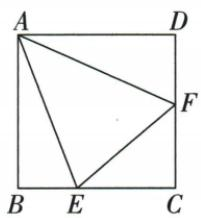
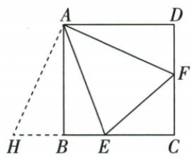

## 讲解

### 是什么

原正方A90，E在BC、F在CD且EAF45，旋转ADF90至ABG可得到BE+DF=EF。半角固定45加实际边点位置共同保证辅助点G、B、E共线可相加；不因任意正方背景都成立。

### 怎么来的

旋A使AD像AB、F像G，AG=AF、BG=DF、BA G=DAF。把A直角分BAE+EAF+FAD，给EAF45后BAE+FAD45。故EAG=BAE+BAG45=EAF。AE公共、AG=AF与夹角45，SAS AEG≌AEF，EG=EF。原G-B-E按序，EG=GB+BE=DF+BE。面积也等，AEG以BC整线作底EG，高AB为方边，原8题EF8所以面积8×8/2=32。原数值用了EF与方边两8，不只是图形“半角”名称。

### 什么时候能用

E/F原有限边与指定角；在延长线上时公共角加减、辅助点序会变，需另证，不套同和式。旋转是整三角绕同A同角，不把只一边移动当刚体。边端退化需直接面积判，而通常SAS用非退化图。

## 例题

### 正方8半角45旋转全等使面积32四项

> 来源ID Q23-55；第23章平行四边形；251-300/full.md 第2360–2381行。原答案与解析定位：251-300/full.md 第2383–2405行。

例6 如图,已知正方形 ABCD 的边长为 8 ,点 E,F 分别在边 BC,CD 上, $\angle {EAF} = {45}^{ \circ  }$ .当 ${EF} = 8$ 时, $\bigtriangleup  {AEF}$ 的面积是 (   )

A.8

B.16

C.24

D.32

**原资料答案与解析：**

解析 将 $\triangle ADF$ 绕点 $A$ 顺时针旋转 $90^{\circ}$ 得到 $\triangle ABH$ , 则有 $AH = AF, \angle BAH = \angle DAF$ ,

$\because \angle EAF = 45^{\circ}, \therefore \angle EAH = \angle BAE + \angle DAF = 45^{\circ} = \angle EAF.$ 易证 $\triangle AEF \cong \triangle AEH, \therefore EH = EF = 8.$

$$
\therefore S _ {\triangle A E F} = S _ {\triangle A E H} = \frac {1}{2} \times 8 \times 8 = 3 2.
$$

答案 D

**展开解析（依据原详解补足理由与步骤）：**

按原把ADF绕A顺时针90到ABH，H在BC过B的反向延长，AH=AF、BH=DF、BAH=DAF。正方A90，EAF45使BAE+DAF45；故EAH=BAE+BAH45=EAF。AE公共、AH=AF、夹角45，SAS AEF≌AEH，EH=EF8。E-H-B共线且A到该直线垂距AB8，AEH面积8×8/2=32，D。A8只取EF数值，B16误又半一次，C24不满足原底高；原不是“45自动半个正方”，面积此值用了EF8。

### 原正方十字半角中心直角三模型

> 来源ID Q23-64；第23章平行四边形；251-300/full.md 第2320–2330行。原答案与解析定位：251-300/full.md 第2320–2330行。

# 1. 十字模型

| 图示 |  |  |  |
| --- | --- | --- | --- |
| 模型说明 | 在正方形ABCD中,若AE⊥BF,则AE=BF | 在正方形ABCD中,若AE⊥FH,则AE=FH | 在正方形ABCD中,若GE⊥FH,则GE=FH |

# 2. 半角模型

| 图示 |  |
| --- | --- |
| 模型说明 | 正方形ABCD中,若∠EAF=45°,则BE+DF=EF(可将△ADF旋转到△ABG的位置进行证明) |

# 3. 中心直角模型

| 图示 |  模型迁移   |
| --- | --- |
| 模型说明 | 正方形ABCD中,若 $\angle {EOF} = {90}^{ \circ }$ ,则 $\triangle {BOE} \cong \triangle {COF}$ ,故四边形BEOF的面积=  $\triangle {BOC}$  的面积=正方形ABCD面积的四分之一 |

**原资料答案与解析：**

# 1. 十字模型

| 图示 |  |  |  |
| --- | --- | --- | --- |
| 模型说明 | 在正方形ABCD中,若AE⊥BF,则AE=BF | 在正方形ABCD中,若AE⊥FH,则AE=FH | 在正方形ABCD中,若GE⊥FH,则GE=FH |

# 2. 半角模型

| 图示 |  |
| --- | --- |
| 模型说明 | 正方形ABCD中,若∠EAF=45°,则BE+DF=EF(可将△ADF旋转到△ABG的位置进行证明) |

# 3. 中心直角模型

| 图示 |  模型迁移   |
| --- | --- |
| 模型说明 | 正方形ABCD中,若 $\angle {EOF} = {90}^{ \circ }$ ,则 $\triangle {BOE} \cong \triangle {COF}$ ,故四边形BEOF的面积=  $\triangle {BOC}$  的面积=正方形ABCD面积的四分之一 |

**展开解析（依据原详解补足理由与步骤）：**

十字：E在CD，F在AD，比较△ADE与△BAF。∠ADE=∠BAF=90°，AD=BA；AE⊥BF且AD⊥BA，使∠DAE=∠ABF。按ASA，△ADE≌△BAF，对应斜边AE=BF。若FH从AD到BC替代BF，过B作FH的平行线交AD于F′；两段在同组平行边间同向，所以BF′=FH，且BF′⊥AE，退回第一图得AE=BF′=FH。若GE从AB到CD，过A作GE的平行线交CD于E′，同理AE′=GE；再将FH平行搬到B起点，按第一图得到GE=FH。要求原三图都是两对边之间的完整段，不能任取半截。

半角：把ADF旋90到ABG，G在BC经B外，AG=AF、BG=DF。正方90减原EAF45给EAG=EAF45，AE公共SAS AEG≌AEF，EG=EF；G-B-E同线EG=BG+BE=DF+BE。

中心直角：原正方O中心、E∈AB、F∈BC且EOF90，OB=OC、OBE=OCF45，BOE与COF的O角由中心相邻射线90共减得到相等，ASA全等；两小面积等，替换一块后BEOF面积为BOC面积，即正方四分之一。原两张迁移示意只画一般直角三角未写等腰/等距条件，不能直接无条件搬“全等及四分之一”，保原图同时登记缺条件。

## 易错

原旋后G在B外不是BC中点；目标面积不是先看“45半90”就说半正方面积，而是全等转到底EG已知、高AB。
