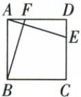
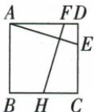
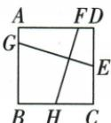
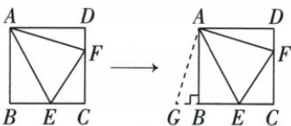
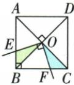
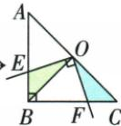
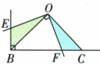
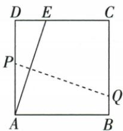
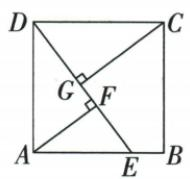

## 讲解

### 是什么

原正方形三十字图分别AE⊥BF、AE⊥FH、GE⊥FH，得对应两条跨对边的完整截段等长。两方向各跨一组相对边，正方形两组垂距相等；不是凡两垂线段都等。

### 怎么来的

第一图比较△ADE与△BAF。E在CD、F在AD，因此∠ADE与∠BAF都为90°；正方形给AD=BA。又因AE⊥BF、AD⊥BA，∠DAE与∠ABF都是同一角的余角，故相等。这两组等角之间的边AD、BA对应相等，按ASA判△ADE≌△BAF，对应斜边AE=BF。后图FH不从B起，可过B作与FH平行段到AD，该段与FH在同组平行边之间且同向，所以等长；保持与AE垂直退回第一图。GE也不从A起，可过A作与GE平行段到CD，平行同向跨边等长，再同证。原三张图都以完整跨边段为对象，端点滑动只是平行搬线，保持同宽。

### 什么时候能用

要求正方形，普通长方形两组宽不同，垂直截段未必等；只半截线也不等。角接近边时可端点落顶点，直接坐标/边界长度核，退化小三角不强套通常全等。原折痕13题也把两互垂方向与同宽12组织成ASA全等，但需原折后距离条件。

## 例题

### 原正方十字半角中心直角三模型

> 来源ID Q23-64；第23章平行四边形；251-300/full.md 第2320–2330行。原答案与解析定位：251-300/full.md 第2320–2330行。

# 1. 十字模型

| 图示 |  |  |  |
| --- | --- | --- | --- |
| 模型说明 | 在正方形ABCD中,若AE⊥BF,则AE=BF | 在正方形ABCD中,若AE⊥FH,则AE=FH | 在正方形ABCD中,若GE⊥FH,则GE=FH |

# 2. 半角模型

| 图示 |  |
| --- | --- |
| 模型说明 | 正方形ABCD中,若∠EAF=45°,则BE+DF=EF(可将△ADF旋转到△ABG的位置进行证明) |

# 3. 中心直角模型

| 图示 |  模型迁移   |
| --- | --- |
| 模型说明 | 正方形ABCD中,若 $\angle {EOF} = {90}^{ \circ }$ ,则 $\triangle {BOE} \cong \triangle {COF}$ ,故四边形BEOF的面积=  $\triangle {BOC}$  的面积=正方形ABCD面积的四分之一 |

**原资料答案与解析：**

# 1. 十字模型

| 图示 |  |  |  |
| --- | --- | --- | --- |
| 模型说明 | 在正方形ABCD中,若AE⊥BF,则AE=BF | 在正方形ABCD中,若AE⊥FH,则AE=FH | 在正方形ABCD中,若GE⊥FH,则GE=FH |

# 2. 半角模型

| 图示 |  |
| --- | --- |
| 模型说明 | 正方形ABCD中,若∠EAF=45°,则BE+DF=EF(可将△ADF旋转到△ABG的位置进行证明) |

# 3. 中心直角模型

| 图示 |  模型迁移   |
| --- | --- |
| 模型说明 | 正方形ABCD中,若 $\angle {EOF} = {90}^{ \circ }$ ,则 $\triangle {BOE} \cong \triangle {COF}$ ,故四边形BEOF的面积=  $\triangle {BOC}$  的面积=正方形ABCD面积的四分之一 |

**展开解析（依据原详解补足理由与步骤）：**

十字：E在CD，F在AD，比较△ADE与△BAF。∠ADE=∠BAF=90°，AD=BA；AE⊥BF且AD⊥BA，使∠DAE=∠ABF。按ASA，△ADE≌△BAF，对应斜边AE=BF。若FH从AD到BC替代BF，过B作FH的平行线交AD于F′；两段在同组平行边间同向，所以BF′=FH，且BF′⊥AE，退回第一图得AE=BF′=FH。若GE从AB到CD，过A作GE的平行线交CD于E′，同理AE′=GE；再将FH平行搬到B起点，按第一图得到GE=FH。要求原三图都是两对边之间的完整段，不能任取半截。

半角：把ADF旋90到ABG，G在BC经B外，AG=AF、BG=DF。正方90减原EAF45给EAG=EAF45，AE公共SAS AEG≌AEF，EG=EF；G-B-E同线EG=BG+BE=DF+BE。

中心直角：原正方O中心、E∈AB、F∈BC且EOF90，OB=OC、OBE=OCF45，BOE与COF的O角由中心相邻射线90共减得到相等，ASA全等；两小面积等，替换一块后BEOF面积为BOC面积，即正方四分之一。原两张迁移示意只画一般直角三角未写等腰/等距条件，不能直接无条件搬“全等及四分之一”，保原图同时登记缺条件。

### 正方12折A到上边距5折痕同向垂直求13四项

> 来源ID Q23-54；第23章平行四边形；251-300/full.md 第2332–2350行。原答案与解析定位：251-300/full.md 第2352–2358行。

例5 如图, 将一边长为 12 的正方形纸片 ABCD 的顶点 A 折至 DC 边上的点 E 处, 使 DE = 5, 折痕为 PQ, 则 PQ 的长为 ( )

A.12

B.13

C.14

D.15

**原资料答案与解析：**

解析 作 $QF \perp AD$ 于点 $F$ , 则 $QF = AD$ , 易证 $\triangle ADE \cong \triangle QFP$ ,

$$
\therefore P Q = A E = \sqrt {5 ^ {2} + 1 2 ^ {2}} = 1 3.
$$

答案 B

**展开解析（依据原详解补足理由与步骤）：**

折痕PQ是AE中垂，故PQ⊥AE。作QF⊥AD，Q在BC原右边，QF=AB=AD12。ADE与QFP两直角，DAE=FQP（对应两边各相互垂直的锐角），且AD=QF，ASA全等，对应A-Q、D-F、E-P，得PQ=AE。ADE直角D，AE²=12²+5²=169，所以PQ13，B。A12仅方边横跨度，不能作斜折痕；C14/D15平方196/225不169，不合全等斜边。原“易证”补对应角来源。

### 正方边5高4先全等另一高3再平方消项面积27比8

> 来源ID Q23-57；第23章平行四边形；251-300/full.md 第2449–2451行。原答案与解析定位：251-300/full.md 第2473–2488行。

例1 (2024 北京) 如图, 在正方形 ABCD 中, 点 E 在 AB 上, $AF \perp DE$ 于点 F, $CG \perp DE$ 于点 G. 若 AD = 5, CG = 4, 则 $\triangle AEF$ 的面积为 \_\_\_\_.

**原资料答案与解析：**

例1 解析 根据正方形的性质，
得 AD = DC = 5, ∵ CG = 4,

$$
\therefore D G = \sqrt {C D ^ {2} - C G ^ {2}} = 3.
$$

易证 $\triangle ADF\cong \triangle DCG,$

则 $AF = DG = 3, DF = CG = 4.$ 设 $EF = x$ ，由勾股定理可得 $AE^2 = AF^2 + EF^2 = DE^2 - AD^2$ ，则 $3^{2} + x^{2} = (4 + x)^{2} - 5^{2}$ ，解得 $x = \frac{9}{4}$

$$
S _ {\triangle A E F} = \frac {1}{2} \times 3 \times \frac {9}{4} = \frac {2 7}{8}.
$$

答案 $\frac{27}{8}$

**展开解析（依据原详解补足理由与步骤）：**

CD5、CG4、CG⊥DE使DCG直角G，DG²25−16=9，DG3。ADF/DCG两直角、斜边AD=DC5，DAF=CDG因AD⊥CD且AF⊥DG对应锐角互余关系给等角，AAS全等得AF=DG3、DF=CG4。原D-F-E按序DE=4+EF。设EF=x>0，AEF直角给AE²=9+x²；ADE直角A给AE²=DE²−AD²=(4+x)²−25。两式相等，9+x²=x²+8x−9，同减x²、加9得18=8x，x9/4。面积AF×EF/2=3×9/4/2=27/8。原“易证”已补两直角与角对应，不将DF错当3。

## 易错

不能看到十字就直接写两个任意片段等；宽度来自原整正方对边而非交点到端点随意截长。
