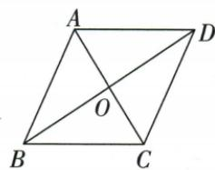

## 讲解

### 是什么

矩形、菱形都是平行四边的特殊成员；正方同时是矩形和菱形。某类一般不保证某性质，不表示它每个成员绝不有：平行四边可有轴、矩形可垂直对角、菱形可等对角，这些特殊成员都允许。

### 怎么来的

平行四边互平分是共有基础，添等对角走矩形、添垂直走菱形，两条件兼有即正方。从边角看，平行四边添邻边等为菱形、添一90为矩形，兼有正方。由于原邻边和对角条件已经在各类定理证明，不从概念集合图反过来充当证明。原辨析“只有正方兼矩形/菱形”真、“平行四边一定不轴”假，直接体现包含与量词；正方4轴、非正方矩形2轴、非正方菱形2轴，一般斜平行四边无轴但有中心。

### 什么时候能用

必须知道出发已经一般四边、平行四边、矩形还是菱形，决定还需哪套条件；一般四边等对角不直接矩形、邻边等不直接菱形。原梯形定义恰一组平行，与平行四边两组不相交。重合顶点或自交图先排不属于原简单非退化分类。

## 例题

### 原平行四边三句及四边从属六句辨析

> 来源ID Q23-60；第23章平行四边形；251-300/full.md 第656–661；2049–2056行。原答案与解析定位：251-300/full.md 第656–661行；251-300/full.md 第2049–2056行。

# ③ 易错辨析

1. 平行四边形是轴对称图形.
(×)  
2. 平行四边形的邻角互补. (√)  
3. 平行四边形被两条对角线分割而成的 4 个三角形全等. (×)

# ③ 易错辨析

1. 只有正方形既具有菱形的性质又具有矩形的性质. （√）  
2. 平行四边形一定不是轴对称图形. (×)  
3. 正方形的中点四边形依然是正方形. (√)  
4. 矩形的对角线可能互相垂直，菱形的对角线可能相等。（√）  
5. 特殊平行四边形中，正方形的对称轴条数最多，为4。（√）  
6. 正方形和菱形的面积都等于对角线长的乘积的一半。（√）

**原资料答案与解析：**

# ③ 易错辨析

1. 平行四边形是轴对称图形.
(×)  
2. 平行四边形的邻角互补. (√)  
3. 平行四边形被两条对角线分割而成的 4 个三角形全等. (×)

# ③ 易错辨析

1. 只有正方形既具有菱形的性质又具有矩形的性质. （√）  
2. 平行四边形一定不是轴对称图形. (×)  
3. 正方形的中点四边形依然是正方形. (√)  
4. 矩形的对角线可能互相垂直，菱形的对角线可能相等。（√）  
5. 特殊平行四边形中，正方形的对称轴条数最多，为4。（√）  
6. 正方形和菱形的面积都等于对角线长的乘积的一半。（√）

**展开解析（依据原详解补足理由与步骤）：**

原平行三句×√×：一般只中心对称、不保轴，但特殊矩形菱形有轴；邻角互补由平行同旁；对角两两相对三角全等而四块只等面积、不都全等。原特殊六句√×√√√√：正方为矩形与菱形交类；“平行四边一定不轴”排除特殊成员，错误；正方中点四边由原对角等且垂直仍正方；矩形可垂直或菱形可等是正方特例；正方4轴最多；菱形/正方垂直对角面积积半。量词“可能”“一定”要分开，不能误把一般不保证写成绝不。

### 平行四边半对角等先矩形再添垂直成正方

> 来源ID Q23-48；第23章平行四边形；251-300/full.md 第2024–2040行。原答案与解析定位：251-300/full.md 第2041–2047行。

例2 如图, 在平行四边形 ABCD 中, AC 与 BD 相交于点 O, $\angle OAB = \angle OBA$ .

(1) 证明: 平行四边形 ABCD 是矩形.  
(2) 请添加一个条件使矩形 ABCD 为正方形.

**原资料答案与解析：**

解析（1）证明：∵ $\angle OAB = \angle OBA, \therefore OA = OB.$

在□ABCD中，OA=OC, OB=OD，
∴ $OA + OC = OB + OD$ ，即 AC = BD，
∴ 平行四边形 ABCD 是矩形.

(2) 当 $AC \perp BD$ 时, 矩形 ABCD 是正方形. (答案不唯一)

**展开解析（依据原详解补足理由与步骤）：**

(1)OAB内OAB=OBA使OA=OB。原互平分AO=CO、BO=DO，所以AC2OA=2OB=BD，等对角的平行四边矩形。(2)添AC⊥BD，在已矩形基础上垂直对角判菱形，兼矩形/菱形为正方。原不唯一，添AB=BC也可，但原答案垂直保留并给依据。

### 菱形补等对角AC等BD或直角成正方

> 来源ID Q23-58；第23章平行四边形；251-300/full.md 第2455–2467行。原答案与解析定位：251-300/full.md 第2490–2492行。

例2 (2024 黑龙江龙东地区) 如图, 在菱形 ABCD 中, 对角线 AC, BD 相交于点 O, 请添加一个条件: , 使得菱形 ABCD 为正方形.

**原资料答案与解析：**

例2 解析 有一个角是直角或对角线相等的菱形是正方形.

答案 $AC = BD$ （答案不唯一）

**展开解析（依据原详解补足理由与步骤）：**

原菱形已有四边等、互垂平分。添AC=BD使又为等对角平行四边即矩形，兼菱形正方。原也可一角90；只再添AC⊥BD或AB=BC是既有性质，没新增限制，不能判。保原AC=BD回答及完整理由。

### 平行四边矩形判定四项垂直对角不足

> 来源ID Q23-36；第23章平行四边形；251-300/full.md 第1538–1546行。原答案与解析定位：251-300/full.md 第1512–1514行。

例3（2024 四川泸州）已知四边形 ABCD 是平行四边形, 下列条件中, 不能判定 □ABCD 为矩形的是 ( )

A. $\angle A = 90^{\circ}$

B. $\angle B = \angle C$

C. $AC = BD$

D. $AC \perp BD$

**原资料答案与解析：**

例3 解析 对角线互相垂直的平行四边形不一定是矩形, 故选项 D 不能判定.

答案 D

**展开解析（依据原详解补足理由与步骤）：**

A一90在平行四边上足够矩形；B邻B/C原互补又相等，2B180所以各90，足够；C对角相等在平行四边上足够；D互相垂直是菱形方向，可能斜菱形，不能保矩形，所以选D。判定基础原已平行四边，不删这个前提。

### 平行四边判菱形四项D平方直角对象错误

> 来源ID Q23-45；第23章平行四边形；251-300/full.md 第1912–1932行。原答案与解析定位：251-300/full.md 第1877–1879行。

例2 (2024 内蒙古通辽) 如图, □ABCD 的对角线 AC, BD 交于点 O, 以下条件不能证明 □ABCD 是菱形的是 ()

A. $\angle BAC = \angle BCA$

B. $\angle ABD = \angle CBD$

C. $OA^2 +OD^2 = AD^2$

D. $AD^{2} + OA^{2} = OD^{2}$

**原资料答案与解析：**

例2 解析 由 A 可得 AB = BC，所以 □ABCD 是菱形；由 B 易得 $\angle ABD = \angle BDC = \angle CBD$ ，则 BC = CD，所以 □ABCD 是菱形；由 C 可得 $\angle AOD = 90^{\circ}$ ，即 $AC \perp BD$ ，所以 □ABCD 是菱形；由 D 可得 $\angle OAD = 90^{\circ}$ ，则 □ABCD 一定不是菱形.

答案 D

**展开解析（依据原详解补足理由与步骤）：**

A BAC=BCA使ABC中AB=BC，平行四边邻边等判菱形。BABD=CBD又AB∥CD给ABD=BDC，故CBD=BDC，BCD中BC=CD判邻边等。C OA²+OD²=AD²逆判AOD直角O，AC⊥BD，在平行四边上判菱形。D AD²+OA²=OD²逆判AOD直角A，不是O，不能判；而菱形AC会平分A，使OAD是原角一半严格小90，与D条件90冲突，所以实际不可能是非退化菱形。选D。

## 易错

原关系图正方位两子类交处，不因矩形通常画非等边便把正方从矩形排掉。
