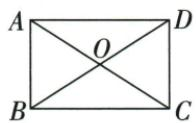

## 讲解

### 是什么

有一个直角的平行四边形是矩形，因邻角互补对角等使四角全90。一般四边形已有三个90，也直接是矩形。矩形两组对边等且平行、对角线相等且互平分，所以交点到四顶点等距；邻边不必相等。

### 怎么来的

连两对角，ABD/CBA的AB共同、AD=BC、DAB=ABC90，SAS全等使BD=AC，互平分由平行四边原性质。反向在平行四边中若AC=BD，ABC与BAD的AB共同、BC=AD、AC=BD，SSS全等使ABC=BAD；这两邻角又和180，因此各90，矩形。三直角一般四边用总360得第四90，并用同旁逆判两组平行。矩形对角相等的用途是把目标DE换成CP再点到直线最短，性质成立之前先判三直角，不能从小图看起来矩形就用。

### 什么时候能用

已平行四边时一90或等对角足够；一般四边只等对角不够（可等腰梯形），需互平分或另平行基础。矩形两轴过对边中点，中心是对角交点；正方是特殊矩形，轴增4，不把矩形排除正方。对角一般不垂直、不平分顶角，互“平分”指线段。

## 例题

### 矩形交角120余60等边边6对角12

> 来源ID Q23-28；第23章平行四边形；251-300/full.md 第1283–1285行。原答案与解析定位：251-300/full.md 第1287–1307行。

例1 如图, 在矩形 ABCD 中, 对角线 AC, BD 相交于点 O, $\angle BOC = 120^{\circ}$ , AB = 6. 求对角线的长.

**原资料答案与解析：**

解析∵四边形ABCD是矩形，

$$
\therefore A C = B D, O A = O C, O B = O D,
$$

$$
\therefore O A = O B. \because \angle B O C = 1 2 0 ^ {\circ},
$$

$$
\therefore \angle A O B = 6 0 ^ {\circ},
$$

∴ $\triangle AOB$ 是等边三角形，

$$
\therefore O A = A B = 6, \therefore B D = A C = 2 O A =
$$

$2 \times 6 = 12$ , 即对角线的长为 12.

**展开解析（依据原详解补足理由与步骤）：**

矩形对角相等且互平分，OA=OB。A-O-C共线，AOB180−BOC120=60；AOB等腰一60等边，OA=AB6。AC2OA12，BD=AC12。一般矩形对角不垂直，也不总等边，本题等边用了120。

### 平行一组加原直角与5 12 13逆判三直角

> 来源ID Q23-29；第23章平行四边形；251-300/full.md 第1311–1323行。原答案与解析定位：251-300/full.md 第1325–1339行。

例2 如原图，在四边形ABCD中，$AB\parallel CD$，$\angle BAD=90^\circ$，$AB=5$，$BC=12$，$AC=13$。求证：四边形ABCD是矩形。

**原资料答案与解析：**

证明 在四边形 ABCD 中, $AB \parallel CD$ , $\angle BAD = 90^{\circ}$ ,

$$
\therefore \angle A D C = 9 0 ^ {\circ}.
$$

在 $\triangle ABC$ 中, AB = 5, BC = 12, AC = 13,

$$
\therefore A C ^ {2} = A B ^ {2} + B C ^ {2},
$$

∴ 由勾股定理的逆定理, 知 $\triangle ABC$ 是直角三角形, 且 $\angle B = 90^{\circ}$ ,

∴ 四边形 ABCD 是矩形.

**展开解析（依据原详解补足理由与步骤）：**

AB∥CD且BAD90，同旁内角ADC90。ABC三边5/12/13，5²+12²13²逆判最长AC对面B90。已有A/D/B三个直角，四边和360使C也90，矩形。不能只原一个90就给矩形，题未先给平行四边。

### 矩形半对角四中点互平分加等对角判矩形

> 来源ID Q23-30；第23章平行四边形；251-300/full.md 第1372–1388行。原答案与解析定位：251-300/full.md 第1390–1398行。

例1 如图所示,矩形 ABCD 的对角线相交于点 O, 点 E, F, G, H 分别是 AO, BO, CO, DO 的中点, 请问四边形 EFGH 是矩形吗? 请说明理由.

**原资料答案与解析：**

解析 四边形 EFGH 是矩形.

理由：∵ 四边形 ABCD 是矩形，∴ AO = BO = CO = DO.

∵ 点 E, F, G, H 分别是 AO, BO, CO, DO 的中点，

$\therefore EO=FO=GO=HO,$ 四边形 EFGH 是平行四边形.

∵ EO+GO=FO+HO, 即 EG=FH, ∴ 四边形 EFGH 是矩形.

**展开解析（依据原详解补足理由与步骤）：**

原AO=BO=CO=DO，四中点OE=OF=OG=OH，E-O-G及F-O-H原点序使新对角EG/FH在O互平分，先平行四边。又EG=OE+OG、FH=OF+OH都同两倍，等对角判矩形。不是顺次连原四边中点（那种一般为菱形），本题是半对角各中点。

### 内外角平分平行线交等距点O取AC中点判矩形

> 来源ID Q23-31；第23章平行四边形；251-300/full.md 第1400–1414行。原答案与解析定位：251-300/full.md 第1416–1423行。

例2 如图, 在 $\triangle ABC$ 中, 点 $O$ 是边 $AC$ 上一动点, 过点 $O$ 作直线 $MN \parallel BC$ . 设 $MN$ 交 $\angle ACB$ 的平分线于点 $E$ , 交 $\triangle ABC$ 的外角 $\angle ACD$ 的平分线于点 $F$ .

(1) 求证: OE = OF.

(2) 当点 O 在边 AC 上运动到什么位置时, 四边形 AECF 是矩形? 并说明理由.

**原资料答案与解析：**

解析（1）证明：∵ CF 平分 $\angle ACD$ 且 $MN \parallel BD, \therefore \angle ACF = \angle FCD = \angle CFO. \therefore OF = OC.$ 同理可得 OC = OE, ∴ OE = OF.

(2) 当点 O 运动到 AC 的中点时, 四边形 AECF 是矩形.

理由:由(1)知 OE=OF, 当点 O 运动到 AC 的中点时, 有 OA=OC, ∴ 四边形 AECF 为平行四边形,
∵ CE 平分∠ACB, CF 平分∠ACD,

$\therefore \angle OCE + \angle OCF = \frac{1}{2} (\angle ACB + \angle ACD) = 90^{\circ}, \therefore \angle ECF = 90^{\circ}, \therefore$ 四边形 $AECF$ 是矩形.

**展开解析（依据原详解补足理由与步骤）：**

(1)CF外角平分、OF∥CD给OCF=FCD=CFO，所以OF=OC；同CE内角平分及OE∥BC，CEO=ECO使OE=OC，得到OE=OF。(2)O在AC中点则AO=OC，且OE=OF，两对角AC/EF互平分先平行四边；CE/CF分别邻补角内平分，ECF为(ACB+ACD)/2=90，所以矩形。必要性：若AECF矩形，其对角必须互平分，O是交点，必AO=OC，所以位置唯一。O在C端点会退化，原“动点边上”该端不能称矩形。

### 直角等腰腿6小矩形对角转CP最短3根号2

> 来源ID Q23-32；第23章平行四边形；251-300/full.md 第1429–1429行。原答案与解析定位：251-300/full.md 第1431–1449行。

例3 如图, 在 $\triangle ABC$ 中, $\angle C = 90^{\circ}, AC = BC = 6, P$ 为边 $AB$ 上一动点, 作 $PD \perp BC$ 于点 $D$ , $PE \perp AC$ 于点 $E$ , 求 $DE$ 的最小值.

**原资料答案与解析：**

解析 连接 CP.

$$
\because \angle A C B = 9 0 ^ {\circ}, A C = B C = 6, \therefore A B = \sqrt {A C ^ {2} + B C ^ {2}} = \sqrt {6 ^ {2} + 6 ^ {2}} = 6 \sqrt {2},
$$

∵ $PD \perp BC, PE \perp AC, \therefore \angle PDC = \angle PEC = 90^{\circ}, \therefore$ 四边形 CDPE 是矩形, ∴ DE = CP.

由垂线段最短可得, 当 $CP \perp AB$ 时, 线段 CP 最短, 即 DE 的值最小,

此时 $AP = BP = CP = \frac{1}{2} AB = 3\sqrt{2}$ , $\therefore DE$ 的最小值为 $3\sqrt{2}$ .

**展开解析（依据原详解补足理由与步骤）：**

C90，PD⊥BC、PE⊥AC，三个直角判CDPE矩形，其对角DE=CP。因此求DE最小转点C到有限AB点P最短，垂足在AB中点（原等腰三线合一），所以P该中点。AB=√(36+36)=6√2，CP为斜边中线=AB/2=3√2。端点P=A或B小矩形退化，但直接DE=CA/CB6仍大此最小，不把端点也当普通四点矩形。

### 矩形平移两直角等腿SAS并原对角等造BDE等腰

> 来源ID Q23-33；第23章平行四边形；251-300/full.md 第1455–1466行。原答案与解析定位：251-300/full.md 第1468–1486行。

例4 如图, 在矩形 ABCD 中, 连接对角线 AC、BD, 将 $\triangle ABC$ 沿 BC 方向平移, 使点 B 移到点 C 处, 得到 $\triangle DCE$ .

(1) 求证: $\triangle ACD \cong \triangle EDC.$   
(2)请探究 $\triangle BDE$ 的形状,并说明理由.

**原资料答案与解析：**

解析（1）证明：∵四边形ABCD是矩形，∴AD=BC, $\angle ADC=\angle ABC=90^{\circ}$ .

由平移的性质得 CE=BC, $\angle DCE=\angle ABC=90^{\circ}$ ,

$$
\therefore A D = E C, \angle A D C = \angle E C D.
$$

在 $\triangle ACD$ 和 $\triangle EDC$ 中,AD=EC, $\angle ADC=\angle ECD$ ,CD=DC,

$$
\therefore \triangle A C D \cong \triangle E D C (\mathrm{SAS}).
$$

(2) $\triangle BDE$ 是等腰三角形.理由如下:

由矩形的性质可知 AC=BD. 由平移的性质得 DE=AC, ∴ BD=DE,

∴ $\triangle BDE$ 是等腰三角形.

**展开解析（依据原详解补足理由与步骤）：**

(1)原矩形AD=BC、ADC90；平移A→D、B→C、C→E给CE=BC、DCE90。ACD/EDC中AD=EC、CD公共、夹角ADC=ECD90，SAS全等。(2)原矩形AC=BD，平移保原AC像DE等长，故BD=DE，BDE等腰两腰分别BD/DE。不是平移本身保证任意两条线都等，需原对角相等连接两关系。

### 矩形四性质选等对角排邻边垂直平分角

> 来源ID Q23-34；第23章平行四边形；251-300/full.md 第1518–1528行。原答案与解析定位：251-300/full.md 第1504–1506行。

例1（2024四川成都）如图，在矩形ABCD中，对角线AC与BD相交于点O，则下列结论一定正确的是 （）

A.AB=AD

B. $AC \perp BD$

C. $AC = BD$

D. $\angle ACB = \angle ACD$

**原资料答案与解析：**

例1 解析 根据矩形的性质可得 ${AB} = {CD},{AD} = {BC},{AC} = {BD}$ .

答案 C

**展开解析（依据原详解补足理由与步骤）：**

C对角AC=BD必真。AAB=AD要求邻边等，会使矩形进一步正方，不是一般性质；B对角垂直也需正方背景，普通矩形不保；D对角平分C同样一般不成立，需要邻边等。原矩形对角互平分是线段，不是顶角平分。

### 平行四边矩形判定四项垂直对角不足

> 来源ID Q23-36；第23章平行四边形；251-300/full.md 第1538–1546行。原答案与解析定位：251-300/full.md 第1512–1514行。

例3（2024 四川泸州）已知四边形 ABCD 是平行四边形, 下列条件中, 不能判定 □ABCD 为矩形的是 ( )

A. $\angle A = 90^{\circ}$

B. $\angle B = \angle C$

C. $AC = BD$

D. $AC \perp BD$

**原资料答案与解析：**

例3 解析 对角线互相垂直的平行四边形不一定是矩形, 故选项 D 不能判定.

答案 D

**展开解析（依据原详解补足理由与步骤）：**

A一90在平行四边上足够矩形；B邻B/C原互补又相等，2B180所以各90，足够；C对角相等在平行四边上足够；D互相垂直是菱形方向，可能斜菱形，不能保矩形，所以选D。判定基础原已平行四边，不删这个前提。

### 等腰中线配平行先三直角矩形再等面积EF六根号13比13

> 来源ID Q23-37；第23章平行四边形；251-300/full.md 第1550–1561行。原答案与解析定位：251-300/full.md 第1563–1592行。

例4（2024甘肃兰州）如图，在 $\triangle ABC$ 中， $AB=AC,D$ 是 $BC$ 的中点， $CE\parallel AD,AE\perp AD,EF\perp AC.$

(1) 求证: 四边形 ADCE 是矩形.  
(2) 若 BC=4, CE=3, 求 EF 的长.

**原资料答案与解析：**

例4 解析 (1) 证明: $\because AE \perp AD$ , $\therefore \angle EAD = 90^{\circ} \because AB = AC, D$ 是 $BC$ 的中点, $\therefore AD \perp BC$ ,

$$
\because C E \parallel A D, \therefore \angle E C D = \angle A D B = 9 0 ^ {\circ},
$$

$$
\therefore \angle A D C = \angle E C D = \angle E A D = 9 0 ^ {\circ},
$$

∴ 四边形 ADCE 是矩形.

(2)∵D是BC的中点,∴CD=2,
由(1)可知四边形ADCE是矩形,

$$
\therefore A E = C D = 2, \angle A E C = 9 0 ^ {\circ}.
$$

$$
\therefore A C = \sqrt {A E ^ {2} + C E ^ {2}} = \sqrt {1 3}.
$$

$$
\because S _ {\triangle A E C} = \frac {1}{2} A C \cdot E F = \frac {1}{2} A E \cdot C E,
$$

$$
\therefore E F = \frac {A E \cdot C E}{A C} = \frac {6 \sqrt {1 3}}{1 3}.
$$

**展开解析（依据原详解补足理由与步骤）：**

(1)AB=AC、D为BC中点，三线合一AD⊥BC，所以ADC90。CE∥AD givesECD90；AE⊥AD givesEAD90。三个直角判ADCE矩形。(2)CD=BC/2=2，矩形AE=CD2，AEC90，CE3。AC²=2²+3²=13，AC√13。AEC同面积AE×CE/2=AC×EF/2，乘2、除正AC得EF6/√13，分子分母乘√13为6√13/13。原EF是E到AC高，非矩形一边。

### 平行四边半对角等先矩形再添垂直成正方

> 来源ID Q23-48；第23章平行四边形；251-300/full.md 第2024–2040行。原答案与解析定位：251-300/full.md 第2041–2047行。

例2 如图, 在平行四边形 ABCD 中, AC 与 BD 相交于点 O, $\angle OAB = \angle OBA$ .

(1) 证明: 平行四边形 ABCD 是矩形.  
(2) 请添加一个条件使矩形 ABCD 为正方形.

**原资料答案与解析：**

解析（1）证明：∵ $\angle OAB = \angle OBA, \therefore OA = OB.$

在□ABCD中，OA=OC, OB=OD，
∴ $OA + OC = OB + OD$ ，即 AC = BD，
∴ 平行四边形 ABCD 是矩形.

(2) 当 $AC \perp BD$ 时, 矩形 ABCD 是正方形. (答案不唯一)

**展开解析（依据原详解补足理由与步骤）：**

(1)OAB内OAB=OBA使OA=OB。原互平分AO=CO、BO=DO，所以AC2OA=2OB=BD，等对角的平行四边矩形。(2)添AC⊥BD，在已矩形基础上垂直对角判菱形，兼矩形/菱形为正方。原不唯一，添AB=BC也可，但原答案垂直保留并给依据。

## 易错

原四选项矩形性质只有等对角必真；原判定对角垂直不足，它走菱形而非矩形。小CDPE在P端点退化须单独用长等回验。
