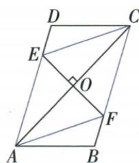

## 讲解

### 是什么

本资料采用四边相等的简单非退化四边形为菱形。等价地，它是邻边相等的平行四边形。四边相等保证两组对边平行，但不保证四角都是90°；正方形是具有四直角的特殊菱形。

### 怎么来的

设按序ABCD四边相等，连AC。△ABC与△CDA三边分别对应相等，按SSS基本判据全等，对应内错角等，故AB∥CD、BC∥AD，成为平行四边形。再连BD，四个半三角形依其等边和公共关系可推出对角线垂直平分，但“相等”不是一般菱形对角线性质；只有进一步的直角结构才使两条完整对角线等长。原逆命题“菱形⇒四边相等”从定义就真；原选择题“菱形对角线相等”把正方形特殊情况推广，故假。

### 什么时候能用

限定简单四边形，不能只画四个随意点、按交叉连边说菱形。定义与逆命题只说明等边这项，不能顺手加入直角。第18章初次命题例只说明定义与逆命题；第23章已追加完整性质、判定、对角计算及面积原例。

四边等与邻边等平行四边两定义等价。对角交O，原互平分BO=DO，AB=AD和AO共同SSS使AOB/AOD全等，BAO=DAO且两O邻补等角各90，得到AC垂BD及平分A；另一顶点同理，两对角均平分对应角。四半小三角两腿OA/OB相同SAS90，全都全等。反向平行四边对角垂直，AO公共、BO=DO及90夹角SAS推出AB=AD，判菱形；若对角平分一顶角，平行内错将半角搬到同一三角底角相等，也给邻边等。轴为两对角整直线、中心O。一般对角不等，等对角进一步正方，原四项平方必须辨90在O还是A。

## 例题

### 三条逆命题交换条件并分别判断

> 来源ID Q18-06；第18章命题的证明；201-250/full.md 第1009–1011行。原答案与解析定位：201-250/full.md 第1013–1017行。

例4 写出下列命题的逆命题,并判断这些逆命题的真假.

(1)在一个三角形中,等角对等边.(2)四边相等的四边形是菱形.(3)如果x=3,那么 $x^{2}=9$ .

**原资料答案与解析：**

解析（1）逆命题为“在一个三角形中，等边对等角”，逆命题是真命题.

(2)原命题的题设是“四边形的四边相等”,结论是“四边形是菱形”,故逆命题的题设是“四边形是菱形”,结论是“四边形的四边相等”,所以逆命题为“菱形的四边相等”,逆命题是真命题.

(3) 逆命题为“如果 $x^{2} = 9$ ，那么 $x = 3$ ”，逆命题是假命题。

**展开解析（依据原详解补足理由与步骤）：**

（1）共同范围“在一个三角形中”保留，条件与结论交换成“等边对等角”，真，可由等腰三角形性质。（2）原四边形四边相等⇒菱形；逆为菱形⇒四边相等，由定义真。（3）逆为x²=9⇒x=3，假，因为x²−9=(x−3)(x+3)=0，得到x=3或x=−3；负根也满足题设却不符合结论。这里−3由原方程完整解集推出，是原题解析中的反例，不另编题。原命题x=3⇒x²=9真，但它的逆并不自动真。

### 四个几何命题逐项判真并说明依据

> 来源ID Q18-07；第18章命题的证明；201-250/full.md 第1040–1048行。原答案与解析定位：201-250/full.md 第1031–1032行。

例1（2024 湖南）下列命题中,正确的是()

A.两点之间,线段最短

B.菱形的对角线相等

C. 正五边形的外角和为 $720^{\circ}$

D. 直角三角形是轴对称图形

**原资料答案与解析：**

例1 解析 菱形的对角线不一定相等; 正五边形的外角和为 $360^{\circ}$ ; 直角三角形不一定是轴对称图形.
答案 A

**展开解析（依据原详解补足理由与步骤）：**

A“两点之间线段最短”是基本事实，正确。B菱形四边相等、两组对边平行，并不要求四个直角或两对角线等长；对角线相等加菱形才进一步成为正方形，原B把特殊情形当一般性质，错。C沿凸正五边形每个顶点取一外角，一周转向总360°，非720°；720°不是五边形外角和，错。D一般直角三角形两直角边不等，不能由直角保证轴对称；仅等腰直角三角形有该对称性。原本章5、4、3直角三角形的两直角边不等，可对应说明它不满足等腰轴对称条件。选A。没有为了否定B、C、D自编新的尺寸题。

### 菱形D150同对角等再底角15

> 来源ID Q23-38；第23章平行四边形；251-300/full.md 第1647–1659行。原答案与解析定位：251-300/full.md 第1661–1667行。

例1 如图,在菱形 ABCD 中, $\angle D=150^{\circ}$ ,则 $\angle1=$ \_\_\_\_°.

**原资料答案与解析：**

解析 在菱形 ABCD 中, $\angle B = \angle D = 150^{\circ}$ , AB = CB,

$$
\therefore \angle 1 = (1 8 0 ^ {\circ} - 1 5 0 ^ {\circ}) \div 2 = 1 5 ^ {\circ}.
$$

答案 15

**展开解析（依据原详解补足理由与步骤）：**

菱形B=D150；ABC中AB=BC，两底角A/C等，和180−150=30，各15。原角1是BAC，非整个菱形A（30）。也可邻角A30再AC平分给15，两条路一致。

### 菱形周长24对角8求另一对角四根5面积16根5

> 来源ID Q23-39；第23章平行四边形；251-300/full.md 第1677–1679行。原答案与解析定位：251-300/full.md 第1681–1691行。

例2 如图,已知菱形 ABCD 的周长为 24,一条对角线的长为 8,求该菱形的面积.

**原资料答案与解析：**

解析：菱形ABCD的周长为24，∴ AB=6. ∵ 一条对角线的长为 8,
∴ 不妨令 AC=8, 则 OA=4.

∵ 在菱形 ABCD 中, $AC \perp BD$ ,
∴ $\angle AOB = 90^{\circ}$ . 在 Rt $\triangle AOB$ 中，

$$
\begin{array}{l} O B = \sqrt {A B ^ {2} - O A ^ {2}} = 2 \sqrt {5}, \therefore B D = \\ 4 \sqrt {5} \therefore S _ {\text {菱形}} = \frac {1}{2} A C \cdot B D = \frac {1}{2} \times 8 \times \\ 4 \sqrt {5} = 1 6 \sqrt {5}. \\ \end{array}
$$

注意 易错在求面积时漏乘 $\frac{1}{2}$ .

**展开解析（依据原详解补足理由与步骤）：**

四边等、周24，边6。令AC8，互平分OA4；垂直对角AOB直角，OB²=6²−4²=20，OB2√5，BD2OB4√5。面积AC×BD/2=8×4√5/2=16√5。不是两对角乘积32√5，亦不可只用半对角OB不再倍回。

### 菱形周长20中点E中位线OE2点5四项

> 来源ID Q23-40；第23章平行四边形；251-300/full.md 第1744–1765行。原答案与解析定位：251-300/full.md 第1767–1777行。

例1 如图,菱形ABCD的周长为20,对角线AC、BD相交于点O,E是CD的中点,则OE的长是()

A.2.5

B.3

C.4

D.5

**原资料答案与解析：**

解析 ∵ 四边形 ABCD 为菱形, 周长为 20, ∴ DO = BO, BC = 20 ÷ 4 = 5,

∵ O 是 BD 的中点, E 是 CD 的中点,

∴ OE 为 $\triangle BCD$ 的中位线，

$$
\therefore O E = \frac {1}{2} B C = 2. 5.
$$

答案 A

**展开解析（依据原详解补足理由与步骤）：**

边BC20/4=5，O为BD中点、E为CD中点，BCD中位OE=BC/2=2.5，A。B3/C4无法与半5相等，D5是整BC没有半长。不需对角具体读数。原2.5OCR小数空格正文恢复，原证据保留。

### 菱形周24一60等边后勾股倍半求AC六根3

> 来源ID Q23-41；第23章平行四边形；251-300/full.md 第1779–1799行。原答案与解析定位：251-300/full.md 第1801–1807行。

例2 如图,已知某广场的菱形花坛 ABCD 的周长是 $24 \, m$ , $\angle BAD = 60^{\circ}$ , 则对角线 AC 的长为 ( )

A. $6\sqrt{3}$ m

B.6 m

C. $3\sqrt{3}$ m

D.3 m

**原资料答案与解析：**

解析 ∵ 四边形 ABCD 为菱形, ∴ AC ⊥ BD, OA = OC, OB = OD, AB = BC = CD = AD = 24÷4 = 6(m),

又∵ $\angle BAD=60^{\circ},\therefore \triangle ABD$ 为等边三角形,∴ BD=AB=6 m,∴ OD=OB=3 m,

在 Rt△AOB 中,根据勾股定理得 $OA=\sqrt{6^{2}-3^{2}}=3\sqrt{3}$ (m),∴ $AC=2OA=6\sqrt{3}$ m.

答案 A

**展开解析（依据原详解补足理由与步骤）：**

每边6，BAD60与AB=AD使ABD等边，BD6。O对角交点，OB3、OA⊥OB；AOB勾股OA²=36−9=27，OA3√3，AC2OA6√3，A。B6为另一对角BD；C3√3为半目标OA；D3为半另一对角OB，均错对象。

### 菱形对角8和6勾股边5等面积高24比5

> 来源ID Q23-42；第23章平行四边形；251-300/full.md 第1813–1813行。原答案与解析定位：251-300/full.md 第1815–1825行。

例3 如图,四边形 ABCD 是菱形,AC=8,DB=6,DH⊥AB 于点 H.求 DH 的长.

**原资料答案与解析：**

解析 $\because$ 四边形 $ABCD$ 为菱形, $AC = 8, DB = 6$ , $\therefore OA = \frac{1}{2} AC = 4, OB = \frac{1}{2} BD = 3, OA \perp OB$ ,

$$
\therefore A B ^ {2} = O A ^ {2} + O B ^ {2} = 4 ^ {2} + 3 ^ {2} = 2 5, \therefore A B = 5.
$$

$$
\because S _ {\text {菱形} A B C D} = \frac {1}{2} A C \cdot B D = A B \cdot D H, \therefore \frac {1}{2} \times 8 \times 6 = 5 D H, \therefore D H = \frac {2 4}{5}.
$$

**展开解析（依据原详解补足理由与步骤）：**

OA4、OB3且垂直，AB√(16+9)=5。全菱面积AC×BD/2=8×6/2=24；AB为底、D到AB高DH，24=5DH，DH24/5。高不是对角半长3/4，也非边5。

### AC中垂交对边构AFCE菱形两法完整

> 来源ID Q23-43；第23章平行四边形；251-300/full.md 第1831–1831行。原答案与解析定位：251-300/full.md 第1833–1863行。

例4 如图所示, □ABCD 的对角线 AC 的垂直平分线与 AD, BC, AC 分别相交于点 E, F, O, 连接 AF, EC. 四边形 AFCE 是菱形吗? 为什么?

**原资料答案与解析：**

解析 四边形 AFCE 是菱形.

理由一：∵ 四边形 ABCD 是平行四边形，∴ $AD \parallel BC$ ，∴ $\angle EAO = \angle FCO$ .

∵ EF 垂直平分 AC, ∴ AO = CO, ∠AOE = ∠COF = 90°.

在 $\triangle AOE$ 和 $\triangle COF$ 中， $\angle EAO = \angle FCO, AO = CO, \angle AOE = \angle COF,$

$$
\therefore \triangle A O E \cong \triangle C O F (\mathrm{ASA}) \therefore A E = C F.
$$

又∵AE∥CF,∴四边形AFCE是平行四边形.

又∵ $AC \perp EF, \therefore$ 四边形 AFCE 是菱形.

理由二：∵点E,F在AC的垂直平分线上，∴AE=EC,AF=FC，∴∠EAC=∠ECA.

∵ 四边形 ABCD 是平行四边形, ∴ $AE \parallel FC$ , ∴ $\angle EAC = \angle FCA$ . ∴ $\angle FCA = \angle ECA$ .

又∵ $CO \perp EF$ ，易知 $\triangle ECO \cong \triangle FCO$ ，

$\therefore EC=FC, \therefore AE=EC=CF=FA.$ 四边形 AFCE 是菱形.

**展开解析（依据原详解补足理由与步骤）：**

是。法一：AD∥BC使EAO=FCO，AO=CO、AOE/COF90、夹边AO/CO，ASA全等得AE=CF，与AE∥CF先判AFCE平行四边；其对角AC/EF垂直，再判菱形。法二：E/F各在AC中垂线上，AE=EC、AF=FC；AEC等腰使EAC=ECA，AE∥FC使EAC=FCA，所以ECO=FCO。ECO/FCO两角（O均90）及CO公共夹边ASA全等得EC=FC，四边AE=EC=CF=FA。原“易知全等”已补具体ASA条件。交点须确在所给边且不退化，否则原四边命名失效。

### 菱形AB中点OE3中位反求边6四项

> 来源ID Q23-44；第23章平行四边形；251-300/full.md 第1889–1897行。原答案与解析定位：251-300/full.md 第1869–1875行。

例1（2024 山东济宁）如图,菱形 ABCD 的对角线 AC,BD 相交于点 O,E 是 AB 的中点,连接 OE. 若 OE =3,则菱形的边长为 ( )

A.6

B.8

C.10

D.12

**原资料答案与解析：**

例1 解析：菱形的对角线互相平分，∴ O 为 AC 的中点，

∵ E 是 AB 的中点，

$\therefore BC=2OE=6,$ 即菱形边长为 6.

答案 A

**展开解析（依据原详解补足理由与步骤）：**

O是AC中点，E是AB中点，ABC中OE=BC/2；OE3使BC6，A。B8/C10/D12都不满足原半长3。原图50cfd...放在后一个标题下面但属于本题中点图，补接到此，第二题原图f6...才给四对角。

### 平行四边判菱形四项D平方直角对象错误

> 来源ID Q23-45；第23章平行四边形；251-300/full.md 第1912–1932行。原答案与解析定位：251-300/full.md 第1877–1879行。

例2 (2024 内蒙古通辽) 如图, □ABCD 的对角线 AC, BD 交于点 O, 以下条件不能证明 □ABCD 是菱形的是 ()

A. $\angle BAC = \angle BCA$

B. $\angle ABD = \angle CBD$

C. $OA^2 +OD^2 = AD^2$

D. $AD^{2} + OA^{2} = OD^{2}$

**原资料答案与解析：**

例2 解析 由 A 可得 AB = BC，所以 □ABCD 是菱形；由 B 易得 $\angle ABD = \angle BDC = \angle CBD$ ，则 BC = CD，所以 □ABCD 是菱形；由 C 可得 $\angle AOD = 90^{\circ}$ ，即 $AC \perp BD$ ，所以 □ABCD 是菱形；由 D 可得 $\angle OAD = 90^{\circ}$ ，则 □ABCD 一定不是菱形.

答案 D

**展开解析（依据原详解补足理由与步骤）：**

A BAC=BCA使ABC中AB=BC，平行四边邻边等判菱形。BABD=CBD又AB∥CD给ABD=BDC，故CBD=BDC，BCD中BC=CD判邻边等。C OA²+OD²=AD²逆判AOD直角O，AC⊥BD，在平行四边上判菱形。D AD²+OA²=OD²逆判AOD直角A，不是O，不能判；而菱形AC会平分A，使OAD是原角一半严格小90，与D条件90冲突，所以实际不可能是非退化菱形。选D。

### 等宽3纸条交角60先平行同高证菱形周8根3

> 来源ID Q23-46；第23章平行四边形；251-300/full.md 第1936–1948行。原答案与解析定位：251-300/full.md 第1881–1885行。

例3 (2024 广西) 如图, 两张宽度均为 $3 \mathrm{~cm}$ 的纸条交叉叠放在一起, 交叉形成的锐角为 $60^{\circ}$ , 则重合部分构成的四边形ABCD的周长为 \_\_\_\_ cm.

**原资料答案与解析：**

例3 解析 由题意知两张纸条对边分别平行且宽度相等, 易证四边形 ABCD 为菱形, 过点 C 作 CE ⊥ AD, 垂足为 E.

由题意可得 $\angle CDA = 60^{\circ}$ ，所以 $CE$ $= CD\sin 60^{\circ} = 3$ ，则 $CD = 2\sqrt{3}$ ，所以四边形ABCD的周长为 $8\sqrt{3}\mathrm{cm}$

答案 $8\sqrt{3}$

**展开解析（依据原详解补足理由与步骤）：**

两纸条边线各组平行，重叠ABCD先平行四边。两对边线间垂距都3；面积用邻边作底分别AD×3和CD×3，等面积除正3得AD=CD，判菱形。原图外60与内部D邻补，所以内D120；原解析写“CDA60”与图不符，纠正单列：作CE⊥AD，垂足E在AD越D的延长线上，CDE180−120=60，DCE30。直角CDE，DE=CD/2，勾股CE²=CD²−(CD/2)²=3CD²/4；CE3给CD²12，CD2√3，周8√3 cm。原用sin60结果同，但本章用30+勾股即可，不必先学后章三角函数。

### 原菱形邻边与垂直对角不足两句辨析

> 来源ID Q23-61；第23章平行四边形；251-300/full.md 第1669–1673行。原答案与解析定位：251-300/full.md 第1669–1673行。

# ③ 易错辨析

1. 一组邻边相等的四边形是菱形.
(×)  
2. 对角线互相垂直的四边形不一定是菱形. (√)

**原资料答案与解析：**

# ③ 易错辨析

1. 一组邻边相等的四边形是菱形.
(×)  
2. 对角线互相垂直的四边形不一定是菱形. (√)

**展开解析（依据原详解补足理由与步骤）：**

“一组邻边等四边形菱形”假，缺平行四边基础或另两边等；“对角垂直四边形不一定菱形”真，缺互平分。若已平行四边才有互平分，垂直推出四半图直角三角全等、四边等。只垂直可成筝形，原另给筝形概述，不能自补两中点。

## 易错

四边相等与两对角线相等不是一回事；本章原判断题B应排除，而不是因为菱形也属于平行四边形便套矩形对角线性质。
