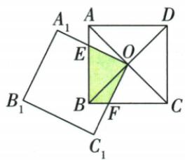

## 讲解

### 判据

O正方中心、旋方两边交原相邻边E/F，角EOF90，真实重叠BEOF。

### 流程

1.原OA=OB、AOB90、两个底角45。2.EOF90共减EOB，AOE=BOF。3.ASA等面积AOE/BOF，将BEOF后一块BOF换AOE，合AOB，原16四分之一4。4.核原两个旋方边段确达E/F且其余边未切进BEOF；只因直角不能跳区域识别。5.一般裸直角三角迁移缺等腰/中点条件，单列缺口。

## 例题

### 中心小正方旋转原两边交AB BC重叠面积4

> 来源ID Q23-56；第23章平行四边形；251-300/full.md 第2407–2424行。原答案与解析定位：251-300/full.md 第2426–2438行。

例7 如图,正方形ABCD的边长为4,O为正方形ABCD的对角线的交点,正方形 $A_{1}B_{1}C_{1}O$ 绕点O旋转, $A_{1}O$ 交AB于E点, $C_{1}O$ 交BC于F点,则两个正方形重叠部分的面积为\_\_\_\_.

**原资料答案与解析：**

解析 在正方形 ABCD 中, OA = OB, $\angle OAB = \angle OBC = 45^{\circ}$ , $\angle AOB = 90^{\circ}$ ,

在正方形 $A_{1}B_{1}C_{1}O$ 中， $\angle EOF=90^{\circ}\therefore\angle AOB=\angle AOE+\angle EOB=90^{\circ},\angle EOF=\angle EOB+\angle BOF=90^{\circ}$

$$
\therefore \angle A O E = \angle B O F, \therefore \triangle A O E \cong \triangle B O F, \therefore S _ {\triangle A O E} = S _ {\triangle B O F},
$$

$$
\therefore S _ {\text {四边形} E O F B} = S _ {\triangle B O F} + S _ {\triangle B O E} = S _ {\triangle A O E} + S _ {\triangle B O E} = S _ {\triangle A O B} = 4 \times 4 \div 4 = 4.
$$

答案 4

**展开解析（依据原详解补足理由与步骤）：**

原边A₁O与C₁O垂直，E/F在原AB/BC边上并实际在两旋转边段内，原重叠区就是BEOF；不是任意大小任意转角都如此。OA=OB、OAB=OBF45，AOB90与EOF90共减EOB得AOE=BOF。ASA AOE≌BOF，面积等；BEOF由BOE+BOF，换BOF为AOE得到AOB面积，为原正方4²/4=4。两新方的另外两边若切进该区域、或E/F换边，需重读区域，不能只看90断所有旋转题都4。

### 原正方十字半角中心直角三模型

> 来源ID Q23-64；第23章平行四边形；251-300/full.md 第2320–2330行。原答案与解析定位：251-300/full.md 第2320–2330行。

# 1. 十字模型

| 图示 |  |  |  |
| --- | --- | --- | --- |
| 模型说明 | 在正方形ABCD中,若AE⊥BF,则AE=BF | 在正方形ABCD中,若AE⊥FH,则AE=FH | 在正方形ABCD中,若GE⊥FH,则GE=FH |

# 2. 半角模型

| 图示 |  |
| --- | --- |
| 模型说明 | 正方形ABCD中,若∠EAF=45°,则BE+DF=EF(可将△ADF旋转到△ABG的位置进行证明) |

# 3. 中心直角模型

| 图示 |  模型迁移   |
| --- | --- |
| 模型说明 | 正方形ABCD中,若 $\angle {EOF} = {90}^{ \circ }$ ,则 $\triangle {BOE} \cong \triangle {COF}$ ,故四边形BEOF的面积=  $\triangle {BOC}$  的面积=正方形ABCD面积的四分之一 |

**原资料答案与解析：**

# 1. 十字模型

| 图示 |  |  |  |
| --- | --- | --- | --- |
| 模型说明 | 在正方形ABCD中,若AE⊥BF,则AE=BF | 在正方形ABCD中,若AE⊥FH,则AE=FH | 在正方形ABCD中,若GE⊥FH,则GE=FH |

# 2. 半角模型

| 图示 |  |
| --- | --- |
| 模型说明 | 正方形ABCD中,若∠EAF=45°,则BE+DF=EF(可将△ADF旋转到△ABG的位置进行证明) |

# 3. 中心直角模型

| 图示 |  模型迁移   |
| --- | --- |
| 模型说明 | 正方形ABCD中,若 $\angle {EOF} = {90}^{ \circ }$ ,则 $\triangle {BOE} \cong \triangle {COF}$ ,故四边形BEOF的面积=  $\triangle {BOC}$  的面积=正方形ABCD面积的四分之一 |

**展开解析（依据原详解补足理由与步骤）：**

十字：E在CD，F在AD，比较△ADE与△BAF。∠ADE=∠BAF=90°，AD=BA；AE⊥BF且AD⊥BA，使∠DAE=∠ABF。按ASA，△ADE≌△BAF，对应斜边AE=BF。若FH从AD到BC替代BF，过B作FH的平行线交AD于F′；两段在同组平行边间同向，所以BF′=FH，且BF′⊥AE，退回第一图得AE=BF′=FH。若GE从AB到CD，过A作GE的平行线交CD于E′，同理AE′=GE；再将FH平行搬到B起点，按第一图得到GE=FH。要求原三图都是两对边之间的完整段，不能任取半截。

半角：把ADF旋90到ABG，G在BC经B外，AG=AF、BG=DF。正方90减原EAF45给EAG=EAF45，AE公共SAS AEG≌AEF，EG=EF；G-B-E同线EG=BG+BE=DF+BE。

中心直角：原正方O中心、E∈AB、F∈BC且EOF90，OB=OC、OBE=OCF45，BOE与COF的O角由中心相邻射线90共减得到相等，ASA全等；两小面积等，替换一块后BEOF面积为BOC面积，即正方四分之一。原两张迁移示意只画一般直角三角未写等腰/等距条件，不能直接无条件搬“全等及四分之一”，保原图同时登记缺条件。

## 易错

四分之一是本完整正方模型的面积，不是任意两正方部分重叠都恒定。
