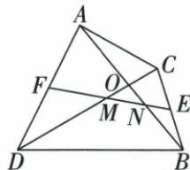
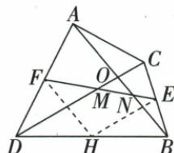

## 讲解

### 判据

原AB=CD且E/F为两边中点，目标交线小OMN，取第三边BD中点H桥接。

### 流程

1.HE是BCD中位、HF是ABD中位，分别平行CD/AB且半长。2.AB=CD使HE=HF，所以HEF两底角等。3.两组平行把角搬到ONM/OMN，同OMN内等角对边OM=ON。4.原自动图片说明误识四面体，实际是平面交叉图，按原线段不新增空间条件。

## 例题

### 交叉四边两中点另取BD中点造等腰再平行搬角

> 来源ID Q23-25；第23章平行四边形；251-300/full.md 第1177–1177行。原答案与解析定位：251-300/full.md 第1179–1221行。

例4 如图所示,在四边形 ADBC 中,AB 与 CD 相交于点 O,AB=CD,E,F 分别是 BC,AD 的中点,连接 EF,分别交 DC,AB 于点 M,N,判断 $\triangle OMN$ 的形状,并说明理由.

**原资料答案与解析：**

解析 $\triangle OMN$ 是等腰三角形. 理由如下:

如图,取BD的中点H.连接HE,HF.

∵ E, F 分别是 BC, AD 的中点, ∴ $HF \parallel AB$ , $HE \parallel CD$ , $HF = \frac{1}{2} AB$ , $HE = \frac{1}{2} CD$ ,

$$
\because A B = C D, \therefore H F = H E, \therefore \angle H F E = \angle H E F.
$$

$$
\because H F \parallel A B, H E \parallel C D, \therefore \angle H F E = \angle O N M, \angle H E F = \angle O M N, \therefore \angle O N M = \angle O M N.
$$

∴ OM=ON，即 $\triangle OMN$ 是等腰三角形.

**展开解析（依据原详解补足理由与步骤）：**

OMN等腰OM=ON。取BD中点H，E为BC中点、F为AD中点，分别在BCD/ABD中中位线HE∥CD、HF∥AB，HE=CD/2、HF=AB/2。给AB=CD使HE=HF，同HEF等腰HFE=HEF。两组平行把它们分别搬成ONM/OMN，目标同三角底角相等，OM=ON。H不必落EF，原辅助两条中位线才桥接跨三角等角。

## 易错

HE/HF等不是EF本身等某半边，两个不同新三角各明确中点对。
