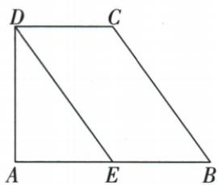

## 讲解

### 判据

原给5套或开放两套，先将每套译成两对边/对角/角的对象。

### 流程

1.①两组平行定义；③互平分、④两组边等分别定理。2.②平行在AB/CD、等长在AD/BC异组，等腰梯形可满足，不足。3.⑤一平行+一对角等，把同旁角补180传到另一边逆判。4.开放角组同样先判另一平行；开放长度组AE=BE=CD配BE∥CD，是同组平等。5.判后才用DE=BC10勾股AE6。

## 例题

### 五组条件只有异组平行相等不足

> 来源ID Q23-13；第23章平行四边形；251-300/full.md 第741–759行。原答案与解析定位：251-300/full.md 第761–765行。

例2 如图, 四边形 ABCD 中, 对角线 AC, BD 交于点 O, 下列条件不能判定这个四边形是平行四边形的是 \_\_\_\_. (填序号)

① $AB \parallel CD, AD \parallel BC;$   
② $AB \parallel CD, AD = BC;$   
③AO=CO,BO=DO;   
④AB=CD,AD=BC;   
⑤AB∥CD,∠ABC=∠ADC.

**原资料答案与解析：**

答案 ②

注意 一组对边平行，另一组对边相等的四边形不一定是平行四边形，也可能是等腰梯形.

**展开解析（依据原详解补足理由与步骤）：**

①两组对边平行，定义成立；②AB∥CD但AD=BC是另一组等腰，可为原等腰梯形，不足；③OA=OC且OB=OD互平分，成立；④两组对边相等，成立；⑤AB∥CD给A+B180，B=D代入A+D180再判AD∥BC，成立。不能判仅②。原等腰梯形图是实际错法证据，不自编数字反例。

### 一组平行加对角相等三种判平行四边证明

> 来源ID Q23-15；第23章平行四边形；251-300/full.md 第800–802行。原答案与解析定位：251-300/full.md 第804–818行。

例2 如图, 在四边形 ABCD 中, 如果 $AD \parallel BC, \angle B = \angle D$ , 那么四边形 ABCD 是平行四边形吗? 请说明理由.

**原资料答案与解析：**

解析 四边形 ABCD 是平行四边形.

理由一:∵ $AD \parallel BC$ , ∴ $\angle A + \angle B = 180^{\circ}$ .

$\because \angle B = \angle D, \therefore \angle A + \angle D = 180^{\circ}, \therefore AB \parallel CD, \therefore$ 四边形 $ABCD$ 是平行四边形.

理由二：∵ $AD \parallel BC, \therefore \angle A + \angle B = 180^{\circ}, \angle C + \angle D = 180^{\circ}.$

$\because \angle B = \angle D, \therefore \angle A = \angle C, \therefore$ 四边形ABCD是平行四边形.

理由三:如图所示,连接AC∵AD∥BC,∴∠1=∠2.又∵∠B=∠D,AC=CA,

$\therefore \triangle ABC \cong \triangle CDA(AAS), \therefore BC = AD, \therefore$ 四边形ABCD是平行四边形.

**展开解析（依据原详解补足理由与步骤）：**

是。法一AD∥BC给A+B180，B=D得A+D180，同旁内角互补判AB∥CD，两组平行定义。法二AD∥BC同时给A+B180、C+D180，B=D同减得A=C，与B=D两组对角等判。法三连AC，DAC=BCA为平行内错、D=B原等、AC公共为对应非夹边，AAS ABC≌CDA，BC=DA，再用同组对边平行且等。三法每个结论都未先用待证四边性质。

### 开放任选角或同组平等先判BCDE再勾股6

> 来源ID Q23-19；第23章平行四边形；251-300/full.md 第899–917行。原答案与解析定位：251-300/full.md 第966–992行。

例2 (2024 湖南) 如图, 在四边形 ABCD 中, $AB \parallel CD$ , 点 E 在边 AB 上, \_\_\_\_.

请从“① $\angle B=\angle AED$ ；② $AE=BE, AE=CD$ ”这两组条件中任选一组作为已知条件，填在横线上（填序号），再解决下列问题：

(1) 求证: 四边形 BCDE 为平行四边形.

(2) 若 $AD \perp AB, AD = 8, BC = 10$ , 求线段 AE 的长.

**原资料答案与解析：**

例2 解析（1）选择①的证明：

$$
\because \angle B = \angle A E D, \therefore B C \parallel D E,
$$

$$
\because A B \parallel C D,
$$

∴ 四边形 BCDE 为平行四边形.

选择②的证明：∵ AE = BE, AE = CD, ∴ BE = CD, ∵ AB // CD,

∴ 四边形 BCDE 为平行四边形.

(2)由(1)可知,四边形 BCDE 为平行四边形, $\therefore DE=BC=10$ ,

$$
\because A D \perp A B, \therefore \angle A = 9 0 ^ {\circ},
$$

$$
\therefore A E = \sqrt {D E ^ {2} - A D ^ {2}} = 6,
$$

即线段 AE 的长为 6.

**展开解析（依据原详解补足理由与步骤）：**

(1)原两组任选都成立：选①B= AED，AB截线对应内错/同位实际原角给BC∥DE，加BE∥CD构两组平行；选②AE=BE=CD，原BE在AB所以BE∥CD，一组对边平行且等判BCDE。(2)判后DE=BC10，AD⊥AB且E在AB使ADE直角A，AE²=DE²−AD²=100−64=36，AE6。原两选择证明均保留，不能跳过四边判定就直接DE10。

## 易错

“平行且等”必须同组；不能把待证性质放进判定前提循环。
