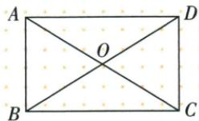
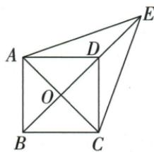
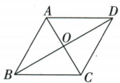

## 讲解

### 判据

原平行四边、矩形、菱形起点不同，补条件须使兼矩形/菱形。

### 流程

1.半对角OA=OB原等角可先完整对角等，平行四边升矩形；再补垂直对角升正方。2.原菱形添完整AC=BD或一90，获得矩形，已有等边，正方。3.原AB=BC加BD平分SAS给D平分；PM/PN原两垂、D90先MPND矩形，距离性质邻腿等再正方。4.外E等距使BD中垂先菱形，外角条件使AO=DO倍回等完整对角，再正方。

## 例题

### 平行四边半对角等先矩形再添垂直成正方

> 来源ID Q23-48；第23章平行四边形；251-300/full.md 第2024–2040行。原答案与解析定位：251-300/full.md 第2041–2047行。

例2 如图, 在平行四边形 ABCD 中, AC 与 BD 相交于点 O, $\angle OAB = \angle OBA$ .

(1) 证明: 平行四边形 ABCD 是矩形.  
(2) 请添加一个条件使矩形 ABCD 为正方形.

**原资料答案与解析：**

解析（1）证明：∵ $\angle OAB = \angle OBA, \therefore OA = OB.$

在□ABCD中，OA=OC, OB=OD，
∴ $OA + OC = OB + OD$ ，即 AC = BD，
∴ 平行四边形 ABCD 是矩形.

(2) 当 $AC \perp BD$ 时, 矩形 ABCD 是正方形. (答案不唯一)

**展开解析（依据原详解补足理由与步骤）：**

(1)OAB内OAB=OBA使OA=OB。原互平分AO=CO、BO=DO，所以AC2OA=2OB=BD，等对角的平行四边矩形。(2)添AC⊥BD，在已矩形基础上垂直对角判菱形，兼矩形/菱形为正方。原不唯一，添AB=BC也可，但原答案垂直保留并给依据。

### 两邻边等和平分先SAS判D平分再矩形加等腿正方

> 来源ID Q23-52；第23章平行四边形；251-300/full.md 第2246–2263行。原答案与解析定位：251-300/full.md 第2265–2283行。

例3 如图,在四边形 ABCD 中,AB=BC,对角线 BD 平分 $\angle ABC$ ,P 是 BD 上一点,过点 P 作 $PM \perp AD$ , $PN \perp CD$ , 垂足分别为 M;N.

(1) 求证: $\angle ADB = \angle CDB$ .   
(2) 若 $\angle ADC = 90^{\circ}$ ，求证：四边形 MPND 是正方形.

**原资料答案与解析：**

证明 (1)∵ BD 平分 ∠ABC, ∴ ∠ABD = ∠CBD.

$$
\text { 又 } \because B A = B C, B D = B D, \therefore \triangle A B D \cong \triangle C B D (\mathrm{SAS}),
$$

$$
\therefore \angle A D B = \angle C D B.
$$

(2) $\because PM \perp AD, PN \perp CD, \therefore \angle PMD = \angle PND = 90^{\circ},$

又∵ $\angle ADC = 90^{\circ}$ , ∴ 四边形 MPND 是矩形.

$$
\because \angle A D B = \angle C D B, P M \perp A D, P N \perp C D, \therefore P M = P N,
$$

∴ 四边形 MPND 是正方形.

**展开解析（依据原详解补足理由与步骤）：**

(1)AB=BC、BD公共、ABD=CBD原平分，两边夹角SAS ABD≌CBD，ADB=CDB。(2)ADC90，P在BD的角内部、PM⊥AD与PN⊥CD，使MPND三个直角先矩形；由D处角平分距离性质PM=PN，为矩形一组邻边相等，判正方。若P=D，两腿0四点退化，原“BD上一点”需排除D，该非退化边界明确登记。

### 平行四边外点EA等EC中垂先菱形外角等半对角正方

> 来源ID Q23-53；第23章平行四边形；251-300/full.md 第2285–2288行。原答案与解析定位：251-300/full.md 第2290–2318行。

例4 如图, 在 $\square ABCD$ 中, 对角线 $AC, BD$ 交于点 $O, E$ 是 $BD$ 延长线上的点, 且 $EA = EC$ .

(1) 求证: 四边形 ABCD 是菱形.  
(2) 若 $\angle DAC = \angle EAD + \angle AED$ ，求证：四边形 ABCD 是正方形.

**原资料答案与解析：**

证明 (1) $\because$ 四边形 $ABCD$ 是平行四边形, $\therefore AO = CO = \frac{1}{2} AC$ .

$$
\because E A = E C, \therefore E O \perp A C, \text {即} B D \perp A C,
$$

∴ 平行四边形 ABCD 是菱形.

(2) $\because \angle ADB = \angle EAD + \angle AED, \angle DAC = \angle EAD + \angle AED,$

$$
\therefore \angle A D B = \angle D A C, \therefore A O = D O.
$$

由(1)知四边形 ABCD 是菱形，

$$
\therefore A C = 2 A O, D B = 2 D O, \therefore A C = B D,
$$

∴菱形 ABCD 是正方形.

**展开解析（依据原详解补足理由与步骤）：**

(1)原AO=CO，E到A/C等距使E位AC中垂线上，O中点也在其上；E≠O、E/O/D/B共线，BD整线为中垂，AC⊥BD，平行四边菱形。(2)原B-D-E延长，ADB为ADE在D外角，ADB=EAD+AED=给定DAC。AOD内OAD=ODA，等角对边AO=DO，互平分使AC2AO=BD2DO；菱形等对角判正方。原外角只在E越D那一支成立，图已说明，不把任意BD延长两侧都照搬。

### 菱形补等对角AC等BD或直角成正方

> 来源ID Q23-58；第23章平行四边形；251-300/full.md 第2455–2467行。原答案与解析定位：251-300/full.md 第2490–2492行。

例2 (2024 黑龙江龙东地区) 如图, 在菱形 ABCD 中, 对角线 AC, BD 相交于点 O, 请添加一个条件: , 使得菱形 ABCD 为正方形.

**原资料答案与解析：**

例2 解析 有一个角是直角或对角线相等的菱形是正方形.

答案 $AC = BD$ （答案不唯一）

**展开解析（依据原详解补足理由与步骤）：**

原菱形已有四边等、互垂平分。添AC=BD使又为等对角平行四边即矩形，兼菱形正方。原也可一角90；只再添AC⊥BD或AB=BC是既有性质，没新增限制，不能判。保原AC=BD回答及完整理由。

## 易错

重复菱形已有邻边等或垂直对角不是新增充分条件；P=D退化不能叫正方。
