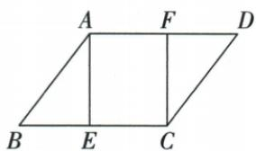

## 讲解

### 判据

AF=CE散在对边两端，先整对边同减得到DF=BE。

### 流程

1.AD=BC同减AF/CE得到DF=BE，因F/E在有限对应边。2.AB=CD、B=D、BE=DF组成夹角SAS ABE/CDF。3.求新ABEF平行四边，已有AF∥BE，再补AF=BE就是同组平行等。4.不再补原AF=CE，那不是缺失条件。

## 例题

### 边两端等截同减SAS再补AF等BE

> 来源ID Q23-20；第23章平行四边形；251-300/full.md 第921–938行。原答案与解析定位：251-300/full.md 第994–1013行。

例3（2024 湖北武汉）如图，在□ABCD 中，点 E, F 分别在边 BC, AD 上, AF = CE.

(1) 求证: $\triangle ABE \cong \triangle CDF.$

(2) 连接 EF. 请添加一个与线段相关的条件, 使四边形 ABEF 是平行四边形。(不需要说明理由)

**原资料答案与解析：**

例3 解析（1）证明：∵ 四边形
ABCD 是平行四边形，

$$
\therefore A B = C D, A D = B C, \angle B = \angle D,
$$

$$
\because A F = C E,
$$

$$
\therefore A D - A F = B C - C E \text {, 即} D F = B E,
$$

$$
\therefore \triangle A B E \cong \triangle C D F (\mathrm{SAS}).
$$

(2)AF=BE.(答案不唯一)

**展开解析（依据原详解补足理由与步骤）：**

(1)原AB=CD、AD=BC、B=D，且AF=CE。同减AD−AF=BC−CE给DF=BE。ABE/CDF的AB=CD、BE=DF、B=D夹角，SAS全等。(2)原AF∥BE，因为分别在AD/BC，添AF=BE，同组对边平行且等判ABEF。原只需条件，仍给其理由；不能添已经原给AF=CE再宣称充分。

## 易错

全等顶点对应A-C B-D E-F，不能在不同顺序取错边。
