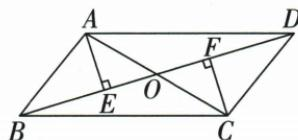

## 讲解

### 判据

已知平行四边及完整对角/边，目标小三角周长或半角，先原性质定位哪半线。

### 流程

1.8/10/5题OC4、OD5、CD5，加14。2.两垂足50题先小直角EAO40，平分给OAD40、平行搬ACB40。3.垂距等证明AO=CO，两90、对顶，AAS给AE=CF。4.每次对应边角来自原已判平行四边，不以任意共点线段或图形观感补等。

## 例题

### 平行四边对角8和10边5小周长14

> 来源ID Q23-12；第23章平行四边形；251-300/full.md 第646–648行。原答案与解析定位：251-300/full.md 第650–654行。

例1 如图, 已知 $\square ABCD$ 的对角线 AC, BD 交于点 O, 且 AC = 8, BD = 10, AB = 5, 则 $\triangle OCD$ 的周长为 \_\_\_\_.

**原资料答案与解析：**

解析 $\because$ 四边形 $ABCD$ 是平行四边形， $\therefore CD = AB = 5, OC = \frac{1}{2} AC = 4, OD = \frac{1}{2} BD = 5,$

∴ $\triangle OCD$ 的周长 = 5 + 4 + 5 = 14.

答案 14

**展开解析（依据原详解补足理由与步骤）：**

对边CD=AB5；互平分OC=AC/2=4、OD=BD/2=5。OCD三边相加4+5+5=14。原两对角可不等，不能取OC=OD；所给AB5不是OA5。

### 平行四边两垂足50半角求40并AAS证等距

> 来源ID Q23-17；第23章平行四边形；251-300/full.md 第847–865行。原答案与解析定位：251-300/full.md 第867–879行。

例4 如图,在平行四边形 ABCD 中,对角线 AC,BD 相交于点 O,分别过点 A,C 作 $AE \perp BD, CF \perp BD$ ,垂足分别为 E,F.AC 平分 $\angle DAE$ .

(1) 若 $\angle AOE = 50^{\circ}$ ，求 $\angle ACB$ 的度数.

(2) 求证: AE = CF.

**原资料答案与解析：**

解析（1）∵ $AE \perp BD, \therefore \angle AEO = 90^{\circ}$ ，又∵ $\angle AOE = 50^{\circ}, \therefore \angle EAO = 40^{\circ}$ .

∵ AC 平分 $\angle DAE, \therefore \angle OAD = \angle EAO = 40^{\circ}.$

∵ 四边形 ABCD 是平行四边形, ∴ $AD \parallel BC$ . ∴ $\angle ACB = \angle OAD = 40^{\circ}$ .

(2) 证明: ∵ 四边形 ABCD 是平行四边形, ∴ AO = CO.

∵ $AE \perp BD, CF \perp BD, \therefore \angle AEO = \angle CFO = 90^{\circ}.$

在 $\triangle AEO$ 和 $\triangle CFO$ 中， $\angle AEO = \angle CFO, \angle EOA = \angle FOC, AO = CO,$

$\therefore \triangle AEO \cong \triangle CFO(AAS) \therefore AE = CF.$

**展开解析（依据原详解补足理由与步骤）：**

(1)AEO直角，AOE50使EAO40；AC平分DAE给OAD40；AD∥BC内错ACB40。(2)AO=CO来自对角互平分，AEO/CFO两直角、EOA/FOC对顶，给对应角及非夹边AO=CO，AAS全等，AE=CF。这里原两垂线垂直同BD但长度相等由原中心对称或全等，不是“任何两垂线总等”。

## 易错

对角互平分不等整对角等长，小图四块等面积也不代表全部全等。
