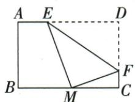

## 讲解

### 判据

矩形的顶点折到另一边中点，折痕端点保持不动。先用翻折保持距离，建立原顶点到折痕点与像点到折痕点等长的关系；再把其中一段写成原边长减未知段，放进直角三角形列勾股式。

### 流程

1. 原D折到BC中点M，F在折痕上且保持不动，故$DF=MF$。相等的是折叠对应的两段，不是CF与MF；先认原点、像点和固定点。
2. 矩形中$CD=AB=4$，$BC=6$且M为中点，所以$MC=3$。设$CF=x$，原D、F、C依次排列，因此$DF=CD-CF=4-x$，须同时保留$0<x<4$。
3. 在直角△MCF中，MF为斜边。由$DF=MF$与勾股定理，$(4-x)^{2}=3^{2}+x^{2}$；左边代表对应斜边平方，右边代表两条直角边平方。
4. 按完全平方公式展开左边，$16-8x+x^{2}=9+x^{2}$。两边减x²得$16-8x=9$，再减9得$7-8x=0$，移项得$8x=7$，除8得$x=7/8$；一次项来自−2×4×x，不能漏掉。
5. 回验$0<7/8<4$。$DF=4-7/8=25/8$，$MF^{2}=9+49/64=625/64$，$MF=25/8$，确实等长，所以所求$CF=7/8$符合原折叠与点序。

## 例题

### 矩形4乘6折D到中点M用等距求CF七比八

> 来源ID Q23-35；第23章平行四边形；251-300/full.md 第1532–1534行。原答案与解析定位：251-300/full.md 第1508–1510行。

例2 (2024 江苏徐州) 如图, 将矩形纸片 ABCD 沿边 EF 折叠, 使点 D 在边 BC 中点 M 处. 若 AB = 4, BC = 6, 则 CF = \_\_\_\_.

**原资料答案与解析：**

例2 解析 在矩形 ABCD 中, CD = AB = 4, $\angle C = 90^{\circ}$ . ∵ M 是 BC 中点, ∴ CM = 3. 由折叠的性质得 MF = DF. 设 CF = x, 由勾股定理得 $MF^{2} = MC^{2} + CF^{2}$ , 即 $(4 - x)^{2} = 3^{2} + x^{2}$ , 解得 $x = \frac{7}{8}$ .

答案 $\frac{7}{8}$

**展开解析（依据原详解补足理由与步骤）：**

原折痕F固定、D像M使DF=MF。CD=AB4，MC=BC/2=3，设CF=x，原D-F-C次序DF4−x。MCF直角C，(4−x)²=3²+x²；展开16−8x+x²=9+x²，同减x²与9得7=8x，x7/8。DF25/8，MF平方9+49/64=625/64，回验同长；0<x<4合法。

## 易错

不把CF=MF，折叠对应D-M、F固定，所以等的是DF/MF。
