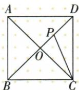
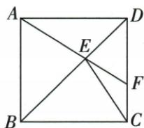
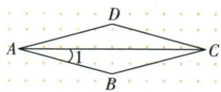

## 讲解

### 判据

原BP等BC或E在BD，45是对角平分顶90，结合等腰/SAS将目标转角差。

### 流程

1.BP=BC题B45，BCP底67.5，AC对角给BCA45，相减ACP22.5。2.56题BE公共、AB=BC、两半B45，SAS把BAE56移BCE56；原C90扣34，F处外角56再扣34给22。3.菱形150题先B150、ABC等腰底15，是半原顶角30，不把角1当整A。

## 例题

### 正方对角点BP等BC角ACP22点5

> 来源ID Q23-47；第23章平行四边形；251-300/full.md 第1974–1976行。原答案与解析定位：251-300/full.md 第1978–1978行。

例1 如图, 已知 P 是正方形 ABCD 对角线 BD 上一点, 且 BP = BC, 则 $\angle ACP$ 的度数是 \_\_\_\_.

**原资料答案与解析：**

答案 $22.5^{\circ}$

**展开解析（依据原详解补足理由与步骤）：**

原正方BD平分B90，P在BD内，PBC45；BP=BC使BPC与BCP为底角各(180−45)/2=67.5。C对角AC将BCD90平分，BCA45，原射线C-A在C-B/C-P之间，ACP=BCP−BCA=67.5−45=22.5°。原仅答案，规范补解析；不能把P移O中点，本题BP等整边，P在O之后。

### 正方共对角SAS移56再外角差22

> 来源ID Q23-50；第23章平行四边形；251-300/full.md 第2191–2191行。原答案与解析定位：251-300/full.md 第2193–2218行。

例1 如图,在正方形 ABCD 中,E 是对角线 BD 上一点,AE 的延长线交 CD 于点 F,连接 CE.若 $\angle BAE = 56^{\circ}$ ,则 $\angle CEF =$ \_\_\_\_ $^{\circ}$ .

**原资料答案与解析：**

解析 $\because$ 四边形 $ABCD$ 为正方形, $\therefore \angle BCD = 90^{\circ}, AB \parallel CD, AB = BC, \angle ABE = \angle CBE$ , 又 $\because BE = BE, \therefore \triangle ABE \cong \triangle CBE(SAS), \therefore \angle BCE = \angle BAE = 56^{\circ}$ ,

$$
\therefore \angle E C F = 9 0 ^ {\circ} - \angle B C E = 3 4 ^ {\circ},
$$

又∵ $AB \parallel CD, \therefore \angle EFD = \angle BAE = 56^{\circ}$ ,

$$
\because \angle E F D = \angle E C F + \angle C E F, \therefore \angle C E F = 5 6 ^ {\circ} - 3 4 ^ {\circ} = 2 2 ^ {\circ}.
$$

答案 22

**展开解析（依据原详解补足理由与步骤）：**

正方AB=BC，BD平分B使ABE=CBE45，BE公共，两边夹角SAS ABE≌CBE，BCE=BAE56。BCD90故ECF34。AB∥CD用AF截给EFD=BAE56，原C-F-D线中EFD为CEF外角，EFD=ECF+CEF，目标56−34=22。原F在CD内部、AE经过E延到F，各外角对象按图核，不把56和34直接加90。

### 菱形D150同对角等再底角15

> 来源ID Q23-38；第23章平行四边形；251-300/full.md 第1647–1659行。原答案与解析定位：251-300/full.md 第1661–1667行。

例1 如图,在菱形 ABCD 中, $\angle D=150^{\circ}$ ,则 $\angle1=$ \_\_\_\_°.

**原资料答案与解析：**

解析 在菱形 ABCD 中, $\angle B = \angle D = 150^{\circ}$ , AB = CB,

$$
\therefore \angle 1 = (1 8 0 ^ {\circ} - 1 5 0 ^ {\circ}) \div 2 = 1 5 ^ {\circ}.
$$

答案 15

**展开解析（依据原详解补足理由与步骤）：**

菱形B=D150；ABC中AB=BC，两底角A/C等，和180−150=30，各15。原角1是BAC，非整个菱形A（30）。也可邻角A30再AC平分给15，两条路一致。

## 易错

同图字母共享不能自动对应，SAS夹角先核两给边真实夹角。
