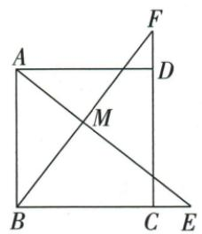

## 讲解

### 判据

CE=DF原各在BC/CD外延，共同方边相等可同加造BE=CF。

### 流程

1.原B-C-E、C-D-F点序，BE=BC+CE、CF=CD+DF。2.BC=CD且CE=DF给BE=CF。3.AB=BC及两夹90，SAS AEB/BFC，AE=BF。4.原M交点暂不用，不以画法给中点；要其他结论必须由对应角再另证。

## 例题

### 正方延长两等段同加边长SAS证AE等BF

> 来源ID Q23-51；第23章平行四边形；251-300/full.md 第2220–2220行。原答案与解析定位：251-300/full.md 第2222–2240行。

例2 如图,在正方形 ABCD 中,点 E 在 BC 边的延长线上,点 F 在 CD 边的延长线上,且 CE=DF,连接 AE 和 BF 相交于点 M.求证:AE=BF.

**原资料答案与解析：**

证明 在正方形 ABCD 中, AB = BC = CD, $\angle ABC = \angle BCD = 90^{\circ}$ .

$$
\because C E = D F, \therefore B C + C E = C D + D F, \therefore B E = C F.
$$

在 $\triangle AEB$ 与 $\triangle BFC$ 中， $\left\{\begin{aligned}AB&=BC,\\ \angle ABE&=\angle BCF,\\ BE&=CF,\end{aligned}\right.$

$$
\therefore \triangle A E B \cong \triangle B F C (\mathrm{SAS}), \therefore A E = B F.
$$

**展开解析（依据原详解补足理由与步骤）：**

正方AB=BC=CD，原B-C-E及C-D-F依次，CE=DF同加BC/CD得BE=CF。ABE90、BCF90，两给边AB=BC、BE=CF及夹角对应，SAS AEB≌BFC，AE=BF。M只是交点未用于原待证，不擅称两线垂直或M中点；若后需垂直应另推对应角互余。

## 易错

一段若改向反延，和式会变差，不能照同加；四边相等之外还用正方90。
