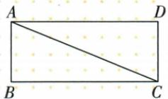
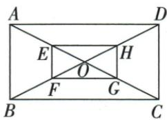
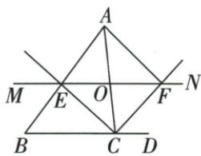
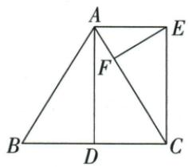

## 讲解

### 判据

要求矩形，原已经平行四边可一90/等对角；一般四边要三90或先判平行四边。

### 流程

1.5/12/13一般四边先原平行搬D90，逆勾股判B90，再连原A90共三直角。2.半对角四中点先新对角互平分，再等对角，判矩形。3.动O内外平分题先OE=OC=OF；O为AC中点让两对角互平分、C两邻补半角90判矩形，并以必要性证只这一位置。4.等腰中线与平行两垂构ADCE三直角，再性质求长度，先后方向清楚。

## 例题

### 平行一组加原直角与5 12 13逆判三直角

> 来源ID Q23-29；第23章平行四边形；251-300/full.md 第1311–1323行。原答案与解析定位：251-300/full.md 第1325–1339行。

例2 如原图，在四边形ABCD中，$AB\parallel CD$，$\angle BAD=90^\circ$，$AB=5$，$BC=12$，$AC=13$。求证：四边形ABCD是矩形。

**原资料答案与解析：**

证明 在四边形 ABCD 中, $AB \parallel CD$ , $\angle BAD = 90^{\circ}$ ,

$$
\therefore \angle A D C = 9 0 ^ {\circ}.
$$

在 $\triangle ABC$ 中, AB = 5, BC = 12, AC = 13,

$$
\therefore A C ^ {2} = A B ^ {2} + B C ^ {2},
$$

∴ 由勾股定理的逆定理, 知 $\triangle ABC$ 是直角三角形, 且 $\angle B = 90^{\circ}$ ,

∴ 四边形 ABCD 是矩形.

**展开解析（依据原详解补足理由与步骤）：**

AB∥CD且BAD90，同旁内角ADC90。ABC三边5/12/13，5²+12²13²逆判最长AC对面B90。已有A/D/B三个直角，四边和360使C也90，矩形。不能只原一个90就给矩形，题未先给平行四边。

### 矩形半对角四中点互平分加等对角判矩形

> 来源ID Q23-30；第23章平行四边形；251-300/full.md 第1372–1388行。原答案与解析定位：251-300/full.md 第1390–1398行。

例1 如图所示,矩形 ABCD 的对角线相交于点 O, 点 E, F, G, H 分别是 AO, BO, CO, DO 的中点, 请问四边形 EFGH 是矩形吗? 请说明理由.

**原资料答案与解析：**

解析 四边形 EFGH 是矩形.

理由：∵ 四边形 ABCD 是矩形，∴ AO = BO = CO = DO.

∵ 点 E, F, G, H 分别是 AO, BO, CO, DO 的中点，

$\therefore EO=FO=GO=HO,$ 四边形 EFGH 是平行四边形.

∵ EO+GO=FO+HO, 即 EG=FH, ∴ 四边形 EFGH 是矩形.

**展开解析（依据原详解补足理由与步骤）：**

原AO=BO=CO=DO，四中点OE=OF=OG=OH，E-O-G及F-O-H原点序使新对角EG/FH在O互平分，先平行四边。又EG=OE+OG、FH=OF+OH都同两倍，等对角判矩形。不是顺次连原四边中点（那种一般为菱形），本题是半对角各中点。

### 内外角平分平行线交等距点O取AC中点判矩形

> 来源ID Q23-31；第23章平行四边形；251-300/full.md 第1400–1414行。原答案与解析定位：251-300/full.md 第1416–1423行。

例2 如图, 在 $\triangle ABC$ 中, 点 $O$ 是边 $AC$ 上一动点, 过点 $O$ 作直线 $MN \parallel BC$ . 设 $MN$ 交 $\angle ACB$ 的平分线于点 $E$ , 交 $\triangle ABC$ 的外角 $\angle ACD$ 的平分线于点 $F$ .

(1) 求证: OE = OF.

(2) 当点 O 在边 AC 上运动到什么位置时, 四边形 AECF 是矩形? 并说明理由.

**原资料答案与解析：**

解析（1）证明：∵ CF 平分 $\angle ACD$ 且 $MN \parallel BD, \therefore \angle ACF = \angle FCD = \angle CFO. \therefore OF = OC.$ 同理可得 OC = OE, ∴ OE = OF.

(2) 当点 O 运动到 AC 的中点时, 四边形 AECF 是矩形.

理由:由(1)知 OE=OF, 当点 O 运动到 AC 的中点时, 有 OA=OC, ∴ 四边形 AECF 为平行四边形,
∵ CE 平分∠ACB, CF 平分∠ACD,

$\therefore \angle OCE + \angle OCF = \frac{1}{2} (\angle ACB + \angle ACD) = 90^{\circ}, \therefore \angle ECF = 90^{\circ}, \therefore$ 四边形 $AECF$ 是矩形.

**展开解析（依据原详解补足理由与步骤）：**

(1)CF外角平分、OF∥CD给OCF=FCD=CFO，所以OF=OC；同CE内角平分及OE∥BC，CEO=ECO使OE=OC，得到OE=OF。(2)O在AC中点则AO=OC，且OE=OF，两对角AC/EF互平分先平行四边；CE/CF分别邻补角内平分，ECF为(ACB+ACD)/2=90，所以矩形。必要性：若AECF矩形，其对角必须互平分，O是交点，必AO=OC，所以位置唯一。O在C端点会退化，原“动点边上”该端不能称矩形。

### 平行四边矩形判定四项垂直对角不足

> 来源ID Q23-36；第23章平行四边形；251-300/full.md 第1538–1546行。原答案与解析定位：251-300/full.md 第1512–1514行。

例3（2024 四川泸州）已知四边形 ABCD 是平行四边形, 下列条件中, 不能判定 □ABCD 为矩形的是 ( )

A. $\angle A = 90^{\circ}$

B. $\angle B = \angle C$

C. $AC = BD$

D. $AC \perp BD$

**原资料答案与解析：**

例3 解析 对角线互相垂直的平行四边形不一定是矩形, 故选项 D 不能判定.

答案 D

**展开解析（依据原详解补足理由与步骤）：**

A一90在平行四边上足够矩形；B邻B/C原互补又相等，2B180所以各90，足够；C对角相等在平行四边上足够；D互相垂直是菱形方向，可能斜菱形，不能保矩形，所以选D。判定基础原已平行四边，不删这个前提。

### 等腰中线配平行先三直角矩形再等面积EF六根号13比13

> 来源ID Q23-37；第23章平行四边形；251-300/full.md 第1550–1561行。原答案与解析定位：251-300/full.md 第1563–1592行。

例4（2024甘肃兰州）如图，在 $\triangle ABC$ 中， $AB=AC,D$ 是 $BC$ 的中点， $CE\parallel AD,AE\perp AD,EF\perp AC.$

(1) 求证: 四边形 ADCE 是矩形.  
(2) 若 BC=4, CE=3, 求 EF 的长.

**原资料答案与解析：**

例4 解析 (1) 证明: $\because AE \perp AD$ , $\therefore \angle EAD = 90^{\circ} \because AB = AC, D$ 是 $BC$ 的中点, $\therefore AD \perp BC$ ,

$$
\because C E \parallel A D, \therefore \angle E C D = \angle A D B = 9 0 ^ {\circ},
$$

$$
\therefore \angle A D C = \angle E C D = \angle E A D = 9 0 ^ {\circ},
$$

∴ 四边形 ADCE 是矩形.

(2)∵D是BC的中点,∴CD=2,
由(1)可知四边形ADCE是矩形,

$$
\therefore A E = C D = 2, \angle A E C = 9 0 ^ {\circ}.
$$

$$
\therefore A C = \sqrt {A E ^ {2} + C E ^ {2}} = \sqrt {1 3}.
$$

$$
\because S _ {\triangle A E C} = \frac {1}{2} A C \cdot E F = \frac {1}{2} A E \cdot C E,
$$

$$
\therefore E F = \frac {A E \cdot C E}{A C} = \frac {6 \sqrt {1 3}}{1 3}.
$$

**展开解析（依据原详解补足理由与步骤）：**

(1)AB=AC、D为BC中点，三线合一AD⊥BC，所以ADC90。CE∥AD givesECD90；AE⊥AD givesEAD90。三个直角判ADCE矩形。(2)CD=BC/2=2，矩形AE=CD2，AEC90，CE3。AC²=2²+3²=13，AC√13。AEC同面积AE×CE/2=AC×EF/2，乘2、除正AC得EF6/√13，分子分母乘√13为6√13/13。原EF是E到AC高，非矩形一边。

## 易错

原四项对角垂直不足，已平行四边时邻角相等配互补也足够；只一般四边一90不能判。
