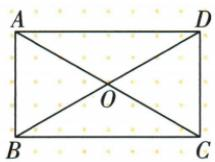

## 讲解

### 判据

矩形两对角线相交，一组邻角为120°，并给一条边，要求整条对角线。先由等对角线与互相平分得到两段半对角线相等，再由邻补角得到60°，把含已知边的小三角形判为等边。

### 流程

1. 矩形对角线$AC=BD$，交点O又使$OA=AC/2$、$OB=BD/2$。相等整长各取一半仍相等，所以$OA=OB$，△AOB为等腰；不能只凭“相交”得到这个等长关系。
2. A、O、C在同一直线上，$\angle AOB$与$\angle BOC$互为邻补角。原$\angle BOC=120^{\circ}$，故$\angle AOB=180^{\circ}-120^{\circ}=60^{\circ}$。
3. △AOB的两腰OA、OB相等，顶角60°，两个底角也各为$(180^{\circ}-60^{\circ})/2=60^{\circ}$，因此△AOB为等边，$OA=OB=AB$。
4. 原$AB=6$，所以$OA=6$。求的是整对角线，$AC=2OA=12$；另一条BD与AC相等，也为12，不把半段6直接作为最终答案。
5. 最后核对60°来自原120°的邻補关系。普通矩形的对角线不一定垂直，也不自动分出等边三角形；若缺交角条件，这条求长过程就不能直接用。

## 例题

### 矩形交角120余60等边边6对角12

> 来源ID Q23-28；第23章平行四边形；251-300/full.md 第1283–1285行。原答案与解析定位：251-300/full.md 第1287–1307行。

例1 如图, 在矩形 ABCD 中, 对角线 AC, BD 相交于点 O, $\angle BOC = 120^{\circ}$ , AB = 6. 求对角线的长.

**原资料答案与解析：**

解析∵四边形ABCD是矩形，

$$
\therefore A C = B D, O A = O C, O B = O D,
$$

$$
\therefore O A = O B. \because \angle B O C = 1 2 0 ^ {\circ},
$$

$$
\therefore \angle A O B = 6 0 ^ {\circ},
$$

∴ $\triangle AOB$ 是等边三角形，

$$
\therefore O A = A B = 6, \therefore B D = A C = 2 O A =
$$

$2 \times 6 = 12$ , 即对角线的长为 12.

**展开解析（依据原详解补足理由与步骤）：**

矩形对角相等且互平分，OA=OB。A-O-C共线，AOB180−BOC120=60；AOB等腰一60等边，OA=AB6。AC2OA12，BD=AC12。一般矩形对角不垂直，也不总等边，本题等边用了120。

## 易错

矩形不自带等边AOB，本题120条件缺了不能跳；答整对角不是半长6。
