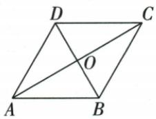

## 讲解

### 判据

菱形有垂直互平分对角，小半图直角适合勾股，求面积或高需完整对角与垂距。

### 流程

1.24周边6，对角8半4，另一半√20=2√5，倍回4√5，面积积半16√5。2.60花坛边6，ABD等边先BD6半3，勾股OA3√3，倍回AC6√3，四选项分别整/半两对角。3.对角8/6先面积24，再半4/3勾股边5，底高24=5DH得24/5。4.周长20中点E，OE中位半边2.5，不能误算某对角。

## 例题

### 菱形周长24对角8求另一对角四根5面积16根5

> 来源ID Q23-39；第23章平行四边形；251-300/full.md 第1677–1679行。原答案与解析定位：251-300/full.md 第1681–1691行。

例2 如图,已知菱形 ABCD 的周长为 24,一条对角线的长为 8,求该菱形的面积.

**原资料答案与解析：**

解析：菱形ABCD的周长为24，∴ AB=6. ∵ 一条对角线的长为 8,
∴ 不妨令 AC=8, 则 OA=4.

∵ 在菱形 ABCD 中, $AC \perp BD$ ,
∴ $\angle AOB = 90^{\circ}$ . 在 Rt $\triangle AOB$ 中，

$$
\begin{array}{l} O B = \sqrt {A B ^ {2} - O A ^ {2}} = 2 \sqrt {5}, \therefore B D = \\ 4 \sqrt {5} \therefore S _ {\text {菱形}} = \frac {1}{2} A C \cdot B D = \frac {1}{2} \times 8 \times \\ 4 \sqrt {5} = 1 6 \sqrt {5}. \\ \end{array}
$$

注意 易错在求面积时漏乘 $\frac{1}{2}$ .

**展开解析（依据原详解补足理由与步骤）：**

四边等、周24，边6。令AC8，互平分OA4；垂直对角AOB直角，OB²=6²−4²=20，OB2√5，BD2OB4√5。面积AC×BD/2=8×4√5/2=16√5。不是两对角乘积32√5，亦不可只用半对角OB不再倍回。

### 菱形周长20中点E中位线OE2点5四项

> 来源ID Q23-40；第23章平行四边形；251-300/full.md 第1744–1765行。原答案与解析定位：251-300/full.md 第1767–1777行。

例1 如图,菱形ABCD的周长为20,对角线AC、BD相交于点O,E是CD的中点,则OE的长是()

A.2.5

B.3

C.4

D.5

**原资料答案与解析：**

解析 ∵ 四边形 ABCD 为菱形, 周长为 20, ∴ DO = BO, BC = 20 ÷ 4 = 5,

∵ O 是 BD 的中点, E 是 CD 的中点,

∴ OE 为 $\triangle BCD$ 的中位线，

$$
\therefore O E = \frac {1}{2} B C = 2. 5.
$$

答案 A

**展开解析（依据原详解补足理由与步骤）：**

边BC20/4=5，O为BD中点、E为CD中点，BCD中位OE=BC/2=2.5，A。B3/C4无法与半5相等，D5是整BC没有半长。不需对角具体读数。原2.5OCR小数空格正文恢复，原证据保留。

### 菱形周24一60等边后勾股倍半求AC六根3

> 来源ID Q23-41；第23章平行四边形；251-300/full.md 第1779–1799行。原答案与解析定位：251-300/full.md 第1801–1807行。

例2 如图,已知某广场的菱形花坛 ABCD 的周长是 $24 \, m$ , $\angle BAD = 60^{\circ}$ , 则对角线 AC 的长为 ( )

A. $6\sqrt{3}$ m

B.6 m

C. $3\sqrt{3}$ m

D.3 m

**原资料答案与解析：**

解析 ∵ 四边形 ABCD 为菱形, ∴ AC ⊥ BD, OA = OC, OB = OD, AB = BC = CD = AD = 24÷4 = 6(m),

又∵ $\angle BAD=60^{\circ},\therefore \triangle ABD$ 为等边三角形,∴ BD=AB=6 m,∴ OD=OB=3 m,

在 Rt△AOB 中,根据勾股定理得 $OA=\sqrt{6^{2}-3^{2}}=3\sqrt{3}$ (m),∴ $AC=2OA=6\sqrt{3}$ m.

答案 A

**展开解析（依据原详解补足理由与步骤）：**

每边6，BAD60与AB=AD使ABD等边，BD6。O对角交点，OB3、OA⊥OB；AOB勾股OA²=36−9=27，OA3√3，AC2OA6√3，A。B6为另一对角BD；C3√3为半目标OA；D3为半另一对角OB，均错对象。

### 菱形对角8和6勾股边5等面积高24比5

> 来源ID Q23-42；第23章平行四边形；251-300/full.md 第1813–1813行。原答案与解析定位：251-300/full.md 第1815–1825行。

例3 如图,四边形 ABCD 是菱形,AC=8,DB=6,DH⊥AB 于点 H.求 DH 的长.

**原资料答案与解析：**

解析 $\because$ 四边形 $ABCD$ 为菱形, $AC = 8, DB = 6$ , $\therefore OA = \frac{1}{2} AC = 4, OB = \frac{1}{2} BD = 3, OA \perp OB$ ,

$$
\therefore A B ^ {2} = O A ^ {2} + O B ^ {2} = 4 ^ {2} + 3 ^ {2} = 2 5, \therefore A B = 5.
$$

$$
\because S _ {\text {菱形} A B C D} = \frac {1}{2} A C \cdot B D = A B \cdot D H, \therefore \frac {1}{2} \times 8 \times 6 = 5 D H, \therefore D H = \frac {2 4}{5}.
$$

**展开解析（依据原详解补足理由与步骤）：**

OA4、OB3且垂直，AB√(16+9)=5。全菱面积AC×BD/2=8×6/2=24；AB为底、D到AB高DH，24=5DH，DH24/5。高不是对角半长3/4，也非边5。

## 易错

先标全长或半长，每次倍2/除2来源明确；面积单位平方，高与斜边区分。
