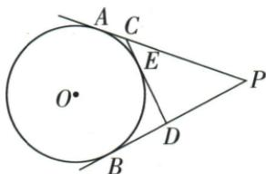

## 错法

看PA=PB10就不论CD位置都断言PCD周长20。

## 正解

原图C在P-A内部，D在P-B内部，E在C-D内部，三次相加与等切线替段才合PA+PB20。移到延长线上时某些段要作差，周长不保证原式。每个切线长相等还必须列出同一个圆外点。

## 例题

### 三切截在两切段内部用切线长等替换周长20

> 来源ID Q24-29；第24章圆；251-300/full.md 第3741–3752行。原答案与解析定位：251-300/full.md 第3754–3758行。

例5 如图, $PA、PB、CD$ 都与 $\odot O$ 相切, $A、B、E$ 为切点, $PA=10, CD$ 分别交 $PA、PB$ 于 $C、D$ 两点, 则 $\triangle PCD$ 的周长是 \_\_\_\_.

**原资料答案与解析：**

解析 由题意得 $PB = PA = 10, CA = CE, DE = DB$

∴ $\triangle PCD$ 的周长是 $PC + CD + PD = PC + CA + DB + PD = PA + PB = 10 + 10 = 20.$

答案 20

**展开解析（依据原详解补足理由与步骤）：**

同一点P的两切线长PA=PB=10。同一点C的CA=CE，同一点D的DB=DE。图示E在CD内，CD=CE+ED=CA+DB；C在P-A间、D在P-B间，PC+CA=PA、PD+DB=PB。于是周长PC+CD+PD=(PC+CA)+(PD+DB)=PA+PB=20。原点序用于每次相加；若第三切线改在A/B外，不能套这个周长式。
