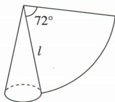
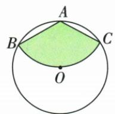

## 错法

把母线5当底半径或高度；半圆展开用底面积15除2；圆锥体积漏1/3选C。

## 正解

先标底半径r、母线l、垂直高h、展开弧长L。L=2πr，扇形半径l，h²=l²−r²。原180°得l2r侧30，原72/l5得r1/h2√6，再体积除3选D。

## 例题

### 圆锥底面积15展开半圆弧长守恒侧面积30

> 来源ID Q24-41；第24章圆；251-300/full.md 第4267–4267行。原答案与解析定位：251-300/full.md 第4269–4275行。

例2 某圆锥的底面积是 $15 \, cm^{2}$ ，其侧面展开图中扇形的圆心角是 $180^{\circ}$ ，则该圆锥的侧面积是 \_\_\_\_ $cm^{2}$ .

**原资料答案与解析：**

解析 设该圆锥的底面圆的半径是 $r \mathrm{~cm}$ , 侧面展开图中扇形的半径是 $R \mathrm{~cm}$ , 则 $\pi r^{2} = 15, 2\pi r = \pi R$ ,

$\therefore R = 2r = 2\sqrt{\frac{15}{\pi}}.\therefore S_{\text{圆锥侧}} = \frac{2\pi r \cdot R}{2} = \frac{\pi R^2}{2} = \frac{1}{2}\pi \times 4 \times \frac{15}{\pi} = 30(\mathrm{cm}^2).$

答案 30

注意 圆锥侧面展开图中扇形的半径是圆锥的母线长，不是圆锥的底面圆的半径.

**展开解析（依据原详解补足理由与步骤）：**

设底面半径r、母线R。展开扇形180°为半圆，其弧长πR等于原底面周长2πr，所以R=2r。底面积πr²=15 cm²。侧面积=弧长×母线/2=(2πr)R/2=πrR=2πr²=2×15=30 cm²。这里180°不是在底圆上取半圆，而是在母线为半径的展开图上取半圆；直接取15/2会用错半径。

### 母线5展开72求底半径1高2根6再体积两根6π比3四项

> 来源ID Q24-51；第24章圆；251-300/full.md 第4517–4534行。原答案与解析定位：251-300/full.md 第4456–4469行。

例4（2024 广东广州）如图，圆锥的侧面展开图是一个圆心角为 $72^{\circ}$ 的扇形，若扇形的半径 l 是 5，则该圆锥的体积是（）

A. $\frac{3\sqrt{11}}{8}\pi$

B. $\frac{\sqrt{11}}{8}\pi$

C. $2 \sqrt{6} \pi$

D. $\frac{2\sqrt{6}}{3}\pi$

**原资料答案与解析：**

例4 解析 由题意得扇形的弧长为 $\frac{72\pi\times5}{180}=2\pi$ ，设该圆锥的底面圆的半径为r，则 $2\pi r=2\pi$ ，

$$
\therefore r = 1,
$$

∴该圆锥的高为 $\sqrt{5^{2}-1^{2}}=2\sqrt{6}$ ,
∴该圆锥的体积为 $\frac{\pi}{3}\times1^{2}\times2\sqrt{6}=$

$$
\frac {2 \sqrt {6}}{3} \pi .
$$

答案 D

**展开解析（依据原详解补足理由与步骤）：**

展开扇形半径是母线l=5，弧长72π×5/180=2π；它等于底圆周长2πr，故r=1。母线、底半径、高构成直角三角形，h²=5²−1²=24，h=2√6。本题使用的圆锥体积公式是拓展：考试可用，V=πr²h/3。代入得V=π×1²×2√6/3=2√6π/3，D。C漏掉圆锥占同底同高圆柱体积的1/3；A/B的系数及根号均不符合已确定r=1、h²=24，不能把5当底半径或把高度当母线。

### 原圆内顶点为圆心剪120扇形先SSS求母线1再底半径1比3

> 来源ID Q24-47；第24章圆；251-300/full.md 第4410–4412行。原答案与解析定位：251-300/full.md 第4414–4418行。

例6 如图,从一块半径为 $1 \, m$ 的圆形铁皮上剪出一个圆心角为 $120^{\circ}$ 的扇形 ABC, 如果将剪下来的扇形围成一个无底的圆锥, 求该圆锥的底面圆的半径.

**原资料答案与解析：**

解析 连接 $OA, OB$ , 由题意易得 $\angle BAO = \frac{1}{2} \angle BAC = \frac{1}{2} \times 120^\circ = 60^\circ$ . 又 $\because OA = OB, \therefore \triangle AOB$ 是等边三角形, $\therefore AB = OA = 1 \mathrm{~m.}$ $\because \angle BAC = 120^\circ, \therefore$ 扇形的弧长 $= \frac{120\pi \times AB}{180} = \frac{2\pi}{3} (\mathrm{~m})$ .

设该圆锥的底面圆的半径为 $r\mathrm{m}$ ，则 $2\pi r = \frac{2\pi}{3}, \therefore r = \frac{1}{3}$ ，即该圆锥的底面圆的半径为 $\frac{1}{3}\mathrm{m}$ .

**展开解析（依据原详解补足理由与步骤）：**

这里被剪扇形的圆心在A，原整铁皮圆的圆心在O，必须区分。扇形两半径AB=AC；原圆半径OB=OC，AO公共，SSS证△AOB≌△AOC，所以AO平分∠BAC=120°，∠BAO=60°。OA=OB=1使△AOB两底角相等且均60°，于是三角形等边，AB=1 m。这才是展开扇形半径即母线。弧长120π×1/180=2π/3 m；围成圆锥后2πr=2π/3，同除2π得r=1/3 m。原圆半径与母线恰巧同为1，是上述全等证明的结果，不能把不同圆心的两个半径先当相同。
