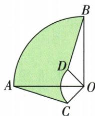

## 错法

原相交半圆题把弓形扣扇形后仍减三角，得到错误负√3项；看到形状像就平移减整圆。

## 正解

先证AEF等边，弓形=扇形−三角；阴影减整个弓形，故括号前负号使三角面积变加。原表达2π−2π/3−(2π/3−√3)=2π/3+√3。其余割补须先SAS或共底等高证明等积，保持区域覆盖。

## 例题

### 矩形4乘2半圆交另圆弧等边割补阴影2π比3加根3

> 来源ID Q24-50；第24章圆；251-300/full.md 第4500–4513行。原答案与解析定位：251-300/full.md 第4442–4454行。

例3 (2024 四川资阳) 如图, 在矩形 $ABCD$ 中, $AB = 4$ , $AD = 2$ . 以点 $A$ 为圆心, $AD$ 长为半径作弧交 $AB$ 于点 $E$ , 再以 $AB$ 为直径作半圆, 与 $\widehat{DE}$ 交于点 $F$ , 则图中阴影部分的面积为 \_\_\_\_.

**原资料答案与解析：**

例3 解析 连接 $AF, EF$ ,

由题意得 $\triangle AEF$ 是等边三角形， $S_{\text{阴影}} = S_{\text{半圆}} - S_{\text{扇形} AEF} - S_{\text{弓形} AF} =$

$$
2 \pi - \frac {6 0 \pi \times 2 ^ {2}}{3 6 0} - \left(\frac {6 0 \pi \times 2 ^ {2}}{3 6 0} - \frac {\sqrt {3}}{4} \times 2 ^ {2}\right)
$$

$$
= \frac {2 \pi}{3} + \sqrt {3}.
$$

答案 $\frac{2\pi}{3} +\sqrt{3}$

**展开解析（依据原详解补足理由与步骤）：**

E是AB中点，因为AE=AD=2且AB=4；半圆中心为E、半径2。F同时落在以A为圆心半径2的弧上及该半圆上，故AF=EF=AE=2，△AEF等边，两个相关扇形中心角各60°。原阴影=半圆面积−扇形AEF面积−弓形AF面积。半圆为π×2²/2=2π；每个60°扇形为60π×2²/360=2π/3；弓形AF是以E为圆心的60°扇形EAF扣等边△AEF，后者高√(2²−1²)=√3，面积2×√3/2=√3。代入2π−2π/3−(2π/3−√3)=2π/3+√3。括号内整块要减，不能把三角面积也重复减去。

### 同中心两90扇形SAS割补面积2π

> 来源ID Q24-43；第24章圆；251-300/full.md 第4325–4325行。原答案与解析定位：251-300/full.md 第4327–4339行。

例2 如图,扇形 OAB 与扇形 OCD 的圆心角均为 $90^{\circ}$ , 连接 AC, BD. 若 OA = 3 cm, OC = 1 cm, 求阴影部分的面积.

**原资料答案与解析：**

解析（割补拼凑法）∵ 扇形 OAB 和扇形 OCD 的圆心角都是 $90^{\circ}$ ,

$$
\therefore \angle A O C + \angle A O D = \angle A O D + \angle B O D = 9 0 ^ {\circ} \therefore \angle A O C = \angle B O D.
$$

又∵ OC=OD, OA=OB, ∴ $\triangle AOC \cong \triangle BOD.$

∴ $\triangle BOD$ 可以看作是由 $\triangle AOC$ 绕点 O 顺时针旋转 $90^{\circ}$ 得到的.

$$
\therefore S _ {\text {阴影}} = S _ {\text {扇形} O A B} - S _ {\text {扇形} O C D} = \frac {9 0 \pi \times 3 ^ {2}}{3 6 0} - \frac {9 0 \pi \times 1 ^ {2}}{3 6 0} = 2 \pi (\mathrm{cm} ^ {2}).
$$

**展开解析（依据原详解补足理由与步骤）：**

两扇形均90°，公共∠AOD从这两个90°中各扣去，得到∠AOC=∠BOD；OA=OB=3、OC=OD=1，SAS证△AOC≌△BOD。这两块等面积可互换，原不规则阴影变成大90°扇形扣小90°扇形。面积=90π×3²/360−90π×1²/360=(9−1)π/4=2π cm²。割补前必须证明被交换的两块等面积，不能只看图像相似。

### 半弦根3与30圆周角等面积替换求阴影2π比3

> 来源ID Q24-44；第24章圆；251-300/full.md 第4341–4351行。原答案与解析定位：251-300/full.md 第4353–4361行。

例3 如图, $AB$ 是 $\odot O$ 的直径, 弦 $CD \perp AB$ , $\angle CDB = 30^{\circ}$ , $CD = 2\sqrt{3}$ , 求阴影部分的面积.

**原资料答案与解析：**

解析（等积变换法）连接 $OD$ ，设 $CD$ 交 $AB$ 于点 $E$ . $\because CD \perp AB, \therefore CE = DE = \frac{1}{2} CD = \sqrt{3}$ ， $\therefore S_{\triangle OCE} = S_{\triangle ODE}, \therefore$ 阴影部分的面积等于扇形 $OBD$ 的面积.

$$
\because \angle C D B = 3 0 ^ {\circ}, \therefore \angle C O B = 6 0 ^ {\circ}, \therefore \angle B O D = \angle C O B = 6 0 ^ {\circ},
$$

在 Rt△COE 中，∵ $CE=\sqrt{3}$ ，∴ OC=2，∴ $S_{扇形OBD}=\frac{60\pi\times2^{2}}{360}=\frac{2\pi}{3}$ ，即阴影部分的面积为 $\frac{2\pi}{3}$ .

**展开解析（依据原详解补足理由与步骤）：**

AB直径且CD⊥AB，交E，垂径定理给CE=DE=CD/2=√3；△OCE、ODE共底OE且等高CE/DE，面积相等。原阴影由△OCE及弓形BD组成，换前者为△ODE，合成扇形OBD。∠CDB=30°给∠COB=60°；直径平分两弧，也给∠BOD=60°。直角△COE中∠COE=60°，另一锐角30°，OE=OC/2；勾股OC²=3+OC²/4，解得OC²=4，半径2。目标扇形面积60π×2²/360=2π/3。

### 共底两个半圆切弦24平移同心半平方差面积72π

> 来源ID Q24-45；第24章圆；251-300/full.md 第4363–4365行。原答案与解析定位：251-300/full.md 第4367–4375行。

例4 如图,两个半圆的直径共线,O为大半圆的圆心,AB是半圆O的弦,CD是半圆O的直径,AB与小半圆相切, $AB \parallel CD$ ,且AB=24,求图中阴影部分的面积.

**原资料答案与解析：**

解析（迁移变换法）将小半圆向右平移，使两个半圆的圆心重合，如图.设 $AB$ 与小半圆的切点为 $E$ ，连接OB、OE.

由切线的性质及垂径定理可得 $OE \perp AB, BE = \frac{1}{2} AB = 12,$

$$
\therefore S _ {\text {阴影}} = S _ {\text {大半圆}} - S _ {\text {小半圆}} = \frac {\pi}{2} O B ^ {2} - \frac {\pi}{2} O E ^ {2} = \frac {\pi}{2} (O B ^ {2} - O E ^ {2}) = \frac {\pi}{2} B E ^ {2} = 7 2 \pi .
$$

**展开解析（依据原详解补足理由与步骤）：**

先按原图将小半圆水平平移到大半圆同心位置，面积不变且仍在大半圆内部；AB∥直径，平移后的小圆仍切AB。设其半径OE=r、大圆半径OB=R，切线性质OE⊥AB，垂径给BE=24/2=12。直角△OEB给R²−r²=12²=144。阴影是大半圆减小半圆，面积π(R²−r²)/2=π×144/2=72π。无需分别求两个半径；直接把弦24当某半径会丢掉结构。
