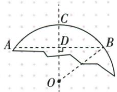

## 错法

把弦24整长当直角边，或看第一图只答7；残圆把40直接作一腿。

## 正解

过圆心垂线先平分弦。13/24/10用12与5，得距离5与12，再同侧差7/异侧和17。残圆40半为20，另一腿R−10；完整展开相消得R25。

## 例题

### 半径13两平行弦24与10同侧差7异侧和17

> 来源ID Q24-04；第24章圆；251-300/full.md 第2729–2729行。原答案与解析定位：251-300/full.md 第2731–2743行。

例1 已知圆的半径为 13, 两弦 $AB \parallel CD$ , $AB = 24$ , $CD = 10$ , 则两弦 $AB$ 、 $CD$ 之间的距离是 \_\_\_\_.

**原资料答案与解析：**

解析 画出示意图如下. 过点 O 作 $OE \perp CD$ 于 E, $OF \perp AB$ 于 F, 易得 O, E, F 三点共线.

  
图 1

  
图 2

利用垂径定理、勾股定理可求得 $OE = 12, OF = 5$ ，所以两弦 $AB, CD$ 之间的距离是 $12 - 5 = 7$ 或 $12 + 5 = 17$ .

# 答案7或17

注意 此类问题中两弦与圆心的相对位置往往不确定，需要分情况讨论.

**展开解析（依据原详解补足理由与步骤）：**

过O向两条弦所在直线作垂线。因为弦平行，两垂线在同一直线上；垂径定理给半弦12和5。分别用勾股定理：到AB的距离为√(13²−12²)=5，到CD的距离为√(13²−5²)=12。

圆心在两弦同侧时，垂足间距离为12−5=7；圆心在两弦之间时，距离为12+5=17。题干未限定相对位置，两种均能放入半径13的圆，答案7或17。不能凭其中一张示意图舍去另一种。

### 残缺圆弦40弓高10建立半径平方差求25四项

> 来源ID Q24-13；第24章圆；251-300/full.md 第3098–3106行。原答案与解析定位：251-300/full.md 第3071–3085行。

例1 (2024 四川凉山州) 数学活动课上, 同学们要测一个如图所示的残缺圆形工件的半径, 小明的解决方案是: 在工件圆弧上任取两点 A, B, 连接 AB, 作 AB 的垂直平分线 CD 交 AB 于点 D, 交 $\widehat{AB}$ 于点 C, 测出 AB = 40 cm, CD = 10 cm, 则圆形工件的半径为

A.50 cm

B.35 cm

C.25 cm

D.20 cm

**原资料答案与解析：**

例1 解析 设圆心为 O，连接 OB, ∵ CD 垂直平分 AB, ∴ BD = 20 cm. 在 Rt△OBD 中, $OD^{2} + BD^{2} = OB^{2}$ , 即 $(OB - 10)^{2} + 20^{2} = OB^{2}$ , ∴ OB = 25 cm, 即圆形工件的半径为 25 cm.

答案 C

**展开解析（依据原详解补足理由与步骤）：**

原CD垂直平分弦AB，圆心O在CD所在直线上；BD=40/2=20 cm。设半径为R，原图C-D-O按序，CD=10 cm，所以OD=R−10。连OB，直角△ODB给(R−10)²+20²=R²。展开R²−20R+100+400=R²，同减R²得−20R+500=0，移项再除20得R=25 cm，C。回验OD=15，15²+20²=25²。A50、B35、D20代入分别使(R−10)²+400−R²为−500、−200、100，均不为0。
