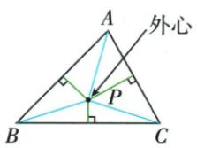
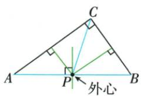
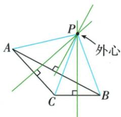

## 讲解

### 是什么

经过非退化三角形三个顶点的圆叫外接圆，其圆心为外心。外心到三个顶点距离相等，是任两边中垂线的唯一交点；重心则是中线交点、内心是角平分线交点，定义不同。

### 怎么来的

作AB、BC中垂线交O，等距性质给OA=OB=OC，O圆心OA半径的圆即通过三点；第三边AC中垂也通过O，故三线共点。因为AB与BC不共线，其垂线方向也不同，两中垂必有唯一交点，圆心确定后半径也唯一。若A/B/C共线，两边中垂平行，不能如此作同一有限圆，故非共线是三点定圆边界。原作图是由等半径性质构造圆，而不是先猜圆心再画到近似通过顶点。

### 什么时候能用

适用于三个不同非共线点，原三角形条件保证。外心可以在内部、边上或外部；直角三角形外心在斜边中点，因为对径圆周角及等距，中点到三点半斜边。原本题无尺寸、无指定中心位置，不增造半径数字。

原三村选址是到顶点等距、不是到三边等距。三边中垂先交两条，等距传递使交点也在第三条，故共点唯一；锐角外心内部、直角斜边中点、钝角外部，原三幅位置图逐一保留，不能凭“中心”一词强放内部。位置判断还需要证明，不能只凭顶点“移到圆内或圆外”的图示。下面对任一边$BC$说明外心$O$在它哪一侧，再对三条边分别使用同一结论。

令$M$是$BC$中点，$BM=CM=s>0$。取$BC$为水平基线，顶点$A$在上方，向基线作垂线$AH$，令$AH=h>0$。从$M$向$C$的方向记$H$的位置为有向量$x$，若在反向则$x<0$。外心在$BC$中垂线上，将$MO$向$A$一侧的方向记作$t$；$t>0$表示$O$与$A$同侧，$t=0$表示$O=M$，$t<0$表示在另一侧。这里有向量只记录方向，实际长度为相应绝对值。

用勾股分别表示两条等半径：$OA^2=x^2+(h-t)^2$、$OB^2=s^2+t^2$。由$OA=OB$，展开$(h-t)^2=h^2-2ht+t^2$并两边同减$t^2$，得

$$2ht=x^2+h^2-s^2.$$

再以同一高$AH$计算两腰平方：$AB^2=(x+s)^2+h^2$、$AC^2=(x-s)^2+h^2$，而$BC^2=4s^2$。展开两平方后，$2xs$与$-2xs$相消，得到

$$AB^2+AC^2-BC^2=2x^2+2h^2-2s^2=4ht.$$

三边平方比较的完整证明说明：左边为正、零、负时，所对的$\angle A$分别为锐角、直角、钝角。由于$h>0$，这三种符号又分别对应$t>0$、$t=0$、$t<0$。所以：$\angle A$锐时，外心与$A$在$BC$同侧；$\angle A$直时，外心为$BC$中点；$\angle A$钝时，外心在$BC$另一侧。锐角三角形对三条边都满足“与对面顶点同侧”，三处内部半平面的共同区域正是三角形内部，因此外心在内部；直角情形在斜边中点；钝角情形至少在钝角所对边的外侧，因而在三角形外部。

非共线三点的两边中垂线唯一交O，OA=OB=OC，第三边中垂也过O，故外接圆及外心唯一。锐角外心在内部、直角外心为斜边中点、钝角外心在外部，指整个三角形的角类型；不能反过来由“外心在外”就认任意给定顶点A必钝。原∠BIC130的65/115两答案，应按A落弦BC对应优弧或劣弧分类；若另顶点钝，外心外部时A仍可65。与内心区分：外心到顶点等距，未必到三边等距；内心到三边垂距等，总在三角内部。

## 例题

### 三顶点外接圆作两中垂得等半径

> 来源ID Q20-26；第20章全等三角形；201-250/full.md 第3507–3517行。原答案与解析定位：201-250/full.md 第3519–3527行。

例3 如图,已知 $\triangle ABC$ , 请作一个圆,使 A、B、C 三点都在该圆上. (尺规作图,不写作法,保留作图痕迹)

**原资料答案与解析：**

解析 如图, $\odot O$ 即为所求.

**展开解析（依据原详解补足理由与步骤）：**

分别作AB、BC中垂线，交于O。O在AB中垂线上给OA=OB，在BC中垂线上给OB=OC，传递OA=OB=OC。以O为圆心OA长为半径画圆，A、B、C三点都在圆上。原非退化三角形三点不共线，两中垂不平行所以唯一交点；第三中垂也过O，不必额外目测圆心。若三点共线，通常不能作同一有限圆通过三点，原题给三角形已排除。

### 三个村庄等距学校两中垂唯一交点

> 来源ID Q21-02；第21章等腰三角形；201-250/full.md 第3845–3855行。原答案与解析定位：201-250/full.md 第3857–3870行。

例2 为了解决三个村庄孩子的就近入学问题,计划新建一所小学,使学校到三个村庄的距离相等.若三个村庄A,B,C的位置如图所示,请你在图中确定小学的位置(用点P表示).

**原资料答案与解析：**

解析 如图所示, 连接 AB, BC. 分别作线段 AB, BC 的垂直平分线 $l, l'$ , 交于点 P, 则点 P 就是所要确定的学校的位置.

**展开解析（依据原详解补足理由与步骤）：**

连接AB、BC并分别尺规作其中垂线，相交P。PA=PB、PB=PC来自各自中垂性质，等量传递得三距相等；反之任一合格P都在这两中垂线上，所以交点唯一。原三点非共线，保证两中垂有唯一交点；不凭原图把点选为三边中点或角平分交点。这里只按直线距离选址，题未给道路、地价或最近总路程条件。

### 外心角130按顶点所在两弧分类65或115

> 来源ID Q24-18；第24章圆；251-300/full.md 第3284–3284行。原答案与解析定位：251-300/full.md 第3286–3299行。

例2 在 $\triangle ABC$ 中,点 $I$ 是外心, $\angle BIC=130^{\circ}$ ,求 $\angle A$ 的度数.

**原资料答案与解析：**

解析 若三角形的外心在三角形内,如图 1,则 $\angle A=\frac{1}{2}\angle BIC=65^{\circ}$ .

若三角形的外心在三角形上,如图2,则 $\angle A=\frac{1}{2}\angle BIC=65^{\circ}$ .

若三角形的外心在三角形外,如图3,在弦BC所对的优弧(除点B、C)上任取一点M,连接BM,CM,则 $\angle A=180^{\circ}-\angle M=180^{\circ}-\frac{1}{2}\angle BIC=115^{\circ}$ .综上, $\angle A$ 的度数是 $65^{\circ}$ 或 $115^{\circ}$ .

  
图1

  
图2

  
图3

**展开解析（依据原详解补足理由与步骤）：**

I为外心，B/C/A均在以I为圆心的外接圆上。普通∠BIC=130°对劣弧BC；若A落优弧BC，∠A截劣弧，等于130°/2=65°。若A落劣弧BC，∠A截优弧，等于(360°−130°)/2=115°。故两值65°或115°，均有相应非退化三角形。

原答案两值正确，但原“外心在三角形外，所以∠A=115°”的分法不能反过来当普遍判据：外心在外也可能是B或C钝，此时A仍65°。分类应直接看A相对弦BC的弧位置。

### 四共线点加线外一点任取三点六个圆

> 来源ID Q24-20；第24章圆；251-300/full.md 第3326–3343行。原答案与解析定位：251-300/full.md 第3404–3406行。

例2 (2023 江西) 如图, 点 A, B, C, D 均在直线 l 上, 点 P 在直线 l 外, 则经过其中任意三个点, 最多可画出圆的个数为 ( )

A.3

B.4

C.5

D.6

**原资料答案与解析：**

例2 解析 由题意知点 P 一定在所画出的圆上, 其余两点在 A、B、C、D 四点中任选即可, 易知最多能画出 6 个圆.

答案 D

**展开解析（依据原详解补足理由与步骤）：**

若三点全从A/B/C/D取，则共线，不能确定圆；必须含线外P，再从四共线点取两个。六对为AB、AC、AD、BC、BD、CD，各与P组成非共线三点，唯一确定一个圆。不同两对不能得到同一圆，否则同一圆会包含直线l上至少三个不同点，与直线和圆最多两个交点矛盾。因此最多且确有6，D。A3、B4、C5均漏掉上述合法点对。

### 内心半角35转顶70外心倍角140求底20

> 来源ID Q24-24；第24章圆；251-300/full.md 第3554–3566行。原答案与解析定位：251-300/full.md 第3568–3592行。

例4 如图, 点 O 是 $\triangle ABC$ 外接圆的圆心, 点 I 是 $\triangle ABC$ 的内心, 连接 OB, IA. 若 $\angle CAI = 35^{\circ}$ , 则 $\angle OBC$ 的度数为 \_\_\_\_.

**原资料答案与解析：**

解析 连接 OC, ∵ 点 I 是 $\triangle ABC$ 的内心, ∴ AI 平分 $\angle BAC$ ,

$$
\because \angle C A I = 3 5 ^ {\circ},
$$

$$
\therefore \angle B A C = 2 \angle C A I = 7 0 ^ {\circ},
$$

∵ 点 O 是 $\triangle ABC$ 外接圆的圆心，

$$
\therefore \angle B O C = 2 \angle B A C = 1 4 0 ^ {\circ},
$$

$$
\because O B = O C, \therefore \angle O B C = \angle O C B =
$$

$$
\frac {1}{2} \times (1 8 0 ^ {\circ} - \angle B O C) = 2 0 ^ {\circ}.
$$

答案 $20^{\circ}$

**展开解析（依据原详解补足理由与步骤）：**

I内心意味着AI内部平分∠BAC，因此∠BAC=2×35°=70°。O外心，所以OB=OC；按原图A在优弧BC，∠BOC=2∠BAC=140°。等腰△OBC两底角各为(180°−140°)/2=20°，故∠OBC=20°。不能把外心性质用成到边等距，也不能把35°未经倍回就搬成圆心角。

## 易错

两中垂线交点能作外接圆，不能当重心；重心作图必须中点到顶点再连中线。原三个顶点都在圆周，不是把整个三角形内部放进圆就够。
