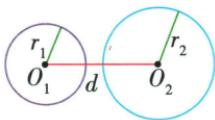
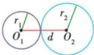
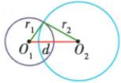
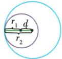
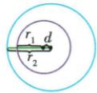

## 讲解

### 是什么

两圆正半径R>r、圆心距d，依次比较R−r与R+r：小于差内含，等于差内切，在差与和之间相交，等于和外切，大于和外离。内含还包括d=0的同心不同半径情形。

### 怎么来的

交点X若存在，两圆心与X的三边长为R、r、d。非共线时三边严格条件给R−r<d<R+r，有对称的两个交点；共线时最长一边等另两边和，d=R+r是外切，R=d+r是内切，各只有一个。若d大于和，两圆之间仍有间隙；若d小于差，小圆到大圆最远处也只有d+r<R，整圈严格在内。原五位置表的不等式由这些长度关系决定，不只是背图。

### 什么时候能用

此表要求R>r。两半径相等且d=0时两圆重合，有无数公共点，不能当“内切一个点”；相等半径而d>0，照和界比较，差界0不再有不同圆的内切。

## 例题

### 原两圆五位置表实际PDF37恢复不等式

> 来源ID Q24-55；第24章圆；251-300/full.md 第3546–3550行。原答案与解析定位：251-300/full.md 第3546–3550行。

圆与圆有外离、外切、相交、内切、内含这五种位置关系.

设两圆的半径分别为 $r_1$ 和 $r_2(r_2 > r_1)$ ，圆心距为 $d$ ，相关的对应关系如下.

| 位置关系 | 图示 | 公共点 | 数量关系 |
| --- | --- | --- | --- |
| 外离 |  | 无 | $d>r_1+r_2$ |
| 外切 |  | 一个切点 | $d=r_1+r_2$ |
| 相交 |  | 两个交点 | $r_2-r_1<d<r_2+r_1$ |
| 内切 |  | 一个切点 | $d=r_2-r_1$ |
| 内含 |  | 无 | $0\leqslant d<r_2-r_1$ |

**原资料答案与解析：**

原表数量关系按实际PDF第37页恢复如下：

圆与圆有外离、外切、相交、内切、内含这五种位置关系.

设两圆的半径分别为 $r_1$ 和 $r_2(r_2 > r_1)$ ，圆心距为 $d$ ，相关的对应关系如下.

| 位置关系 | 图示 | 公共点 | 数量关系 |
| --- | --- | --- | --- |
| 外离 |  | 无 | $d>r_1+r_2$ |
| 外切 |  | 一个切点 | $d=r_1+r_2$ |
| 相交 |  | 两个交点 | $r_2-r_1<d<r_2+r_1$ |
| 内切 |  | 一个切点 | $d=r_2-r_1$ |
| 内含 |  | 无 | $0\leqslant d<r_2-r_1$ |

**展开解析（依据原详解补足理由与步骤）：**

设R>r>0，两圆心距d≥0。d>R+r外离；d=R+r外切；R−r<d<R+r相交；d=R−r内切；0≤d<R−r内含。公共点数依次0、1、2、1、0。相交严格夹在半径差与和之间，两个等号分别属于内切和外切；同心不同半径d=0归内含。原OCR把相交和内含条件截断，规范表已对照251–300分段PDF实际第37页恢复；同半径情况另讨论重合，不混入R>r这张表。

## 易错

没有公共点包含外离和内含；只有一个包含内外切。原OCR相交和内含行缺后半不等式，已对原页恢复，不拿截断文本作公式。
