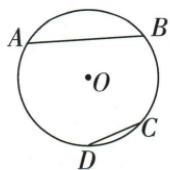
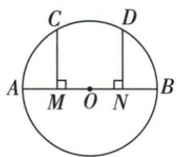
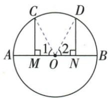

## 讲解

### 是什么

同圆或等圆中，两条对应劣弧相等、两条弦相等、两中心角相等、两弦心距相等，可以互相转换。对应优弧要同类比较，不能用同一弦所对的优弧和劣弧说等弧。

### 怎么来的

把等圆圆心重合并旋转使起始半径重合，若中心角相等，另一半径终点也重合，于是弧和弦都重合。反向等弦配两组等半径，两个中心三角SSS全等，中心角相等。垂径得到半弦直角，等半径与相等半弦决定相等弦心距；反过来等距离给(a/2)²=R²−d²，因此半弦及完整弦相等。原弧AB为弧CD两倍不能直接搬到整弦，须先把弧AB二等分，两个分弧才分别与弧CD等弦。

### 什么时候能用

需同半径R、同类弧及明确中心角对应；不在等圆中只角相等不能推弦相等。大于、小于的比较在劣弧范围可用同半径直角关系，但“倍数”不是这项等量定理。

## 例题

### 同圆弧长两倍用弧中点和三边关系证弦严格小于两倍

> 来源ID Q24-08；第24章圆；251-300/full.md 第2910–2912行。原答案与解析定位：251-300/full.md 第2914–2922行。

例3 如图所示,在同圆中,如果 $\widehat{AB}=2\widehat{CD}$ ,那么弦AB与弦CD的关系为AB \_\_\_\_ 2CD.(填“>”“=”或“<”)

**原资料答案与解析：**

解析 取 $\widehat{AB}$ 的中点 E, 连接 AE, BE, 则 $\widehat{AB}=2\widehat{AE}=2\widehat{BE}$ .

$$
\because \widehat {A B} = 2 \widehat {C D}, \therefore \widehat {C D} = \widehat {A E} = \widehat {B E}, \therefore C D = A E = B E.
$$

在 $\triangle ABE$ 中, $AE+BE>AB,\therefore AB<2CD.$

答案 <

**展开解析（依据原详解补足理由与步骤）：**

在原非退化弧AB上取弧中点E，弧AE=弧EB=弧CD。同圆等弧对应等弦，AE=BE=CD。三个不同圆上点A、E、B不共线，所以△AEB三边严格满足AB<AE+EB。代入AE=BE=CD，得AB<2CD，填“<”。弧长的两倍只提供分弧后等弦，不能直接把整弦也按两倍放大；“=”忽略了折线AE+EB比直线AB长。

### 直径两半径中点垂弦用HL转同侧等弧

> 来源ID Q24-09；第24章圆；251-300/full.md 第2926–2940行。原答案与解析定位：251-300/full.md 第2942–2961行。

例4 如图, $AB$ 是 $\odot O$ 的直径, $M, N$ 分别是 $OA, OB$ 的中点, $CM \perp AB$ 于 $M, DN \perp AB$ 于 $N$ . 求证: $\widehat{AC} = \widehat{BD}$ .

**原资料答案与解析：**

证明 连接 OC, OD, 则 OC = OD.

∵ OA=OB, M、N 分别是 OA、OB 的中点, ∴ OM=ON.

∵ CM⊥AB, DN⊥AB, ∴ ∠CMO = ∠DNO = 90°,

$\therefore \mathrm{Rt}\triangle CMO\cong \mathrm{Rt}\triangle DNO,\therefore \angle 1 = \angle 2,\therefore \widehat{AC} = \widehat{BD}.$

**展开解析（依据原详解补足理由与步骤）：**

连OC、OD，两者为半径故相等；OA=OB，M/N各为中点故OM=ON；原CM、DN均垂直AB，两个小三角是直角三角形。按HL，△CMO≌△DNO，故∠COM=∠DON。OM与OA同射线，ON与OB同射线，得到∠COA=∠DOB；这两个角对应原劣弧AC、BD，所以弧AC=弧BD。不能略去弧类定位后把一个优弧与一个劣弧比较。

### 弧中点圆心72半36等腰底72切角18四项

> 来源ID Q24-33；第24章圆；251-300/full.md 第3918–3939行。原答案与解析定位：251-300/full.md 第3824–3844行。

例2 (2024 福建) 如图, 已知点 A, B 在 $\odot O$ 上, $\angle AOB = 72^{\circ}$ , 直线 MN 与 $\odot O$ 相切, 切点为 C, 且 C 为 $\widehat{AB}$ 的中点, 则 $\angle ACM$ 等于 ( )

A. ${18}^{ \circ  }$

B. $30^{\circ}$

C. $36^{\circ}$

D.72°

**原资料答案与解析：**

例2 解析 $\because C$ 为 $\widehat{AB}$ 的中点，

$$
\begin{array}{l} \therefore \widehat {A C} = \widehat {B C}, \therefore \angle A O C = \angle B O C = \\ \frac {1}{2} \angle A O B = 3 6 ^ {\circ}, \because O A = O C, \end{array}
$$

$$
\therefore \angle O C A = \frac {1 8 0 ^ {\circ} - \angle A O C}{2} = 7 2 ^ {\circ},
$$

∵ 直线 MN 与 $\odot O$ 相切，

$$
\therefore \angle O C M = 9 0 ^ {\circ},
$$

$$
\therefore \angle A C M = 9 0 ^ {\circ} - 7 2 ^ {\circ} = 1 8 ^ {\circ}.
$$

答案 A

**展开解析（依据原详解补足理由与步骤）：**

C是劣弧AB中点，∠AOC=72°/2=36°。OA=OC，△AOC底角∠OCA=(180°−36°)/2=72°。MN切于C，OC⊥CM，按图CA在∠OCM内，∠ACM=90°−72°=18°，A。B30不能从72°得出；C36是中心半角；D72是∠OCA，均不是目标切线与弦的角。

## 易错

弧两倍不推出弦两倍；两个等弦各取一条优弧一条劣弧也不能互换为等弧。
