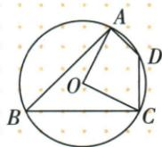
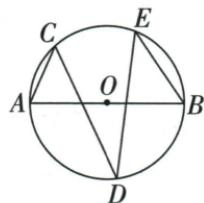
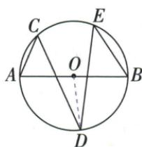
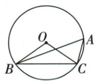
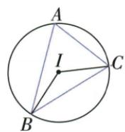
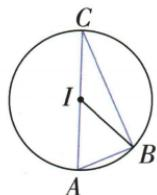
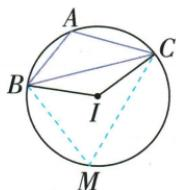
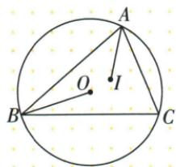
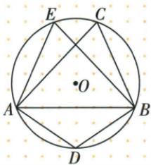

## 讲解

### 是什么

圆周角等于所截弧对应中心转角的一半；“所截弧”是两端点之间不包含圆周角顶点的那条弧。同弧或等弧圆周角相等。若所截是优弧，用360°减劣弧小圆心角后再除2，不能直接对图上普通小角除2。

### 怎么来的

设圆周角为$\angle APB$，圆心为$O$。比较的对象是弧$AB$中**不含$P$**的一条；它的对应中心转角可能大于$180^\circ$，不能总用两半径之间的较小角。

**第一种：圆心在圆周角的一边上。** 先设$PA$经过$O$，则$PA$为直径，点序为$P,O,A$。连接$OB$，设$\angle APB=\alpha$。由于射线$PA$与$PO$同向，$\angle OPB=\alpha$；又$OP=OB$，等腰三角形$POB$给$\angle PBO=\alpha$。$OA$与$OP$反向，故$\angle AOB$是$\triangle POB$在$O$处的外角，等于两个不相邻内角之和，即$\angle AOB=2\alpha$。所以这段弧的中心转角是圆周角的两倍。圆心在另一边$PB$上时，交换$A,B$作同样证明。

**第二种：圆心在圆周角内部。** 作直径$PD$，使$P,O,D$顺次共线。$PD$在$\angle APB$内部，令$\angle APD=\alpha_1$、$\angle DPB=\alpha_2$，则$\angle APB=\alpha_1+\alpha_2$。这两个小圆周角均有一边经过圆心，可用第一种证明：弧$AD$、弧$DB$（均不含$P$）的中心转角分别为$2\alpha_1$、$2\alpha_2$。原弧$AB$由这两段拼成，中心转角相加为$2\alpha_1+2\alpha_2=2(\alpha_1+\alpha_2)=2\angle APB$。即使合成的转角超过$180^\circ$，相加对象仍是所截弧对应的转角，不能换成其余下的小角。

**第三种：圆心在圆周角外部。** 仍作直径$PD$。例如射线次序为$PD,PA,PB$时，$\angle APB=\angle DPB-\angle DPA$。设后两个大、小角为$\beta,\gamma$，第一种证明使弧$DB$、弧$DA$的中心转角分别为$2\beta,2\gamma$。弧$AB$是前一段扣掉后一段，所以它对应的转角为$2\beta-2\gamma=2(\beta-\gamma)=2\angle APB$。若次序为$PD,PB,PA$，则交换$A,B$，从$\angle DPA$扣$\angle DPB$，其弧也按同一方向相减。

三种位置都得到“所截弧对应中心转角等于圆周角的两倍”。原圆周角等于中心转角一半，由两边同除2得到。相加或相减取决于辅助直径是否在目标角内部，不能把它当成不看位置的固定加法。

### 什么时候能用

圆周角三点须不同；每次先定位截弧与圆周角顶点的另一侧，再倍回或取半。中心小角130°时，原顶点A可截130°劣弧，也可截230°优弧，给65°或115°。

## 例题

### 内接四边形圆心角比对角2比3设x得45

> 来源ID Q24-05；第24章圆；251-300/full.md 第2858–2860行。原答案与解析定位：251-300/full.md 第2862–2864行。

例2 如图, 四边形 ABCD 内接于 $\odot O$ , 连接 OA, OC, 若 $\angle AOC : \angle ADC = 2 : 3$ , 则 $\angle ABC$ 的度数为

**原资料答案与解析：**

解析 设 $\angle AOC = 2x^{\circ} (x > 0)$ ，则 $\angle ADC = 3x^{\circ}$ ，由圆周角定理得 $\angle ABC = \frac{1}{2} \angle AOC = x^{\circ}$ ，∵ 四边形 ABCD 是 $\odot O$ 的内接四边形，∴ $\angle ADC + \angle ABC = 180^{\circ}$ ，∴ $3x + x = 180$ ，解得 x = 45，即 $\angle ABC = 45^{\circ}$ .

答案 $45^{\circ}$

**展开解析（依据原详解补足理由与步骤）：**

按原图B在优弧AC上，∠ABC截劣弧AC，等于∠AOC的一半。设∠AOC=2x，原比值给∠ADC=3x，而∠ABC=x。内接四边形对角互补，3x+x=180°，两边除4得x=45°。故∠ABC=45°，∠ADC=135°，∠AOC=90°，比值90:135=2:3回验。不能把∠ADC也写为同一小圆心角的一半，它截的是另一条弧。

### 直径半周减圆心80再半角求50

> 来源ID Q24-10；第24章圆；251-300/full.md 第2967–2980行。原答案与解析定位：251-300/full.md 第2982–3005行。

例5 如图, $AB$ 为 $\odot O$ 的直径, 点 $C、D、E$ 在 $\odot O$ 上, $\angle BED = 40^{\circ}$ , 则 $\angle ACD$ 的度数为 \_\_\_\_.

**原资料答案与解析：**

解析 连接 OD. 由圆周角定理得 $\angle BOD = 2 \angle BED = 2 \times 40^{\circ} = 80^{\circ}$ ,

$$
\therefore \angle A O D = 1 8 0 ^ {\circ} - \angle B O D = 1 8 0 ^ {\circ} - 8 0 ^ {\circ} = 1 0 0 ^ {\circ},
$$

$$
\therefore \angle A C D = \frac {1}{2} \angle A O D = \frac {1}{2} \times 1 0 0 ^ {\circ} = 5 0 ^ {\circ}.
$$

答案 $50^{\circ}$

**展开解析（依据原详解补足理由与步骤）：**

∠BED截弧BD，由圆周角定理∠BOD=2×40°=80°。AB为直径，OA与OB反向，∠AOD=180°−80°=100°。按原C的位置，∠ACD截同一劣弧AD，故∠ACD=100°/2=50°。每一步先确认对应弧再乘2或除2；AB直径提供的是两圆心射线的平角。

### 同弧圆周半角配等半径底角和90

> 来源ID Q24-14；第24章圆；251-300/full.md 第3110–3112行。原答案与解析定位：251-300/full.md 第3087–3089行。

例2 (2024 陕西) 如图, BC 是 $\odot O$ 的弦, 连接 OB, OC, $\angle A$ 是 $\widehat{BC}$ 所对的圆周角, 则 $\angle A$ 与 $\angle OBC$ 的度数的和是 \_\_\_\_.

**原资料答案与解析：**

例2 解析 由圆周角定理知 $\angle A = \frac{1}{2} \angle O$ ，易得 $\angle OBC = \angle OCB$ ， $\therefore \angle A + \angle OBC = \frac{1}{2} \times 180^{\circ} = 90^{\circ}$ .

答案 $90^{\circ}$

**展开解析（依据原详解补足理由与步骤）：**

连OB、OC得到OB=OC，∠OBC=∠OCB，故2∠OBC+∠BOC=180°。原A在优弧BC上，∠A=∠BOC/2。把前一式两边除2，得∠OBC+∠BOC/2=90°，代换即∠OBC+∠A=90°。这里加的是一个等腰底角和对应的圆周角，不能把圆心角与底角直接加90°。

### 外心角130按顶点所在两弧分类65或115

> 来源ID Q24-18；第24章圆；251-300/full.md 第3284–3284行。原答案与解析定位：251-300/full.md 第3286–3299行。

例2 在 $\triangle ABC$ 中,点 $I$ 是外心, $\angle BIC=130^{\circ}$ ,求 $\angle A$ 的度数.

**原资料答案与解析：**

解析 若三角形的外心在三角形内,如图 1,则 $\angle A=\frac{1}{2}\angle BIC=65^{\circ}$ .

若三角形的外心在三角形上,如图2,则 $\angle A=\frac{1}{2}\angle BIC=65^{\circ}$ .

若三角形的外心在三角形外,如图3,在弦BC所对的优弧(除点B、C)上任取一点M,连接BM,CM,则 $\angle A=180^{\circ}-\angle M=180^{\circ}-\frac{1}{2}\angle BIC=115^{\circ}$ .综上, $\angle A$ 的度数是 $65^{\circ}$ 或 $115^{\circ}$ .

  
图1

  
图2

  
图3

**展开解析（依据原详解补足理由与步骤）：**

I为外心，B/C/A均在以I为圆心的外接圆上。普通∠BIC=130°对劣弧BC；若A落优弧BC，∠A截劣弧，等于130°/2=65°。若A落劣弧BC，∠A截优弧，等于(360°−130°)/2=115°。故两值65°或115°，均有相应非退化三角形。

原答案两值正确，但原“外心在三角形外，所以∠A=115°”的分法不能反过来当普遍判据：外心在外也可能是B或C钝，此时A仍65°。分类应直接看A相对弦BC的弧位置。

### 内心半角35转顶70外心倍角140求底20

> 来源ID Q24-24；第24章圆；251-300/full.md 第3554–3566行。原答案与解析定位：251-300/full.md 第3568–3592行。

例4 如图, 点 O 是 $\triangle ABC$ 外接圆的圆心, 点 I 是 $\triangle ABC$ 的内心, 连接 OB, IA. 若 $\angle CAI = 35^{\circ}$ , 则 $\angle OBC$ 的度数为 \_\_\_\_.

**原资料答案与解析：**

解析 连接 OC, ∵ 点 I 是 $\triangle ABC$ 的内心, ∴ AI 平分 $\angle BAC$ ,

$$
\because \angle C A I = 3 5 ^ {\circ},
$$

$$
\therefore \angle B A C = 2 \angle C A I = 7 0 ^ {\circ},
$$

∵ 点 O 是 $\triangle ABC$ 外接圆的圆心，

$$
\therefore \angle B O C = 2 \angle B A C = 1 4 0 ^ {\circ},
$$

$$
\because O B = O C, \therefore \angle O B C = \angle O C B =
$$

$$
\frac {1}{2} \times (1 8 0 ^ {\circ} - \angle B O C) = 2 0 ^ {\circ}.
$$

答案 $20^{\circ}$

**展开解析（依据原详解补足理由与步骤）：**

I内心意味着AI内部平分∠BAC，因此∠BAC=2×35°=70°。O外心，所以OB=OC；按原图A在优弧BC，∠BOC=2∠BAC=140°。等腰△OBC两底角各为(180°−140°)/2=20°，故∠OBC=20°。不能把外心性质用成到边等距，也不能把35°未经倍回就搬成圆心角。

### 原同弦圆周角可相等或互补两句辨析

> 来源ID Q24-53；第24章圆；251-300/full.md 第2837–2854行。原答案与解析定位：251-300/full.md 第2837–2854行。

1. 在同圆或等圆中，同弦或等弦所对的圆周角相等。（×）  
2. 在同圆或等圆中，同弦或等弦所对的圆周角相等或互补.
(√)

解读：弧所对的圆周角都在该弧的同侧，但弦所对的圆周角不都在该弦的同侧.如图，弦 $AB$ 所对的圆周角有 $\angle C$ 、 $\angle D$ 、 $\angle E$ ，其中， $\angle C$ 和 $\angle D$ 互补， $\angle E$ 和 $\angle C$ 相等.

**原资料答案与解析：**

1. 在同圆或等圆中，同弦或等弦所对的圆周角相等。（×）  
2. 在同圆或等圆中，同弦或等弦所对的圆周角相等或互补.
(√)

解读：弧所对的圆周角都在该弧的同侧，但弦所对的圆周角不都在该弦的同侧.如图，弦 $AB$ 所对的圆周角有 $\angle C$ 、 $\angle D$ 、 $\angle E$ ，其中， $\angle C$ 和 $\angle D$ 互补， $\angle E$ 和 $\angle C$ 相等.

**展开解析（依据原详解补足理由与步骤）：**

“同弦圆周角相等”缺少同侧条件，错误；“相等或互补”在原同圆或等圆、对应同长弦的两侧情形下成立。原图C/E在弦AB同侧，截同一弧，∠C=∠E；D在另一侧，截另一弧，两弧共360°，两个圆周角和180°。不能只凭端点AB相同就把C/D都搬成同一个角。

## 易错

只见同弦就当同弧，漏掉另侧互补；把优弧对应的圆周角误写为小圆心角的一半。
