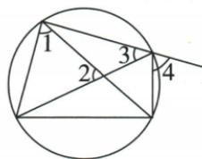

## 讲解

### 是什么

圆心角的顶点在圆心，两边与圆相交形成对应弧；圆周角的顶点在圆上，且两条射线都再次与圆相交。识别时不仅看顶点，还要看角的两边在给定方向上是否能截出两条弦。

### 怎么来的

圆心角用圆心O到两个圆上点A/B的半径组织圆周的一段；圆周角用另一个圆上点P向A/B的两条弦组织同一段圆周。固定弧AB后圆心固定，所对中心转角随之确定；P可在不属于被截弧的其余圆周上变化，所以可有无数个圆周角。原四角识别题中∠2在圆内，∠4的一边向外且不再交圆，分别破坏两个不同条件，不能只画了弦线就统称圆周角。

### 什么时候能用

顶点不能与弦端点重合，否则一条弦变零长，角不再是通常圆周角；角两边是射线，反向延长的整直线交圆不等于原射线也交圆。

## 例题

### 逐角核顶点和两边识别两个圆周角

> 来源ID Q24-01；第24章圆；251-300/full.md 第2611–2619行。原答案与解析定位：251-300/full.md 第2621–2634行。

例1 如图,在图中标出的 4 个角中,圆周角有 ( )

A.1 个

B.2 个

C.3 个

D.4 个

**原资料答案与解析：**

解析 $\angle 1$ 和 $\angle 3$ 是圆周角； $\angle 2$ 的顶点不在圆上， $\angle 4$ 有一边未与圆相交，均不是圆周角.

答案 B

**展开解析（依据原详解补足理由与步骤）：**

先查顶点，再查两边是否再次交圆。原图∠1和∠3两项均满足；∠2的顶点在圆内，第一项不满足；∠4虽顶点在圆上，但有一边是向外的射线，不再与圆相交，第二项不满足。因此恰有2个，选B。A少算了一个符合定义的角；C把∠2或∠4误收；D把四角全收，均与逐个核查不符。

### 直径半周减圆心80再半角求50

> 来源ID Q24-10；第24章圆；251-300/full.md 第2967–2980行。原答案与解析定位：251-300/full.md 第2982–3005行。

例5 如图, $AB$ 为 $\odot O$ 的直径, 点 $C、D、E$ 在 $\odot O$ 上, $\angle BED = 40^{\circ}$ , 则 $\angle ACD$ 的度数为 \_\_\_\_.

**原资料答案与解析：**

解析 连接 OD. 由圆周角定理得 $\angle BOD = 2 \angle BED = 2 \times 40^{\circ} = 80^{\circ}$ ,

$$
\therefore \angle A O D = 1 8 0 ^ {\circ} - \angle B O D = 1 8 0 ^ {\circ} - 8 0 ^ {\circ} = 1 0 0 ^ {\circ},
$$

$$
\therefore \angle A C D = \frac {1}{2} \angle A O D = \frac {1}{2} \times 1 0 0 ^ {\circ} = 5 0 ^ {\circ}.
$$

答案 $50^{\circ}$

**展开解析（依据原详解补足理由与步骤）：**

∠BED截弧BD，由圆周角定理∠BOD=2×40°=80°。AB为直径，OA与OB反向，∠AOD=180°−80°=100°。按原C的位置，∠ACD截同一劣弧AD，故∠ACD=100°/2=50°。每一步先确认对应弧再乘2或除2；AB直径提供的是两圆心射线的平角。

## 易错

图上角的顶点在圆上只是第一步，原∠4说明第二步仍需核查；把圆内顶点角叫圆心角也要核它恰为圆心。
