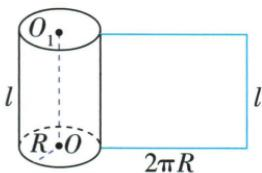
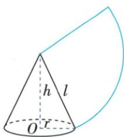

## 讲解

### 是什么

直圆柱底半径R、母线及高l，侧面沿母线剪开是长2πR、宽l的矩形；侧面积2πRl。封闭圆柱总表面积再加两底2πR²，等于2πR(l+R)。

### 怎么来的

剪开并铺平只是把曲面展开，原上下边各一圈底周长不变，变成矩形两条等长边2πR；相邻母线边仍长l。矩形面积给侧面积，两片圆底各πR²，相加得总表面积。原提供的是这一模型及公式，未提供独立数字算圆柱面积的例题；原圆柱侧壁最短题也遵守这两条展开边对应规则。

### 什么时候能用

直圆柱、沿母线剪开且无拉伸；若材料无顶或无底，依实际只加存在的圆底。只爬侧壁的最短路径不准抄近路走圆底。

## 例题

### 原圆柱圆锥展开模型与表侧面积公式

> 来源ID Q24-56；第24章圆；251-300/full.md 第4229–4255行。原答案与解析定位：251-300/full.md 第4229–4255行。

1. 圆柱的侧面展开图：把圆柱的侧面沿母线（高）剪开，得到的侧面展开图是矩形，这个矩形的相邻两边的长分别等于圆柱的底面圆的周长、母线长。

如图,设圆柱的母线长为 l,底面圆的半径为 R,则 $S_{\text{圆柱侧}}=2\pi Rl; S_{\text{圆柱表}}=S_{\text{圆柱侧}}+2S_{\text{圆柱底}}=2\pi Rl+2\pi R^{2}=2\pi R(l+R)$ .

2. 圆锥的侧面展开图：把圆锥的侧面沿母线剪开，得到的侧面展开图是扇形，这个扇形的半径是圆锥的母线长，弧长是圆锥底面圆的周长。如图，设圆锥的母线长为 $l$ ，底面圆的半径为 $r$ ，高为 $h$ ，则这个扇形的半径为 $l$ ，弧长为 $2\pi r; r^2 + h^2 = l^2; S_{\text{圆锥侧}} = \frac{1}{2} l \cdot 2\pi r = \pi rl; S_{\text{圆锥表}} = S_{\text{圆锥侧}} + S_{\text{圆锥底}} = \pi rl + \pi r^2 = \pi r (l + r)$ 。②③

**原资料答案与解析：**

1. 圆柱的侧面展开图：把圆柱的侧面沿母线（高）剪开，得到的侧面展开图是矩形，这个矩形的相邻两边的长分别等于圆柱的底面圆的周长、母线长。

如图,设圆柱的母线长为 l,底面圆的半径为 R,则 $S_{\text{圆柱侧}}=2\pi Rl; S_{\text{圆柱表}}=S_{\text{圆柱侧}}+2S_{\text{圆柱底}}=2\pi Rl+2\pi R^{2}=2\pi R(l+R)$ .

2. 圆锥的侧面展开图：把圆锥的侧面沿母线剪开，得到的侧面展开图是扇形，这个扇形的半径是圆锥的母线长，弧长是圆锥底面圆的周长。如图，设圆锥的母线长为 $l$ ，底面圆的半径为 $r$ ，高为 $h$ ，则这个扇形的半径为 $l$ ，弧长为 $2\pi r; r^2 + h^2 = l^2; S_{\text{圆锥侧}} = \frac{1}{2} l \cdot 2\pi r = \pi rl; S_{\text{圆锥表}} = S_{\text{圆锥侧}} + S_{\text{圆锥底}} = \pi rl + \pi r^2 = \pi r (l + r)$ 。②③

**展开解析（依据原详解补足理由与步骤）：**

圆柱沿一条母线剪开，展开矩形的宽为底周长2πR，高为母线l，侧面积为二者积2πRl；总表面积再加上下两底，2πRl+2πR²。圆锥沿母线剪开，展开扇形半径为母线l、弧长为底周长2πr；侧面积按扇形L·l/2得到πrl，总表面积再加一个底πr²。原轴截面内半径r、高h、母线l成直角，r²+h²=l²。开口、无底容器不应按封闭总表面积加底；圆柱只有原公式模型而没有匹配的独立数字题，明确保留该缺口。

## 易错

展开图宽为底周长不是底直径，侧面积和封闭表面积只差两底，不能不看开口条件。
