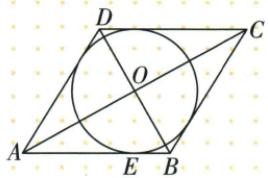
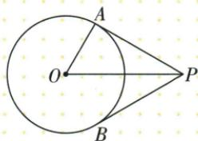
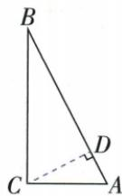
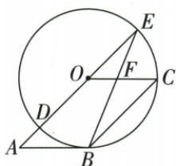
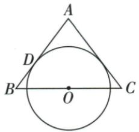
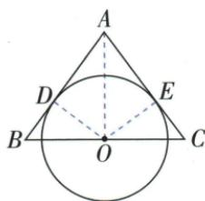
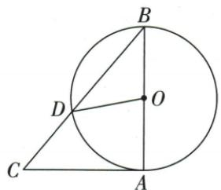

## 讲解

### 是什么

直线与圆只有一个公共点时为切线，该点叫切点。过圆上一点P的直线若垂直OP半径，则它是切线；切线也必垂直过切点半径。“圆上点”与“垂直其半径”缺一不能保证切线。

### 怎么来的

设O到直线垂足D、距离d，圆半径r，任一直线点X满足OX²=d²+DX²。要在圆上就须DX²=r²−d²；d>r右端负无交点，d<r有左右两个交点，d=r仅X=D一个交点。因此切线对应d=r且垂足就是切点。原P在圆上、直线⊥OP时，垂足P、距离OP=r，恰只有P交点。原圆上切线作图先造PM⊥OP，圆外切线作辅助直径圆得到OQP90°后造PQ⊥OQ，两者都逐项满足判据。

### 什么时候能用

讨论无限直线与正半径圆，不能仅画一段没有穿圆就叫切线。垂直半径的直线若过圆内或外其他点，可能相交或相离，必须经过半径的圆上端点。圆外点通常两条切线，圆上点一条，圆内点没有切线，作图题需先核位置。

切线定义为与圆只有一个公共点的直线。过圆心O向直线作垂线OH，任一点X满足OX²=OH²+HX²；要恰有一个点距O等r，必须OH=r且X=H，所以切点半径垂直切线。反过来过圆上点C且垂直OC的线，其任何其他点X都有OX²=r²+CX²>r²，仅C在圆上，故确为切线。已知公共点时“连半径，证垂直”；未知时“作垂直，证相等”，相等的是圆心垂距与r，不能预设圆/线公共点。圆内一点不能引切线，圆上只有唯一垂直该半径的切线，圆外有两条。原菱形选择两证明方法、等腰另一腰切线、已知D的SAS证明等均已接入，区分证明前提与证明后才能称切点。

## 例题

### 圆上一点作半径垂线为切线

> 来源ID Q20-25；第20章全等三角形；201-250/full.md 第3481–3483行。原答案与解析定位：201-250/full.md 第3485–3503行。

例2 如图,已知 $\odot O$ 和 $\odot O$ 上一点P,请过点P作 $\odot O$ 的切线.(尺规作图,保留作图痕迹)

**原资料答案与解析：**

解析（1）作射线 $OP$

(2)以点P为圆心,小于OP的长为半径作弧,交射线OP于A、B两点;

(3) 分别以点 A、B 为圆心, 大于 $\frac{1}{2}AB$ 的长为半径作弧, 两弧交于点 M;

(4) 过点 M、P 作直线 MP, 直线 MP 即为所求, 如图.

**展开解析（依据原详解补足理由与步骤）：**

作射线OP；以P为圆心取小于OP的正半径s，两交点A、B在射线OP上并夹P，PA=PB=s。s<OP保证A仍在射线内、非越过O的负向位置。以A、B圆心同半径>AB/2取交点M，PM垂直平分AB（P已为中点）。AB在OP上，故PM⊥OP。P在原圆，OP为过P半径，由切线判据PM是切线。证明不是仅“看见作弧所以切线”，而是同半径→中垂→垂直半径→圆上切线。

### 圆外一点以OP为直径辅助圆作两切线之一

> 来源ID Q20-30；第20章全等三角形；201-250/full.md 第3659–3661行。原答案与解析定位：201-250/full.md 第3663–3676行。

例4 已知 $\odot O$ 和 $\odot O$ 外一点 $P$ , 请过点 $P$ 作出 $\odot O$ 的一条切线. (尺规作图, 保留作图痕迹)

**原资料答案与解析：**

解析（1）连接 $OP$ ，分别以点 $O, P$ 为圆心，大于 $\frac{1}{2} OP$ 的长为半径向 $OP$ 两侧作弧，两弧分别交于点 $M, N$ ；(2) 过点 $M, N$ 作直线 $MN$ ，交 $OP$ 于点 $A$ ；(3) 以点 $A$ 为圆心， $AP$ 长为半径作弧，交 $\odot O$ 于点 $Q$ ；(4) 过点 $P, Q$ 作直线 $PQ$ ，则 $PQ$ 即为所求。如图。（点 $Q$ 取在 $OP$ 下方也可）

**展开解析（依据原详解补足理由与步骤）：**

作OP中垂线得其中点A，A圆心AP为半径作辅助圆，即以OP为直径的圆。与原圆交Q，Q在辅助圆上且不同于O、P，所以OQP90°；Q又在原圆上，OQ为原半径，PQ⊥OQ，切线判据给PQ为原圆切线。原P在线外，OP>原半径r，辅助圆与原圆有两交点，上下均可作，题只需一条，保原Q上方选择。P若在圆上只一切线，圆内无切线，不能不核“圆外”就套辅助圆。

### 半径3割线两个公共点距离范围含零不含3

> 来源ID Q24-21；第24章圆；251-300/full.md 第3410–3410行。原答案与解析定位：251-300/full.md 第3412–3420行。

例1 已知 $\odot O$ 的半径为 3, 点 O 到直线 m 的距离为 d, 若直线 m 与 $\odot O$ 的公共点的个数为 2, 则 d 的取值范围是 \_\_\_\_.

**原资料答案与解析：**

解析∵直线m与⊙O的公共点的个数为2，

∴ 直线 m 与 $\odot O$ 相交，

$$
\therefore 0 \leqslant d <   3.
$$

答案 $0 \leqslant d < 3$

**展开解析（依据原详解补足理由与步骤）：**

两个公共点表示相交，所以圆心到直线的垂距d<r=3；距离非负，因此0≤d<3。d=0时直线过圆心，有两个直径端点，仍相交；d=3时变为相切只有一个公共点，必须排除。不能把相交误写0<d，也不能将等号带到上端。

### 菱形另一边切线未知公共点只能作垂直证半径

> 来源ID Q24-22；第24章圆；251-300/full.md 第3424–3436行。原答案与解析定位：251-300/full.md 第3438–3440行。

例2 如图,已知菱形 ABCD 的对角线 AC、BD 相交于点 O, AB 与 $\odot O$ 相切于点 E. 若要证明 BC 与 $\odot O$ 相切, 正确的证明思路是 \_\_\_\_. (填序号)

①连接 OE, 作 $OF \perp BC$ 于点 F, 证明 OF = OE.

②设 F 是 $\odot O$ 与 BC 的公共点, 连接 OF, 证明 $OF \perp BC$ .

**原资料答案与解析：**

答案 ①

注意 题干中并未说明 $\odot O$ 与 $BC$ 有公共点.

**展开解析（依据原详解补足理由与步骤）：**

①正确：OE为已知切点半径，OE⊥AB；作OF⊥BC，若证OF=OE=r，则圆心到直线BC的距离等于半径，证明切线且F自然成为切点。菱形对角线BO平分∠ABC，角平分线上的O到两边的垂距相等，正好证明OF=OE。②错误：题干尚未给BC与圆有公共点，不能先假设这个公共点F存在，再用它证明相切，这是循环使用待证结论。

### 两切夹60中心距2半角30求半径1

> 来源ID Q24-23；第24章圆；251-300/full.md 第3450–3461行。原答案与解析定位：251-300/full.md 第3463–3463行。

例3 如图, $PA、PB$ 是 $\odot O$ 的两条切线, $A、B$ 是切点, 若 $\angle APB = 60^{\circ}, PO = 2$ , 则 $\odot O$ 的半径长为 \_\_\_\_.

**原资料答案与解析：**

答案1

**展开解析（依据原详解补足理由与步骤）：**

连OA，切线性质给OA⊥PA；同一圆外点P的切线夹角由PO平分，∠APO=60°/2=30°。直角△OAP的斜边OP=2，30°对边OA=OP/2=1，半径1。题中PO不是切线长，不能把它直接当半径或切线段。

### 直角腿2与4用等面积求弦心距判线圆并求切圆半径

> 来源ID Q24-25；第24章圆；251-300/full.md 第3622–3626行。原答案与解析定位：251-300/full.md 第3628–3638行。

例1 在 Rt△ABC 中, ∠C=90°, AC=2, BC=4, 以 C 为圆心, r 为半径作圆.

(1) 当 r=3 时, 直线 AB 和 $\odot C$ 的位置关系是什么?

(2) 当 r 取何值时, $\odot C$ 与直线 AB 有且只有一个公共点?

**原资料答案与解析：**

解析（1）如图，作 $CD \perp AB$ 于点 $D$ . $\because \angle ACB = 90^{\circ}, AC = 2, BC = 4,$

$\therefore AB = \sqrt{AC^2 + BC^2} = 2\sqrt{5}$ ，由 $\frac{1}{2}\times 2\times 4 = \frac{1}{2}\times 2\sqrt{5}\times CD$ 得 $CD = \frac{4\sqrt{5}}{5},$

$\because \frac{4\sqrt{5}}{5} < 3, \therefore$ 当 $r = 3$ 时，直线 $AB$ 和 $\odot C$ 相交.

(2) $\because\odot C$ 与直线AB有且只有一个公共点，

∴ 直线 AB 与 $\odot C$ 相切, 此时 r = CD, ∴ 当 $r = \frac{4\sqrt{5}}{5}$ 时, $\odot C$ 与直线 AB 有且只有一个公共点.

**展开解析（依据原详解补足理由与步骤）：**

AB=√(2²+4²)=2√5。作CD⊥AB，△ABC面积一方面为2×4/2=4，另一方面为AB×CD/2=√5·CD，两式相等得CD=4/√5=4√5/5。

(1)CD²=16/5<9=3²，两边均非负，所以CD<3，r=3时直线AB与圆相交。(2)只有一个公共点就是相切，所需r=CD=4√5/5。判断用的是圆心C到整个直线AB的垂距，不是CA或CB。

### 切线给直角配平行四边等半径求45和22点5

> 来源ID Q24-26；第24章圆；251-300/full.md 第3644–3644行。原答案与解析定位：251-300/full.md 第3646–3666行。

例2 如图, 四边形 OABC 是平行四边形, 以点 O 为圆心, OC 的长为半径的 $\odot O$ 与 AB 相切于点 B, 与 AO 相交于点 D, AO 的延长线交 $\odot O$ 于点 E, 连接 EB 交 OC 于点 F. 求 $\angle C$ 和 $\angle E$ 的度数.

**原资料答案与解析：**

解析 连接 OB.∵ AB 与 ⊙O 相切于点 B, ∴ OB⊥AB. ∴ ∠OBA=90°.

∵ 四边形 OABC 是平行四边形, ∴ $AB \parallel OC$ . ∴ $\angle BOC = \angle OBA = 90^{\circ}$ .

$$
\because O B = O C, \therefore \angle C = \angle O B C = \frac {1}{2} (1 8 0 ^ {\circ} - \angle B O C) = \frac {1}{2} \times (1 8 0 ^ {\circ} - 9 0 ^ {\circ}) = 4 5 ^ {\circ}.
$$

∵ 四边形 OABC 是平行四边形, ∴ OA∥BC.

$$
\therefore \angle A O B = \angle O B C = 4 5 ^ {\circ} \therefore \angle E = \frac {1}{2} \angle D O B = \frac {1}{2} \times 4 5 ^ {\circ} = 2 2. 5 ^ {\circ}.
$$

**展开解析（依据原详解补足理由与步骤）：**

连OB，切点B给OB⊥AB；AB∥OC，所以OB⊥OC，∠BOC=90°。半径OB=OC，△BOC两底角各45°，因此原∠C=45°。OA∥BC使∠AOB=∠OBC=45°；D在OA同射线上，∠DOB也45°。∠DEB截弧DB，圆周角定理给∠E=45°/2=22.5°。E虽在AO延长方向，取的是以E为顶点的圆周角，不是中心角。

### 已知圆上D用等腰与平行SAS证明切线再平方差求r4

> 来源ID Q24-27；第24章圆；251-300/full.md 第3672–3674行。原答案与解析定位：251-300/full.md 第3676–3698行。

例3 如图, 已知 AB 为 $\odot O$ 的直径, AD、BD 是 $\odot O$ 的弦, BC 是 $\odot O$ 的切线, 切点为 B, OC // AD, BA、CD 的延长线相交于点 E.

(1) 求证: CD 是 $\odot O$ 的切线. (2) 若 AE = 1, ED = 3, 求 $\odot O$ 的半径.

**原资料答案与解析：**

解析（1）证明：连接 $DO\because AD \parallel OC, \therefore \angle DAO = \angle COB, \angle ADO = \angle COD.$

$$
\because O A = O D, \therefore \angle D A O = \angle A D O, \therefore \angle C O D = \angle C O B.
$$

又∵ OC=OC, OD=OB, ∴ $\triangle COD \cong \triangle COB$ , ∴ $\angle CDO = \angle CBO$ .

∵ BC 是 $\odot O$ 的切线, ∴ $\angle CBO = 90^{\circ}$ , ∴ $\angle CDO = 90^{\circ}$ .

又∵点D在 $\odot O$ 上,∴CD是 $\odot O$ 的切线.

(2) 设 $\odot O$ 的半径为 $r$ , 则 $OD = r, OE = r + 1$ , $\because CD$ 是 $\odot O$ 的切线, $\therefore \angle EDO = 90^\circ$ ,

$\therefore ED^{2} + OD^{2} = OE^{2}, \therefore 3^{2} + r^{2} = (r + 1)^{2}$ , 解得 $r = 4, \therefore \odot O$ 的半径为 4.

**展开解析（依据原详解补足理由与步骤）：**

(1)连接OD。AD∥OC，给∠DAO=∠COB、∠ADO=∠COD；OA=OD使△OAD两底角等，所以∠COB=∠COD。OC公共、OD=OB为半径，按SAS，△COD≌△COB。已知BC切于B，∠CBO=90°，对应∠CDO=90°；又D在圆上，故CD是过D且垂直OD的切线。

(2)设r>0，原E-A-O顺序给OE=EA+AO=1+r。ED在切线CD上，OD⊥ED，勾股3²+r²=(r+1)²。展开9+r²=r²+2r+1，同减r²，8=2r，r=4。回验3²+4²=5²成立。

### 等腰底边中点在顶角平分线上等垂距判另一腰切线

> 来源ID Q24-28；第24章圆；251-300/full.md 第3704–3716行。原答案与解析定位：251-300/full.md 第3718–3735行。

例4 如图, $\triangle ABC$ 为等腰三角形, $O$ 是底边 $BC$ 的中点, 腰 $AB$ 与 $\odot O$ 相切于点 $D$ . 求证: $AC$ 是 $\odot O$ 的切线.

**原资料答案与解析：**

证明 过点 O 作 $OE \perp AC$ 于点 E, 连接 OD, OA. ∵ AB 与 ⊙O 相切于点 D,

$\therefore OD \perp AB.$ $\because \triangle ABC$ 为等腰三角形, O 是底边 BC 的中点, $\therefore AO$ 平分 $\angle BAC$ ,

$\therefore OE=OD,\therefore AC$ 是 $\odot O$ 的切线.

**展开解析（依据原详解补足理由与步骤）：**

作OE⊥AC，连OD和OA。AB已切于D，OD⊥AB且OD=r。等腰△ABC中，O是底边BC中点，顶点中线AO也是内部角平分线。角平分线上点O到两边垂距相等，故OE=OD=r。圆心到AC的距离等于半径，所以AC相切，E成为切点；没有提前假设AC与圆相交。

### 切点直角加圆心80一半40求C50四项

> 来源ID Q24-32；第24章圆；251-300/full.md 第3900–3916行。原答案与解析定位：251-300/full.md 第3806–3822行。

例1 (2024 山西) 如图, 已知 $\triangle ABC$ , 以 $AB$ 为直径的 $\odot O$ 交 $BC$ 于点 $D$ , 与 $AC$ 相切于点 $A$ , 连接 $OD$ . 若 $\angle AOD = 80^{\circ}$ , 则 $\angle C$ 的度数为 ( )

A. ${30}^{ \circ  }$

B. $40^{\circ}$

C.45°

D. $50^{\circ}$

**原资料答案与解析：**

例1 解析 $\because \angle AOD = 80^{\circ}$

$$
\therefore \angle B = 4 0 ^ {\circ},
$$

∵ ⊙O 与 AC 相切于点 A,

$$
\therefore \angle B A C = 9 0 ^ {\circ},
$$

$$
\therefore \angle C = 9 0 ^ {\circ} - 4 0 ^ {\circ} = 5 0 ^ {\circ}.
$$

答案 D

**展开解析（依据原详解补足理由与步骤）：**

A是切点，半径OA在直径AB上，AC⊥AB，故∠BAC=90°。∠ABD截劣弧AD，∠ABD=∠AOD/2=40°；B-D-C共线，∠ABC=40°。△ABC中∠C=180°−90°−40°=50°，D。A30没有题中角依据；B40是∠B；C45只可能来自等腰直角，原并非这种条件。

### 弧中点圆心72半36等腰底72切角18四项

> 来源ID Q24-33；第24章圆；251-300/full.md 第3918–3939行。原答案与解析定位：251-300/full.md 第3824–3844行。

例2 (2024 福建) 如图, 已知点 A, B 在 $\odot O$ 上, $\angle AOB = 72^{\circ}$ , 直线 MN 与 $\odot O$ 相切, 切点为 C, 且 C 为 $\widehat{AB}$ 的中点, 则 $\angle ACM$ 等于 ( )

A. ${18}^{ \circ  }$

B. $30^{\circ}$

C. $36^{\circ}$

D.72°

**原资料答案与解析：**

例2 解析 $\because C$ 为 $\widehat{AB}$ 的中点，

$$
\begin{array}{l} \therefore \widehat {A C} = \widehat {B C}, \therefore \angle A O C = \angle B O C = \\ \frac {1}{2} \angle A O B = 3 6 ^ {\circ}, \because O A = O C, \end{array}
$$

$$
\therefore \angle O C A = \frac {1 8 0 ^ {\circ} - \angle A O C}{2} = 7 2 ^ {\circ},
$$

∵ 直线 MN 与 $\odot O$ 相切，

$$
\therefore \angle O C M = 9 0 ^ {\circ},
$$

$$
\therefore \angle A C M = 9 0 ^ {\circ} - 7 2 ^ {\circ} = 1 8 ^ {\circ}.
$$

答案 A

**展开解析（依据原详解补足理由与步骤）：**

C是劣弧AB中点，∠AOC=72°/2=36°。OA=OC，△AOC底角∠OCA=(180°−36°)/2=72°。MN切于C，OC⊥CM，按图CA在∠OCM内，∠ACM=90°−72°=18°，A。B30不能从72°得出；C36是中心半角；D72是∠OCA，均不是目标切线与弦的角。

### 半圆直径配两个60构造B直角证明BD切线

> 来源ID Q24-34；第24章圆；251-300/full.md 第3943–3951行。原答案与解析定位：251-300/full.md 第3846–3862行。

例3 (2024 江西节选) 如图, $AB$ 是半圆 $O$ 的直径, 点 $D$ 是弦 $AC$ 延长线上一点, 连接 $BD, BC, \angle D = \angle ABC = 60^{\circ}$ . 求证: $BD$ 是半圆 $O$ 的切线.

**原资料答案与解析：**

例3 证明 $\because AB$ 是半圆 $O$ 的直径, $\therefore \angle ACB = 90^{\circ}$ ,

$$
\therefore \angle D C B = 9 0 ^ {\circ},
$$

$$
\because \angle D = 6 0 ^ {\circ}, \therefore \angle C B D = 3 0 ^ {\circ},
$$

$$
\because \angle A B C = 6 0 ^ {\circ}, \therefore \angle A B D = 9 0 ^ {\circ},
$$

∵ AB 是直径，

∴ BD 是半圆 O 的切线.

**展开解析（依据原详解补足理由与步骤）：**

C在以AB为直径的半圆上，∠ACB=90°；A-C-D共线，所以∠DCB=90°。△DCB中，∠D=60°，∠CBD=30°。原BC在∠ABD内部，∠ABD=∠ABC+∠CBD=60°+30°=90°。OB在BA所在直线上，BD⊥OB且B在圆上，按切线判定得BD相切。先构造直角，再说明这个直角的其中一边确是过切点的半径。

## 易错

原过圆外P作出的PQ垂直OQ，而非一定垂直OP；辅助OP是斜边，不是切点半径。原圆上一点P作图才垂直OP。
