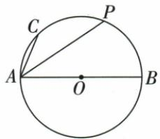
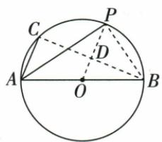
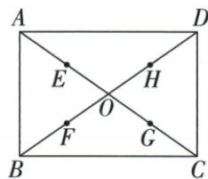
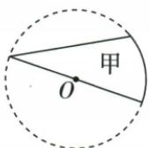
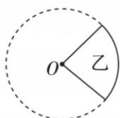
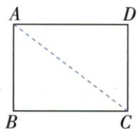

## 讲解

### 是什么

平面内到固定点O距离等于固定正数r的点构成圆，O是圆心，r是半径。圆上两点的连线段是弦；通过圆心的弦是直径，长2r；两圆上点分出的圆周部分是弧。弧长不是弦长，直径亦不同于任意弦。

### 怎么来的

定义保证同一圆所有半径相等；直径端点、圆心共线且圆心在中间，两段半径相加得2r。原AB13是直径，所以OA=OB=OP=13/2；原AC5是另一弦，不能因也连两个圆上点就认为它等于13或半径。弧BC中点P表示两段圆弧BP、PC相等，在同圆中对应圆心角相等，而不是说P在直线BC上。先区分圆弧对象与线段对象，辅助OP、BC才有不同作用。

### 什么时候能用

用于平面圆中同圆半径等、直径一半及角关系。圆半径需正，退化r=0不讨论圆周角。只说AB是弦不能推出O在AB上；只有直径才给圆心位于弦中点。图上P写在圆弧边界，不应把它移到弦中点D。

圆指同平面到O等距正数r的一条圆周，圆面另含内部；转动固定长度OA一周也形成它。任意弦AB满足AB≤OA+OB=2r，只有O在AB中间才取等，所以直径是最长弦。弦的两端划分两条圆弧：半圆恰一半，优弧超过半圆，劣弧不足半圆；指定优弧用三字母表明中间点，避免同两端不能区分。一个弧固定两端所以只对应一条弦；一个弦有两条弧。半圆与半圆形区别是曲线与区域，原七句辨析、扇形识别、共圆以及3/4/5点距原例都已补上。源题年份只按提供资料原文保留，不在此核实真题身份。

## 例题

### 弧中点连半径弦与直径直角多次勾股

> 来源ID Q18-18；第18章命题的证明；201-250/full.md 第1389–1401行。原答案与解析定位：201-250/full.md 第1403–1415行。

例7 如图, $AB$ 是 $\odot O$ 的直径, $P$ 是弧 $BC$ 的中点, $AB = 13$ , $AC = 5$ , 求 $PA$ 的长.

**原资料答案与解析：**

解析 连接 $PB, BC$ , 连接 $OP$ 交 $BC$ 于 $D$ .

∵ P 是弧 BC 的中点, ∴ $OP \perp BC, BD = CD.$

又∵ OA=OB, ∴ $OD=\frac{1}{2}AC=\frac{5}{2}$ . 又∵ $OP=\frac{1}{2}AB=\frac{13}{2}$ , ∴ PD=OP-OD=4.

∵ AB 是 ⊙O 的直径, ∴ $\angle ACB = 90^{\circ}$ . ∵ AB = 13, AC = 5,

$$
\therefore B C = \sqrt {A B ^ {2} - A C ^ {2}} = 1 2, \therefore B D = \frac {1}{2} B C = 6. \therefore P B = \sqrt {P D ^ {2} + B D ^ {2}} = 2 \sqrt {1 3}.
$$

∵ AB 是 $\odot O$ 的直径, ∴ $\angle APB = 90^{\circ}$ , ∴ $PA = \sqrt{AB^{2} - PB^{2}} = 3\sqrt{13}$ .

**展开解析（依据原详解补足理由与步骤）：**

先连PB、BC、OP并令OP交BC于D，原P在不含A的BC弧中点。等弧给BOP=POC，OB=OC、OP共同，由SAS得PB=PC；进一步△BPD与△CPD由SAS全等，故BD=CD，BDP=CDP，两角邻补所以均90°，OP⊥BC。O是AB中点、D是BC中点，△ABC中位线OD=AC/2=5/2；OP为半径=AB/2=13/2。原图O、D、P按序，PD=OP−OD=4。

AB为直径，ACB90°，BC²=13²−5²=144，BC=12，BD=6。在直角△PDB中PB²=PD²+BD²=16+36=52，PB=2√13。AB亦为直径，APB90°，PA²=AB²−PB²=169−52=117，PA=3√13。每次正根来自长度为正。三个不同直角分别来自直径、垂径和直径，不能把未画辅助线的斜段随意当直角边；PD差式依赖原弧中点与点序。

### 原弧半圆同心等圆七句辨析

> 来源ID Q24-52；第24章圆；251-300/full.md 第2529–2536行。原答案与解析定位：251-300/full.md 第2529–2536行。

1. 半圆既不是优弧，也不是劣弧.
(√)  
2. 半圆与半圆形没有区别. (×)  
3.等弧就是长度相等的弧.（×）  
4.一条弧只对着一条弦. (√)   
5.一条弦只对着一条弧. (×)   
6. 弧只有优弧和劣弧之分. (×)   
7.优弧一定比劣弧长. (×)

**原资料答案与解析：**

1. 半圆既不是优弧，也不是劣弧.
(√)  
2. 半圆与半圆形没有区别. (×)  
3.等弧就是长度相等的弧.（×）  
4.一条弧只对着一条弦. (√)   
5.一条弦只对着一条弧. (×)   
6. 弧只有优弧和劣弧之分. (×)   
7.优弧一定比劣弧长. (×)

**展开解析（依据原详解补足理由与步骤）：**

依次√、×、×、√、×、×、×。半圆是恰好一半圆周，既非大于一半的优弧也非小于一半的劣弧；半圆形还包含内部区域，不能与一条曲线混同。等弧除长度相等还要在同圆/等圆中能重合，半径不同仅长度相同不够。一条指定弧两端固定，唯一连出一条弦；一条弦却有两条对应弧。弧还包含半圆。优劣是与各自圆的半圆比较，不同半径圆的优弧不一定长过另一圆的劣弧。

### 矩形半对角四中点到O等距证明共圆

> 来源ID Q24-02；第24章圆；251-300/full.md 第2640–2640行。原答案与解析定位：251-300/full.md 第2642–2666行。

例2 如图,矩形 ABCD 的对角线相交于点 O, E, F, G, H 分别为 OA, OB, OC, OD 的中点. 求证: E, F, G, H 四点在同一个圆上.

**原资料答案与解析：**

证明 $\because$ 四边形 $ABCD$ 是矩形, $\therefore OA = OB = OC = OD$ .

又∵E,F,G,H分别为OA,OB,OC,OD的中点，

$$
\therefore O E = O F = O G = O H,
$$

∴ E, F, G, H 四点在同一个圆上.

**展开解析（依据原详解补足理由与步骤）：**

矩形的两条对角线相等且在O互相平分，所以OA=OB=OC=OD。E、F、G、H分别是四条半对角线的中点，各自到O的距离均为上述相同长度的一半，故OE=OF=OG=OH>0。以O为圆心、OE为半径作圆，四点都满足到O的距离等于该半径，所以共圆。这证明用的是“同一固定点等距”，不只看四点位置像圆。

### 甲乙丙按两半径围弧定义识别扇形

> 来源ID Q24-03；第24章圆；251-300/full.md 第2674–2686行。原答案与解析定位：251-300/full.md 第2692–2694行。

例（2023 江苏连云港）如图，甲是由一条直径、一条弦及一段圆弧所围成的图形；乙是由两条半径与一段圆弧所围成的图形；丙是由不过圆心 O 的两条线段与一段圆弧所围成的图形。下列叙述正确的是（）

A. 只有甲是扇形

C. 只有丙是扇形

B. 只有乙是扇形

D. 只有乙、丙是扇形

**原资料答案与解析：**

例 解析 由扇形的定义可知甲、乙、丙中只有乙是扇形.

答案B

**展开解析（依据原详解补足理由与步骤）：**

扇形的两条直边必须是同一个圆的两条半径，并由它们所对的弧闭合。甲的一条直边是直径，另一条是弦，不是这组两半径；乙两边从圆心出发，符合；丙两线段的共同端点不在圆心，不能当半径。故只有乙，B正确。A只甲、C只丙都收错对象；D虽收了乙，却又收了不符合半径条件的丙。

### 矩形3和4点圆内上外并至少一内一外严格范围

> 来源ID Q24-17；第24章圆；251-300/full.md 第3265–3268行。原答案与解析定位：251-300/full.md 第3270–3278行。

例1 已知矩形 $ABCD$ 的边 $AB = 3, AD = 4$ .

(1) 若以点 A 为圆心, 4 为半径作 $\odot A$ , 分别写出点 B, C, D 与 $\odot A$ 的位置关系.  
(2) 若以点 A 为圆心作 $\odot A$ ，使 B, C, D 三点中至少有一点在圆内，且至少有一点在圆外，求 $\odot A$ 的半径 r 的取值范围.

**原资料答案与解析：**

解析（1）如图，连接 $AC$ 。在 $\mathrm{Rt}\triangle ABC$ 中， $AB = 3, BC = 4$ ，由勾股定理可得 $AC = 5$ 。

∵ ⊙A 的半径为 4, ∴ 点 B 在 ⊙A 内, 点 D 在 ⊙A 上, 点 C 在 ⊙A 外.

(2)由(1)可 $AB < AD < AC$ ，若满足题意，则点 $B$ 在圆内，点 $C$ 在圆外，

∴ AB < r < AC, ∴ r 的取值范围是 3 < r < 5.

**展开解析（依据原详解补足理由与步骤）：**

先求三个点到A的距离：AB=3，AD=4，AC=√(3²+4²)=5。(1)r=4时，3<4所以B在内；AD=r所以D在上；5>4所以C在外。

(2)至少一点在内，相当于最小距离3<r；至少一点在外，相当于最大距离5>r。交集为3<r<5。r=3没有任何一点严格在内，r=5没有任何一点严格在外，两个端点均不可取；r=4虽然D在上，但B内C外仍满足要求。

## 易错

原PD=4不是半径，OP才是13/2；弧中点P与弦中点D不同，原资料专门另作OP交BC于D。
