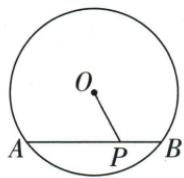
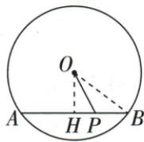
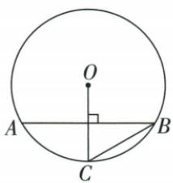
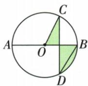
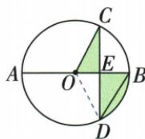
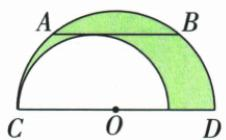
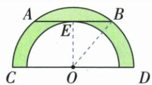

## 讲解

### 是什么

过圆心且垂直弦的直线平分弦及弦所对的两条弧。设半径R、弦长a、弦心距d，圆心到弦垂线组成的直角三角形满足R²=d²+(a/2)²。逆向用“过圆心且平分弦”推垂直时，被平分弦必须不是直径。

### 怎么来的

连OA/OB，两半径等，作OH⊥AB，两个直角三角形公共OH、斜边OA=OB，HL得AH=BH。翻折绕OH交换A/B，并保持圆，故两条弧也被分别平分。若已知H为非直径弦中点，OH>0；OA=OB、AH=BH、OH公共，SSS给两邻补角相等，各90°，于是垂直。若AB是直径，H=O，任意其他直径都过O并“平分AB”，却未必垂直，逆证中的OH零长正是失效点。

### 什么时候能用

计算必须先把完整弦除2；弦心距是垂距不是到弦端点距离。两平行弦相隔的距离还要看它们在圆心同侧还是异侧；本定理本身只给各自到圆心的非负距离。

## 例题

### 半径13两平行弦24与10同侧差7异侧和17

> 来源ID Q24-04；第24章圆；251-300/full.md 第2729–2729行。原答案与解析定位：251-300/full.md 第2731–2743行。

例1 已知圆的半径为 13, 两弦 $AB \parallel CD$ , $AB = 24$ , $CD = 10$ , 则两弦 $AB$ 、 $CD$ 之间的距离是 \_\_\_\_.

**原资料答案与解析：**

解析 画出示意图如下. 过点 O 作 $OE \perp CD$ 于 E, $OF \perp AB$ 于 F, 易得 O, E, F 三点共线.

  
图 1

  
图 2

利用垂径定理、勾股定理可求得 $OE = 12, OF = 5$ ，所以两弦 $AB, CD$ 之间的距离是 $12 - 5 = 7$ 或 $12 + 5 = 17$ .

# 答案7或17

注意 此类问题中两弦与圆心的相对位置往往不确定，需要分情况讨论.

**展开解析（依据原详解补足理由与步骤）：**

过O向两条弦所在直线作垂线。因为弦平行，两垂线在同一直线上；垂径定理给半弦12和5。分别用勾股定理：到AB的距离为√(13²−12²)=5，到CD的距离为√(13²−5²)=12。

圆心在两弦同侧时，垂足间距离为12−5=7；圆心在两弦之间时，距离为12+5=17。题干未限定相对位置，两种均能放入半径13的圆，答案7或17。不能凭其中一张示意图舍去另一种。

### 同心圆共同弦垂线平分两弦同减证AC等BD

> 来源ID Q24-06；第24章圆；251-300/full.md 第2884–2888行。原答案与解析定位：251-300/full.md 第2890–2890行。

例1 已知在以点 O 为圆心的两个同心圆中, 大圆的弦 AB 交小圆于点 C, D (如图所示).

求证:AC=BD.

**原资料答案与解析：**

证明 过点 $O$ 作 $OE \perp AB$ 于点 $E$ , 则 $CE = DE, AE = BE, \therefore AE - CE = BE - DE$ , 即 $AC = BD$ .

**展开解析（依据原详解补足理由与步骤）：**

作OE⊥AB于E，CD也在同一直线AB上。对大圆，AE=BE；对小圆，CE=DE。原点序A-C-E-D-B，所以AC=AE−CE，BD=BE−DE。两个等式对应相减，得到AC=BD。要用同一个圆心、同一条垂线，不能只因两个圆同心就称所有弦等长。

### 半径10弦16点P到圆心最短6

> 来源ID Q24-07；第24章圆；251-300/full.md 第2892–2894行。原答案与解析定位：251-300/full.md 第2896–2904行。

例2 如图, $\odot O$ 的半径为10,AB=16,点P在弦AB上,求OP的最小值.

**原资料答案与解析：**

解析 作 $OH \perp AB$ 于点 $H$ , 连接 $OB$ , 则 $OB = 10$ ,

由垂径定理得 HA=HB= $\frac{1}{2}$ AB=8，

由勾股定理得 $OH=\sqrt{OB^{2}-HB^{2}}=6$ ,

由垂线段最短得 OP 的最小值是 6.

**展开解析（依据原详解补足理由与步骤）：**

作OH⊥AB。垂径定理使H是弦中点，HB=16/2=8，且H在原有限线段AB内。OB=10，直角△OHB给OH²=10²−8²=36，距离为正故OH=6。任意P在AB，OP²=OH²+HP²≥36；当且仅当P=H取等，最小值6。这也补明最短候选确实能落在给定线段内。

### 残缺圆弦40弓高10建立半径平方差求25四项

> 来源ID Q24-13；第24章圆；251-300/full.md 第3098–3106行。原答案与解析定位：251-300/full.md 第3071–3085行。

例1 (2024 四川凉山州) 数学活动课上, 同学们要测一个如图所示的残缺圆形工件的半径, 小明的解决方案是: 在工件圆弧上任取两点 A, B, 连接 AB, 作 AB 的垂直平分线 CD 交 AB 于点 D, 交 $\widehat{AB}$ 于点 C, 测出 AB = 40 cm, CD = 10 cm, 则圆形工件的半径为

A.50 cm

B.35 cm

C.25 cm

D.20 cm

**原资料答案与解析：**

例1 解析 设圆心为 O，连接 OB, ∵ CD 垂直平分 AB, ∴ BD = 20 cm. 在 Rt△OBD 中, $OD^{2} + BD^{2} = OB^{2}$ , 即 $(OB - 10)^{2} + 20^{2} = OB^{2}$ , ∴ OB = 25 cm, 即圆形工件的半径为 25 cm.

答案 C

**展开解析（依据原详解补足理由与步骤）：**

原CD垂直平分弦AB，圆心O在CD所在直线上；BD=40/2=20 cm。设半径为R，原图C-D-O按序，CD=10 cm，所以OD=R−10。连OB，直角△ODB给(R−10)²+20²=R²。展开R²−20R+100+400=R²，同减R²得−20R+500=0，移项再除20得R=25 cm，C。回验OD=15，15²+20²=25²。A50、B35、D20代入分别使(R−10)²+400−R²为−500、−200、100，均不为0。

### 弦4根3与圆周30先求半径4再判断点P外四项

> 来源ID Q24-19；第24章圆；251-300/full.md 第3303–3322行。原答案与解析定位：251-300/full.md 第3392–3402行。

例1（2024 广东广州）如图， $\odot O$ 中，弦 AB 的长为 $4\sqrt{3}$ ，点 C 在 $\odot O$ 上， $OC \perp AB, \angle ABC = 30^{\circ}$ . $\odot O$ 所在的平面内有一点 P，若 OP = 5，则点 P 与 $\odot O$ 的位置关系是（）

A. 点 P 在 $\odot O$ 上

B. 点 P 在 $\odot O$ 内

C. 点 P 在 $\odot O$ 外

D. 无法确定

**原资料答案与解析：**

例1 解析 连接 OA, 设 OC 与 AB 的交点为 D,

由垂径定理得 $AD=2\sqrt{3}$ ,

由圆周角定理得 $\angle AOC = 60^{\circ}$

所以 $OA=2\sqrt{3}\div\frac{\sqrt{3}}{2}=4.$

因为 5>4, 所以点 P 在 $\odot O$ 外.

答案 C

**展开解析（依据原详解补足理由与步骤）：**

连OA，OC交AB于D。垂径定理给AD=AB/2=2√3，圆周角∠ABC=30°给∠AOC=60°。D在OC上，△OAD直角，∠AOD=60°，另角30°，故OD=OA/2。勾股OA²=AD²+OD²=12+OA²/4，同减OA²/4得3OA²/4=12，OA²=16，半径OA=4。OP=5>4，所以P在外，C。A需OP=4，B需OP<4，D忽略了原条件已唯一确定半径。原用sin60°的步骤在此用30°性质和勾股恢复，内容不依赖后章。

### 半弦根3与30圆周角等面积替换求阴影2π比3

> 来源ID Q24-44；第24章圆；251-300/full.md 第4341–4351行。原答案与解析定位：251-300/full.md 第4353–4361行。

例3 如图, $AB$ 是 $\odot O$ 的直径, 弦 $CD \perp AB$ , $\angle CDB = 30^{\circ}$ , $CD = 2\sqrt{3}$ , 求阴影部分的面积.

**原资料答案与解析：**

解析（等积变换法）连接 $OD$ ，设 $CD$ 交 $AB$ 于点 $E$ . $\because CD \perp AB, \therefore CE = DE = \frac{1}{2} CD = \sqrt{3}$ ， $\therefore S_{\triangle OCE} = S_{\triangle ODE}, \therefore$ 阴影部分的面积等于扇形 $OBD$ 的面积.

$$
\because \angle C D B = 3 0 ^ {\circ}, \therefore \angle C O B = 6 0 ^ {\circ}, \therefore \angle B O D = \angle C O B = 6 0 ^ {\circ},
$$

在 Rt△COE 中，∵ $CE=\sqrt{3}$ ，∴ OC=2，∴ $S_{扇形OBD}=\frac{60\pi\times2^{2}}{360}=\frac{2\pi}{3}$ ，即阴影部分的面积为 $\frac{2\pi}{3}$ .

**展开解析（依据原详解补足理由与步骤）：**

AB直径且CD⊥AB，交E，垂径定理给CE=DE=CD/2=√3；△OCE、ODE共底OE且等高CE/DE，面积相等。原阴影由△OCE及弓形BD组成，换前者为△ODE，合成扇形OBD。∠CDB=30°给∠COB=60°；直径平分两弧，也给∠BOD=60°。直角△COE中∠COE=60°，另一锐角30°，OE=OC/2；勾股OC²=3+OC²/4，解得OC²=4，半径2。目标扇形面积60π×2²/360=2π/3。

### 共底两个半圆切弦24平移同心半平方差面积72π

> 来源ID Q24-45；第24章圆；251-300/full.md 第4363–4365行。原答案与解析定位：251-300/full.md 第4367–4375行。

例4 如图,两个半圆的直径共线,O为大半圆的圆心,AB是半圆O的弦,CD是半圆O的直径,AB与小半圆相切, $AB \parallel CD$ ,且AB=24,求图中阴影部分的面积.

**原资料答案与解析：**

解析（迁移变换法）将小半圆向右平移，使两个半圆的圆心重合，如图.设 $AB$ 与小半圆的切点为 $E$ ，连接OB、OE.

由切线的性质及垂径定理可得 $OE \perp AB, BE = \frac{1}{2} AB = 12,$

$$
\therefore S _ {\text {阴影}} = S _ {\text {大半圆}} - S _ {\text {小半圆}} = \frac {\pi}{2} O B ^ {2} - \frac {\pi}{2} O E ^ {2} = \frac {\pi}{2} (O B ^ {2} - O E ^ {2}) = \frac {\pi}{2} B E ^ {2} = 7 2 \pi .
$$

**展开解析（依据原详解补足理由与步骤）：**

先按原图将小半圆水平平移到大半圆同心位置，面积不变且仍在大半圆内部；AB∥直径，平移后的小圆仍切AB。设其半径OE=r、大圆半径OB=R，切线性质OE⊥AB，垂径给BE=24/2=12。直角△OEB给R²−r²=12²=144。阴影是大半圆减小半圆，面积π(R²−r²)/2=π×144/2=72π。无需分别求两个半径；直接把弦24当某半径会丢掉结构。

## 易错

“知二推三”必须带非直径弦等前提，不能删掉逆用限制；原半径13、弦24/10需分别求5和12，再分7/17。
