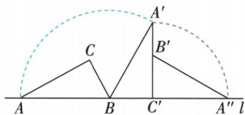
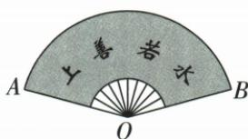

## 讲解

### 是什么

半径R、中心转角为n度，弧长L=nπR/180，扇形面积S=nπR²/360，也可写S=LR/2。n是度数的数值，R/L用长度单位，S用平方单位。

### 怎么来的

整周360°对应周长2πR与面积πR²，所以n度占整周n/360。周长乘占比得L=(n/360)·2πR=nπR/180；面积乘同一占比得S=nπR²/360。把面积式中R²拆R·R，再把nπR/180识别为L：S=(1/2)(nπR/180)R=LR/2。原弧10π、面积20π题直接用后一式反求半径，避免先求未知角。

### 什么时候能用

0<n≤360时普通完整扇形成立；旋转多周的路径长度可按总转角累加，但所覆盖区域面积会重叠，不能直接用多周角当一次区域面积。若所给角是圆周角，须先变成截弧中心转角。

## 例题

### 扇形60半径6面积6π及弧10π面积20π反求半径4

> 来源ID Q24-40；第24章圆；251-300/full.md 第4259–4261行。原答案与解析定位：251-300/full.md 第4263–4263行。

例1 (1)在半径为6 cm的圆中, 圆心角为 $60^{\circ}$ 的扇形的面积是\_\_\_\_.

(2) 若扇形的弧长为 $10\pi \, cm$ ，面积为 $20\pi \, cm^{2}$ ，则该扇形的半径是 \_\_\_\_ cm.

**原资料答案与解析：**

答案 (1) $6\pi \mathrm{cm}^2$ (2)4

**展开解析（依据原详解补足理由与步骤）：**

(1)60°占一周的60/360=1/6，圆面积π×6²=36π，扇形面积36π/6=6π cm²。

(2)扇形面积S=L·R/2，代S=20π、弧长L=10π：20π=10πR/2=5πR。两边除正数5π，R=4 cm。弧长和面积的单位不同，反求半径所得应为长度单位。

### 直角三角滚两次两圆心两半径轨迹弧长相加

> 来源ID Q24-42；第24章圆；251-300/full.md 第4297–4297行。原答案与解析定位：251-300/full.md 第4299–4319行。

例1 如图, 把直角三角形 ABC 的斜边 AB 放在直线 l 上, 按顺时针方向在 l 上滚动两次, 使它滚动到 $\triangle A''B'C'$ 的位置. 若 $BC = 1, AC = \sqrt{3}$ , 求顶点 A 运动到点 $A''$ 的位置时, 点 A 所经过的路线长.

**原资料答案与解析：**

解析 点 A 所经过的路线长包括以点 B 为圆心, AB 的长为半径的弧 $AA'$ 的长和以点 $C'$ 为圆心, $A'C'$ 的长为半径的弧 $A'A''$ 的长.

在 Rt△ABC 中, BC=1, AC= $\sqrt{3}$ , ∴ AB=2, ∴ $\angle CAB=30^{\circ}$ ,

$\therefore \angle A^{\prime}BC^{\prime} = \angle ABC = 60^{\circ},\therefore \angle ABA^{\prime} = 120^{\circ}.$ 易知 $\angle A^{\prime}C^{\prime}A^{\prime \prime} = 90^{\circ},$

∴ $\widehat{AA'}$ 的长为 $\frac{120\pi\times2}{180}=\frac{4\pi}{3},\widehat{A'A''}$ 的长为 $\frac{90\pi\times\sqrt{3}}{180}=\frac{\sqrt{3}\pi}{2}$ . ∴ 点 A 所经过的路线长为 $\frac{4\pi}{3}+\frac{\sqrt{3}\pi}{2}$ .

**展开解析（依据原详解补足理由与步骤）：**

由BC=1、AC=√3，AB=√(1+3)=2。30°对边为1且斜边2，所以∠A=30°、∠B=60°。第一次以B为固定点，图形为滚到下一条边，转角是B的外角180°−60°=120°；A轨迹半径AB=2，弧长120π×2/180=4π/3。第二次以C′为固定点，直角处外转180°−90°=90°；A′轨迹半径A′C′=AC=√3，弧长90π√3/180=√3π/2。两段顺次相接，总长4π/3+√3π/2。不能把两段都以原圆心B、半径AB计算。

### 纸扇150半径24求弧长20π四项

> 来源ID Q24-48；第24章圆；251-300/full.md 第4473–4492行。原答案与解析定位：251-300/full.md 第4434–4436行。

例1 (2024 贵州)如图,在扇形纸扇中,若 $\angle AOB=150^{\circ},OA=24$ ,则 $\widehat{AB}$ 的长为 ( )

A.30π

B. $25\pi$

C.20π

D. $10\pi$

**原资料答案与解析：**

例1 解析 由弧长公式得 $\widehat{AB}$ 的长为 $\frac{150\pi\times24}{180}=20\pi.$

答案C

**展开解析（依据原详解补足理由与步骤）：**

150°占一周的150/360=5/12，圆周长2π×24=48π，弧长48π×5/12=20π，C。A30π、B25π、D10π均不等该一周占比；D常由误把24当直径而减半，A相当于错误取225°，B相当于187.5°。题中的扇面中间挖空不改变最外弧AB的半径24。

### 半径4直角扇形面积4π

> 来源ID Q24-49；第24章圆；251-300/full.md 第4496–4496行。原答案与解析定位：251-300/full.md 第4438–4440行。

例2 (2024 湖南长沙) 半径为 4, 圆心角为 $90^{\circ}$ 的扇形的面积为 \_\_\_\_ (结果保留 $\pi$ ).

**原资料答案与解析：**

例2 解析 $S_{\text{扇形}} = \frac{90\pi \times 4^2}{360} = 4\pi.$

答案 $4\pi$

**展开解析（依据原详解补足理由与步骤）：**

90°是360°的四分之一，完整圆面积π×4²=16π，扇形面积16π/4=4π。也可直接代90π×4²/360，必须把半径4平方；弧长2π和面积4π不同量，不可混填。

### 原圆内顶点为圆心剪120扇形先SSS求母线1再底半径1比3

> 来源ID Q24-47；第24章圆；251-300/full.md 第4410–4412行。原答案与解析定位：251-300/full.md 第4414–4418行。

例6 如图,从一块半径为 $1 \, m$ 的圆形铁皮上剪出一个圆心角为 $120^{\circ}$ 的扇形 ABC, 如果将剪下来的扇形围成一个无底的圆锥, 求该圆锥的底面圆的半径.

**原资料答案与解析：**

解析 连接 $OA, OB$ , 由题意易得 $\angle BAO = \frac{1}{2} \angle BAC = \frac{1}{2} \times 120^\circ = 60^\circ$ . 又 $\because OA = OB, \therefore \triangle AOB$ 是等边三角形, $\therefore AB = OA = 1 \mathrm{~m.}$ $\because \angle BAC = 120^\circ, \therefore$ 扇形的弧长 $= \frac{120\pi \times AB}{180} = \frac{2\pi}{3} (\mathrm{~m})$ .

设该圆锥的底面圆的半径为 $r\mathrm{m}$ ，则 $2\pi r = \frac{2\pi}{3}, \therefore r = \frac{1}{3}$ ，即该圆锥的底面圆的半径为 $\frac{1}{3}\mathrm{m}$ .

**展开解析（依据原详解补足理由与步骤）：**

这里被剪扇形的圆心在A，原整铁皮圆的圆心在O，必须区分。扇形两半径AB=AC；原圆半径OB=OC，AO公共，SSS证△AOB≌△AOC，所以AO平分∠BAC=120°，∠BAO=60°。OA=OB=1使△AOB两底角相等且均60°，于是三角形等边，AB=1 m。这才是展开扇形半径即母线。弧长120π×1/180=2π/3 m；围成圆锥后2πr=2π/3，同除2π得r=1/3 m。原圆半径与母线恰巧同为1，是上述全等证明的结果，不能把不同圆心的两个半径先当相同。

## 易错

把弧长公式分母180和面积分母360串换；把半径不平方，或把扇形周长2R+L误当其弧长L。
