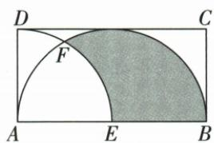

## 讲解

### 是什么

扇形由同一圆的两条半径和它们所对的圆弧围成；弓形由一条弦和它所对的某一条弧围成。同一条弦对应两条弧，便围成两种弓形。半圆是曲线，半圆形是直径加半圆弧围成的区域。

### 怎么来的

两半径共圆心，所以扇形的两直边一定在圆心相遇；弓形的一条直边则跨两个圆上端点，通常不经过圆心。弦为直径时两侧弓形各是半圆形；扇形中心转角180°时也得到半圆形。原甲有直径及弦，丙的两线段不在圆心相遇，均不是扇形；原矩形重叠面积题则把弓形拆成“对应扇形减中心三角形”，从围界理解才能正确减区域。

### 什么时候能用

这里要求曲边为圆弧，任意两直边加曲线不能都套扇形面积。劣弓形可用小扇形扣中心三角；优弓形需看区域是补集还是大扇形加三角，不机械照搬减法。

## 例题

### 甲乙丙按两半径围弧定义识别扇形

> 来源ID Q24-03；第24章圆；251-300/full.md 第2674–2686行。原答案与解析定位：251-300/full.md 第2692–2694行。

例（2023 江苏连云港）如图，甲是由一条直径、一条弦及一段圆弧所围成的图形；乙是由两条半径与一段圆弧所围成的图形；丙是由不过圆心 O 的两条线段与一段圆弧所围成的图形。下列叙述正确的是（）

A. 只有甲是扇形

C. 只有丙是扇形

B. 只有乙是扇形

D. 只有乙、丙是扇形

**原资料答案与解析：**

例 解析 由扇形的定义可知甲、乙、丙中只有乙是扇形.

答案B

**展开解析（依据原详解补足理由与步骤）：**

扇形的两条直边必须是同一个圆的两条半径，并由它们所对的弧闭合。甲的一条直边是直径，另一条是弦，不是这组两半径；乙两边从圆心出发，符合；丙两线段的共同端点不在圆心，不能当半径。故只有乙，B正确。A只甲、C只丙都收错对象；D虽收了乙，却又收了不符合半径条件的丙。

### 扇形60半径6面积6π及弧10π面积20π反求半径4

> 来源ID Q24-40；第24章圆；251-300/full.md 第4259–4261行。原答案与解析定位：251-300/full.md 第4263–4263行。

例1 (1)在半径为6 cm的圆中, 圆心角为 $60^{\circ}$ 的扇形的面积是\_\_\_\_.

(2) 若扇形的弧长为 $10\pi \, cm$ ，面积为 $20\pi \, cm^{2}$ ，则该扇形的半径是 \_\_\_\_ cm.

**原资料答案与解析：**

答案 (1) $6\pi \mathrm{cm}^2$ (2)4

**展开解析（依据原详解补足理由与步骤）：**

(1)60°占一周的60/360=1/6，圆面积π×6²=36π，扇形面积36π/6=6π cm²。

(2)扇形面积S=L·R/2，代S=20π、弧长L=10π：20π=10πR/2=5πR。两边除正数5π，R=4 cm。弧长和面积的单位不同，反求半径所得应为长度单位。

### 矩形4乘2半圆交另圆弧等边割补阴影2π比3加根3

> 来源ID Q24-50；第24章圆；251-300/full.md 第4500–4513行。原答案与解析定位：251-300/full.md 第4442–4454行。

例3 (2024 四川资阳) 如图, 在矩形 $ABCD$ 中, $AB = 4$ , $AD = 2$ . 以点 $A$ 为圆心, $AD$ 长为半径作弧交 $AB$ 于点 $E$ , 再以 $AB$ 为直径作半圆, 与 $\widehat{DE}$ 交于点 $F$ , 则图中阴影部分的面积为 \_\_\_\_.

**原资料答案与解析：**

例3 解析 连接 $AF, EF$ ,

由题意得 $\triangle AEF$ 是等边三角形， $S_{\text{阴影}} = S_{\text{半圆}} - S_{\text{扇形} AEF} - S_{\text{弓形} AF} =$

$$
2 \pi - \frac {6 0 \pi \times 2 ^ {2}}{3 6 0} - \left(\frac {6 0 \pi \times 2 ^ {2}}{3 6 0} - \frac {\sqrt {3}}{4} \times 2 ^ {2}\right)
$$

$$
= \frac {2 \pi}{3} + \sqrt {3}.
$$

答案 $\frac{2\pi}{3} +\sqrt{3}$

**展开解析（依据原详解补足理由与步骤）：**

E是AB中点，因为AE=AD=2且AB=4；半圆中心为E、半径2。F同时落在以A为圆心半径2的弧上及该半圆上，故AF=EF=AE=2，△AEF等边，两个相关扇形中心角各60°。原阴影=半圆面积−扇形AEF面积−弓形AF面积。半圆为π×2²/2=2π；每个60°扇形为60π×2²/360=2π/3；弓形AF是以E为圆心的60°扇形EAF扣等边△AEF，后者高√(2²−1²)=√3，面积2×√3/2=√3。代入2π−2π/3−(2π/3−√3)=2π/3+√3。括号内整块要减，不能把三角面积也重复减去。

### 原弧半圆同心等圆七句辨析

> 来源ID Q24-52；第24章圆；251-300/full.md 第2529–2536行。原答案与解析定位：251-300/full.md 第2529–2536行。

1. 半圆既不是优弧，也不是劣弧.
(√)  
2. 半圆与半圆形没有区别. (×)  
3.等弧就是长度相等的弧.（×）  
4.一条弧只对着一条弦. (√)   
5.一条弦只对着一条弧. (×)   
6. 弧只有优弧和劣弧之分. (×)   
7.优弧一定比劣弧长. (×)

**原资料答案与解析：**

1. 半圆既不是优弧，也不是劣弧.
(√)  
2. 半圆与半圆形没有区别. (×)  
3.等弧就是长度相等的弧.（×）  
4.一条弧只对着一条弦. (√)   
5.一条弦只对着一条弧. (×)   
6. 弧只有优弧和劣弧之分. (×)   
7.优弧一定比劣弧长. (×)

**展开解析（依据原详解补足理由与步骤）：**

依次√、×、×、√、×、×、×。半圆是恰好一半圆周，既非大于一半的优弧也非小于一半的劣弧；半圆形还包含内部区域，不能与一条曲线混同。等弧除长度相等还要在同圆/等圆中能重合，半径不同仅长度相同不够。一条指定弧两端固定，唯一连出一条弦；一条弦却有两条对应弧。弧还包含半圆。优劣是与各自圆的半圆比较，不同半径圆的优弧不一定长过另一圆的劣弧。

## 易错

只见圆弧就判扇形，漏查两条直边；把半圆曲线长度与半圆形面积混同。
