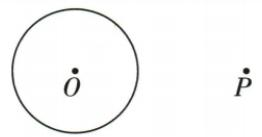
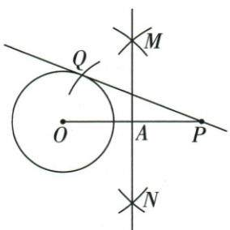
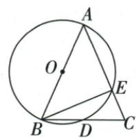
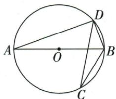

## 讲解

### 是什么

AB为圆的直径，P为圆上异于A、B的点，则APB=90°。顶点必须在圆上，角两边连到直径两端；角顶点在圆心或圆内任意点时不能照用。

### 怎么来的

连OP，同圆OA=OP=OB。设两个等腰三角形OAP、OBP在A、B处底角分别x、y，则P处相应角也为x、y。因O在AB内部，△APB的A角x、B角y、P角x+y，内角和给2x+2y=180°，所以APB=x+y=90°。若P在另一半圆，同样按内部角划分；端点P=A或B退化不能套。原圆题P和C都在圆上，所以ACB、APB分别90°，两次给勾股计算不同的直角三角形。

### 什么时候能用

题给“直径”和圆上顶点才足够；不能把每个看到的弦所对角都判直角。若原图圆心不在该弦上，先证明它为直径。使用勾股时斜边是这个直角对面的AB13，PB或AC为直角边，别把它们位置串换。

圆外切线辅助圆以OP为直径，切点Q在辅助圆上使OQP90°；同Q在原圆上使OQ为原半径。两个圆的角色分开，辅助直径提供直角、原圆提供切点半径，最终切线PQ垂直OQ而非OP。

圆周角是截弧中心转角的一半，直径两端之间的任一半圆转角180°，故圆上第三点与直径两端形成90°。反过来90°圆周角截180°半圆，其弦经过圆心，故为直径。证明也可连第三点P与圆心O：OA=OP与OB=OP形成两个等腰三角，把P角分两份，各底角等；三角APB内角和中这些底角两份出现，2∠APB=180°，所以90°，外部情形按角差同样对应半圆。这里直径、第三点必须属于同一圆；圆外C不能直接把C角当直角。原AB=AC顶角45计算及高线中线、20°余角、半圆切线证明均给出独立应用。

## 例题

### 弧中点连半径弦与直径直角多次勾股

> 来源ID Q18-18；第18章命题的证明；201-250/full.md 第1389–1401行。原答案与解析定位：201-250/full.md 第1403–1415行。

例7 如图, $AB$ 是 $\odot O$ 的直径, $P$ 是弧 $BC$ 的中点, $AB = 13$ , $AC = 5$ , 求 $PA$ 的长.

**原资料答案与解析：**

解析 连接 $PB, BC$ , 连接 $OP$ 交 $BC$ 于 $D$ .

∵ P 是弧 BC 的中点, ∴ $OP \perp BC, BD = CD.$

又∵ OA=OB, ∴ $OD=\frac{1}{2}AC=\frac{5}{2}$ . 又∵ $OP=\frac{1}{2}AB=\frac{13}{2}$ , ∴ PD=OP-OD=4.

∵ AB 是 ⊙O 的直径, ∴ $\angle ACB = 90^{\circ}$ . ∵ AB = 13, AC = 5,

$$
\therefore B C = \sqrt {A B ^ {2} - A C ^ {2}} = 1 2, \therefore B D = \frac {1}{2} B C = 6. \therefore P B = \sqrt {P D ^ {2} + B D ^ {2}} = 2 \sqrt {1 3}.
$$

∵ AB 是 $\odot O$ 的直径, ∴ $\angle APB = 90^{\circ}$ , ∴ $PA = \sqrt{AB^{2} - PB^{2}} = 3\sqrt{13}$ .

**展开解析（依据原详解补足理由与步骤）：**

先连PB、BC、OP并令OP交BC于D，原P在不含A的BC弧中点。等弧给BOP=POC，OB=OC、OP共同，由SAS得PB=PC；进一步△BPD与△CPD由SAS全等，故BD=CD，BDP=CDP，两角邻补所以均90°，OP⊥BC。O是AB中点、D是BC中点，△ABC中位线OD=AC/2=5/2；OP为半径=AB/2=13/2。原图O、D、P按序，PD=OP−OD=4。

AB为直径，ACB90°，BC²=13²−5²=144，BC=12，BD=6。在直角△PDB中PB²=PD²+BD²=16+36=52，PB=2√13。AB亦为直径，APB90°，PA²=AB²−PB²=169−52=117，PA=3√13。每次正根来自长度为正。三个不同直角分别来自直径、垂径和直径，不能把未画辅助线的斜段随意当直角边；PD差式依赖原弧中点与点序。

### 圆外一点以OP为直径辅助圆作两切线之一

> 来源ID Q20-30；第20章全等三角形；201-250/full.md 第3659–3661行。原答案与解析定位：201-250/full.md 第3663–3676行。

例4 已知 $\odot O$ 和 $\odot O$ 外一点 $P$ , 请过点 $P$ 作出 $\odot O$ 的一条切线. (尺规作图, 保留作图痕迹)

**原资料答案与解析：**

解析（1）连接 $OP$ ，分别以点 $O, P$ 为圆心，大于 $\frac{1}{2} OP$ 的长为半径向 $OP$ 两侧作弧，两弧分别交于点 $M, N$ ；(2) 过点 $M, N$ 作直线 $MN$ ，交 $OP$ 于点 $A$ ；(3) 以点 $A$ 为圆心， $AP$ 长为半径作弧，交 $\odot O$ 于点 $Q$ ；(4) 过点 $P, Q$ 作直线 $PQ$ ，则 $PQ$ 即为所求。如图。（点 $Q$ 取在 $OP$ 下方也可）

**展开解析（依据原详解补足理由与步骤）：**

作OP中垂线得其中点A，A圆心AP为半径作辅助圆，即以OP为直径的圆。与原圆交Q，Q在辅助圆上且不同于O、P，所以OQP90°；Q又在原圆上，OQ为原半径，PQ⊥OQ，切线判据给PQ为原圆切线。原P在线外，OP>原半径r，辅助圆与原圆有两交点，上下均可作，题只需一条，保原Q上方选择。P若在圆上只一切线，圆内无切线，不能不核“圆外”就套辅助圆。

### 直径直角配等腰顶45求22点5并证明BD等CD

> 来源ID Q24-11；第24章圆；251-300/full.md 第3011–3021行。原答案与解析定位：251-300/full.md 第3023–3029行。

例6 如图, $AB$ 为 $\odot O$ 的直径, $AB = AC$ , $AC$ 交 $\odot O$ 于点 $E$ , $BC$ 交 $\odot O$ 于点 $D$ , 连接 $BE$ , $\angle BAC = 45^{\circ}$ .

(1) 求 $\angle EBC$ 的度数. (2) 求证: BD = CD.

**原资料答案与解析：**

解析（1）∵ AB 是 $\odot O$ 的直径，∴ $\angle AEB = 90^{\circ}$ . 又∵ $\angle BAC = 45^{\circ}$ ，∴ $\angle ABE = 45^{\circ}$ .

$$
\because A B = A C, \angle B A C = 4 5 ^ {\circ}, \therefore \angle A B C = \angle C = \frac {1}{2} \times (1 8 0 ^ {\circ} - 4 5 ^ {\circ}) = 6 7. 5 ^ {\circ}, \therefore \angle E B C = \angle A B C - \angle A B E = 2 2. 5 ^ {\circ}.
$$

(2) 证明: 连接 $AD$ , $\because AB$ 是 $\odot O$ 的直径, $\therefore \angle ADB = 90^\circ$ , $\therefore AD \perp BC$ . 又 $\because AB = AC$ , $\therefore BD = CD$ .

**展开解析（依据原详解补足理由与步骤）：**

(1)E在圆上、AB为直径，所以∠AEB=90°。A-E-C共线，∠BAE=45°，△ABE内角和给∠ABE=45°。AB=AC使△ABC两底角均为(180°−45°)/2=67.5°。BE在∠ABC内部，目标∠EBC=67.5°−45°=22.5°。

(2)连AD。D在圆上，∠ADB=90°；B-D-C共线，所以AD⊥BC。等腰△ABC的顶点高线也是底边中线，故BD=CD。也可用直角△ABD/ACD的斜边AB=AC、公共直角边AD，HL证全等再取对应边，避免把D凭图当中点。

### 直径直角加同弧20求ABD70

> 来源ID Q24-15；第24章圆；251-300/full.md 第3116–3125行。原答案与解析定位：251-300/full.md 第3091–3094行。

例3（2024江苏常州）如图，AB是⊙O的直径，CD是⊙O的弦，连接AD、BC、BD.若 $\angle BCD=20^{\circ}$ ，则 $\angle ABD=$ \_\_\_\_°.

**原资料答案与解析：**

例3 解析 由圆周角定理的推论
知 $\angle C = \angle A, \angle ADB = 90^{\circ}$ , $\therefore \angle ABD = 90^{\circ} - 20^{\circ} = 70^{\circ}.$

答案 70

**展开解析（依据原详解补足理由与步骤）：**

∠BCD和∠BAD顶点在弦BD同侧，截同一弧BD，因此∠BAD=20°。AB直径且D在圆上给∠ADB=90°。△ABD内角和得∠ABD=180°−90°−20°=70°。原C的20°不能直接当作∠ABD，它们的弦端点不同。

### 半圆直径配两个60构造B直角证明BD切线

> 来源ID Q24-34；第24章圆；251-300/full.md 第3943–3951行。原答案与解析定位：251-300/full.md 第3846–3862行。

例3 (2024 江西节选) 如图, $AB$ 是半圆 $O$ 的直径, 点 $D$ 是弦 $AC$ 延长线上一点, 连接 $BD, BC, \angle D = \angle ABC = 60^{\circ}$ . 求证: $BD$ 是半圆 $O$ 的切线.

**原资料答案与解析：**

例3 证明 $\because AB$ 是半圆 $O$ 的直径, $\therefore \angle ACB = 90^{\circ}$ ,

$$
\therefore \angle D C B = 9 0 ^ {\circ},
$$

$$
\because \angle D = 6 0 ^ {\circ}, \therefore \angle C B D = 3 0 ^ {\circ},
$$

$$
\because \angle A B C = 6 0 ^ {\circ}, \therefore \angle A B D = 9 0 ^ {\circ},
$$

∵ AB 是直径，

∴ BD 是半圆 O 的切线.

**展开解析（依据原详解补足理由与步骤）：**

C在以AB为直径的半圆上，∠ACB=90°；A-C-D共线，所以∠DCB=90°。△DCB中，∠D=60°，∠CBD=30°。原BC在∠ABD内部，∠ABD=∠ABC+∠CBD=60°+30°=90°。OB在BA所在直线上，BD⊥OB且B在圆上，按切线判定得BD相切。先构造直角，再说明这个直角的其中一边确是过切点的半径。

## 易错

原ACB90°用来先求BC12，APB90°用来最后求PA3√13；二者不能合成同一个三角形一次求所有长度。
