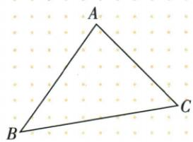
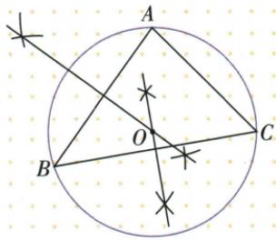

## 讲解

### 判据

要求A/B/C都在圆上，取三个顶点等距轨迹的交点，不作中线或角平分。

### 流程

1.分别尺规作AB与BC中垂线，交O。2.由两次等距性质列OA=OB=OC。3.O圆心OA为半径画圆，三点恰到圆心同r，所以全在圆周。4.非共线保证两中垂唯一交点，第三中垂也过O可校验。5.不目测圆心或半径，不强求圆心总在内部。

## 例题

### 三顶点外接圆作两中垂得等半径

> 来源ID Q20-26；第20章全等三角形；201-250/full.md 第3507–3517行。原答案与解析定位：201-250/full.md 第3519–3527行。

例3 如图,已知 $\triangle ABC$ , 请作一个圆,使 A、B、C 三点都在该圆上. (尺规作图,不写作法,保留作图痕迹)

**原资料答案与解析：**

解析 如图, $\odot O$ 即为所求.

**展开解析（依据原详解补足理由与步骤）：**

分别作AB、BC中垂线，交于O。O在AB中垂线上给OA=OB，在BC中垂线上给OB=OC，传递OA=OB=OC。以O为圆心OA长为半径画圆，A、B、C三点都在圆上。原非退化三角形三点不共线，两中垂不平行所以唯一交点；第三中垂也过O，不必额外目测圆心。若三点共线，通常不能作同一有限圆通过三点，原题给三角形已排除。

## 易错

外接圆不是任意能包住三角形的圆；三点需在边界，原作图痕迹决定圆心。
