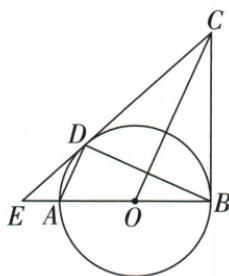
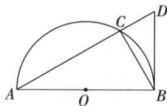

## 讲解

### 判据

D或B已明确在圆上，目标线经过它，只剩证该线垂直过此点半径。

### 流程

1.D原题连OD，用AD∥OC和OA=OD搬出两中心夹角相等。2.OC公共、OB=OD，SAS得COD/COB全等，把已知切点B的90搬到D，证明CD切线。3.半圆题先直径C90，D60给CBD30，原ABC60再加成ABD90，BA包含OB，证BD切线。4.数值r题切线已证后用ED3、OE1+r勾股，不先套待证直角。

## 例题

### 已知圆上D用等腰与平行SAS证明切线再平方差求r4

> 来源ID Q24-27；第24章圆；251-300/full.md 第3672–3674行。原答案与解析定位：251-300/full.md 第3676–3698行。

例3 如图, 已知 AB 为 $\odot O$ 的直径, AD、BD 是 $\odot O$ 的弦, BC 是 $\odot O$ 的切线, 切点为 B, OC // AD, BA、CD 的延长线相交于点 E.

(1) 求证: CD 是 $\odot O$ 的切线. (2) 若 AE = 1, ED = 3, 求 $\odot O$ 的半径.

**原资料答案与解析：**

解析（1）证明：连接 $DO\because AD \parallel OC, \therefore \angle DAO = \angle COB, \angle ADO = \angle COD.$

$$
\because O A = O D, \therefore \angle D A O = \angle A D O, \therefore \angle C O D = \angle C O B.
$$

又∵ OC=OC, OD=OB, ∴ $\triangle COD \cong \triangle COB$ , ∴ $\angle CDO = \angle CBO$ .

∵ BC 是 $\odot O$ 的切线, ∴ $\angle CBO = 90^{\circ}$ , ∴ $\angle CDO = 90^{\circ}$ .

又∵点D在 $\odot O$ 上,∴CD是 $\odot O$ 的切线.

(2) 设 $\odot O$ 的半径为 $r$ , 则 $OD = r, OE = r + 1$ , $\because CD$ 是 $\odot O$ 的切线, $\therefore \angle EDO = 90^\circ$ ,

$\therefore ED^{2} + OD^{2} = OE^{2}, \therefore 3^{2} + r^{2} = (r + 1)^{2}$ , 解得 $r = 4, \therefore \odot O$ 的半径为 4.

**展开解析（依据原详解补足理由与步骤）：**

(1)连接OD。AD∥OC，给∠DAO=∠COB、∠ADO=∠COD；OA=OD使△OAD两底角等，所以∠COB=∠COD。OC公共、OD=OB为半径，按SAS，△COD≌△COB。已知BC切于B，∠CBO=90°，对应∠CDO=90°；又D在圆上，故CD是过D且垂直OD的切线。

(2)设r>0，原E-A-O顺序给OE=EA+AO=1+r。ED在切线CD上，OD⊥ED，勾股3²+r²=(r+1)²。展开9+r²=r²+2r+1，同减r²，8=2r，r=4。回验3²+4²=5²成立。

### 半圆直径配两个60构造B直角证明BD切线

> 来源ID Q24-34；第24章圆；251-300/full.md 第3943–3951行。原答案与解析定位：251-300/full.md 第3846–3862行。

例3 (2024 江西节选) 如图, $AB$ 是半圆 $O$ 的直径, 点 $D$ 是弦 $AC$ 延长线上一点, 连接 $BD, BC, \angle D = \angle ABC = 60^{\circ}$ . 求证: $BD$ 是半圆 $O$ 的切线.

**原资料答案与解析：**

例3 证明 $\because AB$ 是半圆 $O$ 的直径, $\therefore \angle ACB = 90^{\circ}$ ,

$$
\therefore \angle D C B = 9 0 ^ {\circ},
$$

$$
\because \angle D = 6 0 ^ {\circ}, \therefore \angle C B D = 3 0 ^ {\circ},
$$

$$
\because \angle A B C = 6 0 ^ {\circ}, \therefore \angle A B D = 9 0 ^ {\circ},
$$

∵ AB 是直径，

∴ BD 是半圆 O 的切线.

**展开解析（依据原详解补足理由与步骤）：**

C在以AB为直径的半圆上，∠ACB=90°；A-C-D共线，所以∠DCB=90°。△DCB中，∠D=60°，∠CBD=30°。原BC在∠ABD内部，∠ABD=∠ABC+∠CBD=60°+30°=90°。OB在BA所在直线上，BD⊥OB且B在圆上，按切线判定得BD相切。先构造直角，再说明这个直角的其中一边确是过切点的半径。

## 易错

必须说公共点在圆上及对应半径外端；任意过O垂线没有切线结论。
