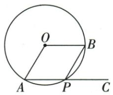
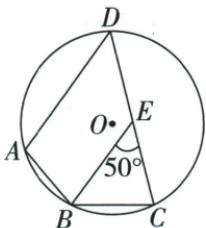

## 讲解

### 判据

原角与目标在不同顶点，先用平行或圆周半角确认其中一个内对角，再互补。

### 流程

1.2:3原题设中心2x、ADC3x，原位置给ABC=x；对角和4x180解45。2.BE∥AD原题同位搬BEC50至ADC50，再ABC130。3.P的外角题构另侧E，同一内角APB分别与AEB、BPC互补，所以两后角相等并取中心120一半60。4.每次写是哪个四边的哪组对角，不把邻角当对角。

## 例题

### 内接四边形圆心角比对角2比3设x得45

> 来源ID Q24-05；第24章圆；251-300/full.md 第2858–2860行。原答案与解析定位：251-300/full.md 第2862–2864行。

例2 如图, 四边形 ABCD 内接于 $\odot O$ , 连接 OA, OC, 若 $\angle AOC : \angle ADC = 2 : 3$ , 则 $\angle ABC$ 的度数为

**原资料答案与解析：**

解析 设 $\angle AOC = 2x^{\circ} (x > 0)$ ，则 $\angle ADC = 3x^{\circ}$ ，由圆周角定理得 $\angle ABC = \frac{1}{2} \angle AOC = x^{\circ}$ ，∵ 四边形 ABCD 是 $\odot O$ 的内接四边形，∴ $\angle ADC + \angle ABC = 180^{\circ}$ ，∴ $3x + x = 180$ ，解得 x = 45，即 $\angle ABC = 45^{\circ}$ .

答案 $45^{\circ}$

**展开解析（依据原详解补足理由与步骤）：**

按原图B在优弧AC上，∠ABC截劣弧AC，等于∠AOC的一半。设∠AOC=2x，原比值给∠ADC=3x，而∠ABC=x。内接四边形对角互补，3x+x=180°，两边除4得x=45°。故∠ABC=45°，∠ADC=135°，∠AOC=90°，比值90:135=2:3回验。不能把∠ADC也写为同一小圆心角的一半，它截的是另一条弧。

### 劣弧120上点P的外角用内对角求60

> 来源ID Q24-12；第24章圆；251-300/full.md 第3035–3043行。原答案与解析定位：251-300/full.md 第3045–3055行。

例7 如图, 圆心角 $\angle AOB = 120^{\circ}$ , 若 $P$ 是弧 $AB$ 上任意一点 (不与点 $A, B$ 重合), 点 $C$ 在 $AP$ 的延长线上, 则 $\angle BPC$ 的度数为 \_\_\_\_.

**原资料答案与解析：**

解析 设点 E 是优弧 AB 上一点(不与点 A, B 重合),

连接 $AE, BE$ ，则四边形 $AEBP$ 为 $\odot O$ 的内接四边形， $\therefore \angle AEB + \angle APB = 180^\circ$ .

又 $\angle APB + \angle BPC = 180^{\circ},\therefore \angle BPC = \angle AEB.$

$$
\because \angle A O B = 1 2 0 ^ {\circ}, \therefore \angle A E B = \frac {1}{2} \angle A O B = 6 0 ^ {\circ} \therefore \angle B P C = 6 0 ^ {\circ}.
$$

答案 $60^{\circ}$

**展开解析（依据原详解补足理由与步骤）：**

原两字母弧AB及图指定的是小圆心角120°对应的劣弧，P在该弧内部。优弧上取E，∠AEB截劣弧AB，等于120°/2=60°。内接四边形AEBP给∠AEB+∠APB=180°；C在AP过P的延长射线上，∠BPC+∠APB=180°。同减∠APB得∠BPC=∠AEB=60°。若P改落优弧，目标外角会是120°；不能取消原弧位置条件。

### 平行先移50到ADC再圆内接补130四项

> 来源ID Q24-16；第24章圆；251-300/full.md 第3128–3150行。原答案与解析定位：251-300/full.md 第3152–3164行。

例4（2024 吉林）如图, 四边形 ABCD 内接于 $\odot O$ . 过点 B 作 BE // AD, 交 CD 于点 E. 若 $\angle BEC = 50^{\circ}$ , 则 $\angle ABC$ 的度数是 ( )

A. ${50}^{ \circ  }$

B. ${100}^{ \circ  }$

C.130°

D. $150^{\circ}$

**原资料答案与解析：**

例4 解析 ∵ BE∥AD,

$$
\therefore \angle A D C = \angle B E C = 5 0 ^ {\circ}.
$$

∵ 四边形 ABCD 内接于 $\odot O$ ,

$$
\therefore \angle A B C = 1 8 0 ^ {\circ} - \angle A D C = 1 3 0 ^ {\circ}.
$$

答案 C

**展开解析（依据原详解补足理由与步骤）：**

BE∥AD，D-E-C按序，∠ADC与∠BEC是同位角，故∠ADC=50°。ABCD内接，∠ABC与∠ADC互补，所以180°−50°=130°，选C。A50误把两对角等同；B100随意倍50；D150相当于减30，题中没有30°依据。

## 易错

四点先共圆且依边界顺序组成简单四边；一般四边只有总和360不提供单组互补。
