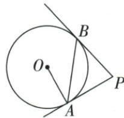

## 讲解

### 判据

图有三条切线和多个外点，逐个列哪两条长度出自同一点。

### 流程

1.P给PA=PB，C给CA=CE，D给DB=DE，各等式注明外点。2.E在CD内，CD=CE+ED，替为CA+DB。3.C/D在PA/PB内，PC+CA=PA，PD+DB=PB，所以周长PA+PB20。4.两切角38题先PA=PB成等腰，切点直角减得底52，再角和得P76。

## 例题

### 三切截在两切段内部用切线长等替换周长20

> 来源ID Q24-29；第24章圆；251-300/full.md 第3741–3752行。原答案与解析定位：251-300/full.md 第3754–3758行。

例5 如图, $PA、PB、CD$ 都与 $\odot O$ 相切, $A、B、E$ 为切点, $PA=10, CD$ 分别交 $PA、PB$ 于 $C、D$ 两点, 则 $\triangle PCD$ 的周长是 \_\_\_\_.

**原资料答案与解析：**

解析 由题意得 $PB = PA = 10, CA = CE, DE = DB$

∴ $\triangle PCD$ 的周长是 $PC + CD + PD = PC + CA + DB + PD = PA + PB = 10 + 10 = 20.$

答案 20

**展开解析（依据原详解补足理由与步骤）：**

同一点P的两切线长PA=PB=10。同一点C的CA=CE，同一点D的DB=DE。图示E在CD内，CD=CE+ED=CA+DB；C在P-A间、D在P-B间，PC+CA=PA、PD+DB=PB。于是周长PC+CD+PD=(PC+CA)+(PD+DB)=PA+PB=20。原点序用于每次相加；若第三切线改在A/B外，不能套这个周长式。

### 两切等腰底角90减38再内角和求76

> 来源ID Q24-30；第24章圆；251-300/full.md 第3760–3760行。原答案与解析定位：251-300/full.md 第3762–3780行。

例6 如图, $PA 、 PB$ 是 $\odot O$ 的切线, $A 、 B$ 为切点, $\angle OAB = 38^{\circ}$ , 则 $\angle P$ 的度数为 \_\_\_\_.

**原资料答案与解析：**

解析 $\because PA, PB$ 是 $\odot O$ 的切线， $\therefore PA = PB, PA \perp OA, \therefore \angle PAB = \angle PBA, \angle OAP = 90^\circ,$

$$
\because \angle O A B = 3 8 ^ {\circ}, \therefore \angle P B A = \angle P A B = 9 0 ^ {\circ} - \angle O A B = 9 0 ^ {\circ} - 3 8 ^ {\circ} = 5 2 ^ {\circ},
$$

$$
\therefore \angle P = 1 8 0 ^ {\circ} - 5 2 ^ {\circ} - 5 2 ^ {\circ} = 7 6 ^ {\circ}.
$$

答案 $76^{\circ}$

**展开解析（依据原详解补足理由与步骤）：**

PA、PB为同一圆外点的两切线长，PA=PB，故△PAB的两底角相等。OA⊥PA，按图AB分开∠OAP，∠PAB=90°−∠OAB=52°。∠PBA也52°，三角形角和得∠P=180°−52°−52°=76°。等价地∠AOB=180°−2×38°=104°，两切夹角与它互补，仍76°。

## 易错

第三切线改位在外时长度加减会变，不能记死“周长=2切线长”而不核序。
