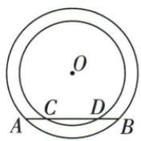

## 讲解

### 判据

一条直线同时截两同心圆，要求证明大圆与小圆之间两侧的截段相等。两圆共用同一圆心，对同一直线作垂线就有同一个垂足；分别平分两条弦后，再按点序相减。

### 流程

1. 从共同圆心O作OE垂直弦AB所在直线。小圆弦CD与AB在同一直线上，因此这条OE也垂直CD，两个圆使用的是同一垂足E。
2. 在大圆中，垂径定理给$AE=BE$；在小圆中，同一定理给$CE=DE$。两条弦分别被平分，但这不表示大圆整弦与小圆整弦相等。
3. 原点序为A、C、E、D、B。左侧外截段$AC=AE-CE$，右侧外截段$BD=BE-DE$；相减式来自各点在同一条直线上的先后关系。
4. 把$AE=BE$、$CE=DE$代入两式，相等量分别减去相等量，得到$AC=BD$。每一条等量关系都在各自圆内成立，再合并到外截段。
5. 使用前确认直线确实与两圆均有两个交点，CD作为弦存在。若只切小圆或不与小圆相交，原四交点的线段关系已改变，不能继续照用同一减段式。

## 例题

### 同心圆共同弦垂线平分两弦同减证AC等BD

> 来源ID Q24-06；第24章圆；251-300/full.md 第2884–2888行。原答案与解析定位：251-300/full.md 第2890–2890行。

例1 已知在以点 O 为圆心的两个同心圆中, 大圆的弦 AB 交小圆于点 C, D (如图所示).

求证:AC=BD.

**原资料答案与解析：**

证明 过点 $O$ 作 $OE \perp AB$ 于点 $E$ , 则 $CE = DE, AE = BE, \therefore AE - CE = BE - DE$ , 即 $AC = BD$ .

**展开解析（依据原详解补足理由与步骤）：**

作OE⊥AB于E，CD也在同一直线AB上。对大圆，AE=BE；对小圆，CE=DE。原点序A-C-E-D-B，所以AC=AE−CE，BD=BE−DE。两个等式对应相减，得到AC=BD。要用同一个圆心、同一条垂线，不能只因两个圆同心就称所有弦等长。

## 易错

不能以两个圆同心便断言大弦与小弦相等；等的是各自半弦及外截差。
