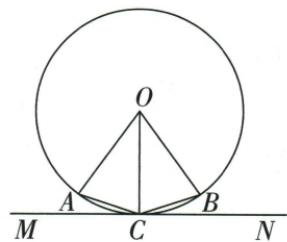

## 讲解

### 判据

目标角分散在圆周，已知圆心或另一个圆周角，用同弧集中到圆心，再沿直径或等腰连接。

### 流程

1.给每个角标出两端点及不包含顶点的截弧。2.已知圆周40°截BD，先倍成中心80°。3.直径AB使另一中心角180°−80°=100°。4.目标截AD同弧，半回50°；另原圆周角与半径底角和题用2β+θ=180及α=θ/2直接除2得90。5.若顶点位置不定，先分类截优弧还是劣弧再算。

## 例题

### 直径半周减圆心80再半角求50

> 来源ID Q24-10；第24章圆；251-300/full.md 第2967–2980行。原答案与解析定位：251-300/full.md 第2982–3005行。

例5 如图, $AB$ 为 $\odot O$ 的直径, 点 $C、D、E$ 在 $\odot O$ 上, $\angle BED = 40^{\circ}$ , 则 $\angle ACD$ 的度数为 \_\_\_\_.

**原资料答案与解析：**

解析 连接 OD. 由圆周角定理得 $\angle BOD = 2 \angle BED = 2 \times 40^{\circ} = 80^{\circ}$ ,

$$
\therefore \angle A O D = 1 8 0 ^ {\circ} - \angle B O D = 1 8 0 ^ {\circ} - 8 0 ^ {\circ} = 1 0 0 ^ {\circ},
$$

$$
\therefore \angle A C D = \frac {1}{2} \angle A O D = \frac {1}{2} \times 1 0 0 ^ {\circ} = 5 0 ^ {\circ}.
$$

答案 $50^{\circ}$

**展开解析（依据原详解补足理由与步骤）：**

∠BED截弧BD，由圆周角定理∠BOD=2×40°=80°。AB为直径，OA与OB反向，∠AOD=180°−80°=100°。按原C的位置，∠ACD截同一劣弧AD，故∠ACD=100°/2=50°。每一步先确认对应弧再乘2或除2；AB直径提供的是两圆心射线的平角。

### 同弧圆周半角配等半径底角和90

> 来源ID Q24-14；第24章圆；251-300/full.md 第3110–3112行。原答案与解析定位：251-300/full.md 第3087–3089行。

例2 (2024 陕西) 如图, BC 是 $\odot O$ 的弦, 连接 OB, OC, $\angle A$ 是 $\widehat{BC}$ 所对的圆周角, 则 $\angle A$ 与 $\angle OBC$ 的度数的和是 \_\_\_\_.

**原资料答案与解析：**

例2 解析 由圆周角定理知 $\angle A = \frac{1}{2} \angle O$ ，易得 $\angle OBC = \angle OCB$ ， $\therefore \angle A + \angle OBC = \frac{1}{2} \times 180^{\circ} = 90^{\circ}$ .

答案 $90^{\circ}$

**展开解析（依据原详解补足理由与步骤）：**

连OB、OC得到OB=OC，∠OBC=∠OCB，故2∠OBC+∠BOC=180°。原A在优弧BC上，∠A=∠BOC/2。把前一式两边除2，得∠OBC+∠BOC/2=90°，代换即∠OBC+∠A=90°。这里加的是一个等腰底角和对应的圆周角，不能把圆心角与底角直接加90°。

### 内心半角35转顶70外心倍角140求底20

> 来源ID Q24-24；第24章圆；251-300/full.md 第3554–3566行。原答案与解析定位：251-300/full.md 第3568–3592行。

例4 如图, 点 O 是 $\triangle ABC$ 外接圆的圆心, 点 I 是 $\triangle ABC$ 的内心, 连接 OB, IA. 若 $\angle CAI = 35^{\circ}$ , 则 $\angle OBC$ 的度数为 \_\_\_\_.

**原资料答案与解析：**

解析 连接 OC, ∵ 点 I 是 $\triangle ABC$ 的内心, ∴ AI 平分 $\angle BAC$ ,

$$
\because \angle C A I = 3 5 ^ {\circ},
$$

$$
\therefore \angle B A C = 2 \angle C A I = 7 0 ^ {\circ},
$$

∵ 点 O 是 $\triangle ABC$ 外接圆的圆心，

$$
\therefore \angle B O C = 2 \angle B A C = 1 4 0 ^ {\circ},
$$

$$
\because O B = O C, \therefore \angle O B C = \angle O C B =
$$

$$
\frac {1}{2} \times (1 8 0 ^ {\circ} - \angle B O C) = 2 0 ^ {\circ}.
$$

答案 $20^{\circ}$

**展开解析（依据原详解补足理由与步骤）：**

I内心意味着AI内部平分∠BAC，因此∠BAC=2×35°=70°。O外心，所以OB=OC；按原图A在优弧BC，∠BOC=2∠BAC=140°。等腰△OBC两底角各为(180°−140°)/2=20°，故∠OBC=20°。不能把外心性质用成到边等距，也不能把35°未经倍回就搬成圆心角。

### 弧中点圆心72半36等腰底72切角18四项

> 来源ID Q24-33；第24章圆；251-300/full.md 第3918–3939行。原答案与解析定位：251-300/full.md 第3824–3844行。

例2 (2024 福建) 如图, 已知点 A, B 在 $\odot O$ 上, $\angle AOB = 72^{\circ}$ , 直线 MN 与 $\odot O$ 相切, 切点为 C, 且 C 为 $\widehat{AB}$ 的中点, 则 $\angle ACM$ 等于 ( )

A. ${18}^{ \circ  }$

B. $30^{\circ}$

C. $36^{\circ}$

D.72°

**原资料答案与解析：**

例2 解析 $\because C$ 为 $\widehat{AB}$ 的中点，

$$
\begin{array}{l} \therefore \widehat {A C} = \widehat {B C}, \therefore \angle A O C = \angle B O C = \\ \frac {1}{2} \angle A O B = 3 6 ^ {\circ}, \because O A = O C, \end{array}
$$

$$
\therefore \angle O C A = \frac {1 8 0 ^ {\circ} - \angle A O C}{2} = 7 2 ^ {\circ},
$$

∵ 直线 MN 与 $\odot O$ 相切，

$$
\therefore \angle O C M = 9 0 ^ {\circ},
$$

$$
\therefore \angle A C M = 9 0 ^ {\circ} - 7 2 ^ {\circ} = 1 8 ^ {\circ}.
$$

答案 A

**展开解析（依据原详解补足理由与步骤）：**

C是劣弧AB中点，∠AOC=72°/2=36°。OA=OC，△AOC底角∠OCA=(180°−36°)/2=72°。MN切于C，OC⊥CM，按图CA在∠OCM内，∠ACM=90°−72°=18°，A。B30不能从72°得出；C36是中心半角；D72是∠OCA，均不是目标切线与弦的角。

## 易错

相同弦的两侧顶点不保证等角，不能省第1步。
