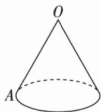
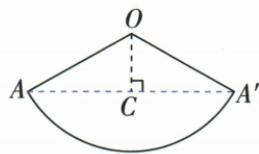

## 讲解

### 判据

从底边A绕圆锥侧面一周回A，展开时两份A/A′才是不同端点，不能取零距离。

### 流程

1.沿母线OA剪开，原起点两份落扇形两边，半径母线3，弧为底周2π。2.弧长式求角120，连AA′，这条弦位于完整120扇形内。3.等腰三角高分顶60，底角30，OC3/2；勾股半弦3√3/2，整弦3√3 cm。4.线段最短保证同绕数一周路径的下界，实际弦能走保证下界取到；折回走侧面而非穿过圆锥内部。

## 例题

### 圆锥底半径1母线3绕一周展开120最短3根3

> 来源ID Q24-46；第24章圆；251-300/full.md 第4381–4383行。原答案与解析定位：251-300/full.md 第4385–4404行。

例5 如图,圆锥底面圆的半径为 $1 \mathrm{~cm}$ , 母线长为 $3 \mathrm{~cm}$ , 有一只蚂蚁位于底面圆周上的点 $A$ 处, 它从点 $A$ 出发沿圆锥侧面爬行一周后又回到原出发点. 请你给它指出一条最短的爬行路径, 并求出最短路程.

**原资料答案与解析：**

解析 将圆锥的侧面沿 $OA$ 展开, 连接 $AA'$ , 则蚂蚁爬行的最短路径为线段 $AA'$ . 过点 $O$ 作 $OC \perp AA'$ 于点 $C$ . 由题意可知 $OA = OA' = 3 \mathrm{~cm}, \widehat{AA'}$ 的长为 $2\pi \times 1 = 2\pi (\mathrm{cm})$ .

设 $\angle AOA' = n^{\circ}$ ，则 $2\pi = \frac{n\pi\times 3}{180}$ 解得 $n = 120$ ，即 $\angle AOA' = 120^{\circ}$

$$
\therefore \angle A O C = 6 0 ^ {\circ}, \therefore \angle O A C = 3 0 ^ {\circ}, \therefore O C = \frac {1}{2} O A = \frac {3}{2} \mathrm{cm},
$$

$\therefore AC = \sqrt{OA^2 - OC^2} = \frac{3\sqrt{3}}{2}\mathrm{cm},\therefore AA' = 2AC = 3\sqrt{3}\mathrm{cm}$ ，即蚂蚁爬行的最短路程是 $3\sqrt{3}\mathrm{cm}.$

**展开解析（依据原详解补足理由与步骤）：**

沿OA展开侧面，把原同一底边点A的相邻两份记作A与A′。展开图弧长=底周长2π，半径=母线3，故nπ×3/180=2π，两边除π并乘60，n=120°。△OAA′等腰，作OC⊥AA′，平分顶角成60°，A处30°，OC=3/2。勾股AC²=3²−(3/2)²=27/4，AC=3√3/2，AA′=2AC=3√3 cm。120°扇形内的弦AA′完整在侧面展开区域，折回后确为绕一周的可走路径；任意同绕数路径展开连接同两端，长度至少该线段，因此它取到最短。底周长2π只提供弧长，不是蚂蚁必须沿底边走的长度。

## 易错

其他展开角若使候选穿出侧面区域或穿顶点，需要重新讨论，不能只写“展开两点直连”就结束。
