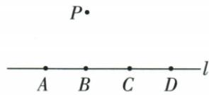

## 讲解

### 判据

四点共线加一个线外点，按任意三点作圆，既检查存在也检查重合。

### 流程

1.纯线上三点不作圆；每个合法组合必须含P。2.线上四点选两点列六对AB/AC/AD/BC/BD/CD。3.每对与P非共线，唯一圆存在。4.不同两对若圆相同会让同圆有三个线上点，不可能，所以六圆全异，D。5.不直接取总组合10，亦不能少列成3/4/5。

## 例题

### 四共线点加线外一点任取三点六个圆

> 来源ID Q24-20；第24章圆；251-300/full.md 第3326–3343行。原答案与解析定位：251-300/full.md 第3404–3406行。

例2 (2023 江西) 如图, 点 A, B, C, D 均在直线 l 上, 点 P 在直线 l 外, 则经过其中任意三个点, 最多可画出圆的个数为 ( )

A.3

B.4

C.5

D.6

**原资料答案与解析：**

例2 解析 由题意知点 P 一定在所画出的圆上, 其余两点在 A、B、C、D 四点中任选即可, 易知最多能画出 6 个圆.

答案 D

**展开解析（依据原详解补足理由与步骤）：**

若三点全从A/B/C/D取，则共线，不能确定圆；必须含线外P，再从四共线点取两个。六对为AB、AC、AD、BC、BD、CD，各与P组成非共线三点，唯一确定一个圆。不同两对不能得到同一圆，否则同一圆会包含直线l上至少三个不同点，与直线和圆最多两个交点矛盾。因此最多且确有6，D。A3、B4、C5均漏掉上述合法点对。

## 易错

有别的布局时不同三点组可能共圆，应重新去重；本题无重靠直线最多两交点证明。
