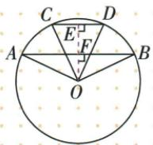
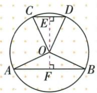

## 讲解

### 判据

半径和两条平行弦长已知，但两弦间距未定，分圆心与弦的相对位置。

### 流程

1.过圆心作垂线，两个垂足与圆心共线，因为原弦平行。2.完整弦各除2，用半径斜边勾股分别求两个弦心距。3.两弦同在圆心一侧，垂足距离为大距减小距；异侧为两距相加。4.原13/24/10给5/12，故7或17；两图分别验证，没有位置限制就保两解。

## 例题

### 半径13两平行弦24与10同侧差7异侧和17

> 来源ID Q24-04；第24章圆；251-300/full.md 第2729–2729行。原答案与解析定位：251-300/full.md 第2731–2743行。

例1 已知圆的半径为 13, 两弦 $AB \parallel CD$ , $AB = 24$ , $CD = 10$ , 则两弦 $AB$ 、 $CD$ 之间的距离是 \_\_\_\_.

**原资料答案与解析：**

解析 画出示意图如下. 过点 O 作 $OE \perp CD$ 于 E, $OF \perp AB$ 于 F, 易得 O, E, F 三点共线.

  
图 1

  
图 2

利用垂径定理、勾股定理可求得 $OE = 12, OF = 5$ ，所以两弦 $AB, CD$ 之间的距离是 $12 - 5 = 7$ 或 $12 + 5 = 17$ .

# 答案7或17

注意 此类问题中两弦与圆心的相对位置往往不确定，需要分情况讨论.

**展开解析（依据原详解补足理由与步骤）：**

过O向两条弦所在直线作垂线。因为弦平行，两垂线在同一直线上；垂径定理给半弦12和5。分别用勾股定理：到AB的距离为√(13²−12²)=5，到CD的距离为√(13²−5²)=12。

圆心在两弦同侧时，垂足间距离为12−5=7；圆心在两弦之间时，距离为12+5=17。题干未限定相对位置，两种均能放入半径13的圆，答案7或17。不能凭其中一张示意图舍去另一种。

## 易错

距离取非负；不能将两完整弦差24−10直接当相隔距离。
