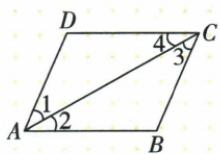

## 错法

原四边形两问看到共同AC，就把AC与某边判平行，或把1=3套给AB、CD。错误是没有区分共线边与剩余边。

## 正解

先写角边，AC是共同截线；1、3剩余边在AD、CB，故只得这组平行；2、4剩余边在AB、DC，才得另一组。截线已经和被截线相交，不能当同组平行结论。

## 例题

### 同一截线AC的两组内错角判不同边平行

> 来源ID Q17-14；第17章相交线与平行线；201-250/full.md 第597–601行。原答案与解析定位：201-250/full.md 第603–606行。

例1 如图,由下列条件可判定哪两条直线平行?

(1) $\angle 1 = \angle 3$ . (2) $\angle 2 = \angle 4$ .

**原资料答案与解析：**

解析（1）由 $\angle1 = \angle3$ 可判定 DA
// CB.  
(2) 由 $\angle 2 = \angle 4$ 可判定 $DC \parallel AB$ .  
注意 能构成同位角或内错角或同旁内角的两个角一定有一条边共线，而不共线的两条边所在直线就是可判定平行的直线.

**展开解析（依据原详解补足理由与步骤）：**

（1）1=∠DAC，3=∠ACB，两角沿共同截线AC、另外两边分别在AD与CB，内错相等推出AD∥CB。（2）2=∠CAB，4=∠DCA，共同截线仍AC，另外两边在AB、CD，推出AB∥CD。不能从1=3推出AB∥CD，因为AB、CD不是这两个角除截线外的边；不能把截线AC和被截线之一判成平行，两者在A或C已相交。先把每个角写成三字母，再追到两条被截线。
